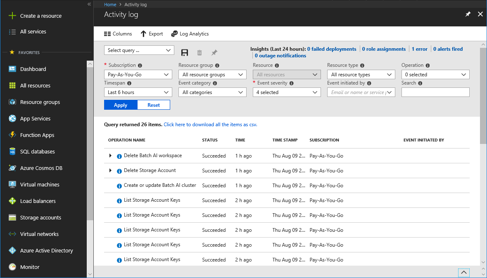

## Exercise

First Up Consultants reviews RBAC changes quarterly for auditing and troubleshooting purposes. You know that changes get logged in [Azure Activity Log](/azure/monitoring-and-diagnostics/monitoring-overview-activity-logs). Your manager has asked if you can generate a report of the role assignment and custom role changes for last month.

In this exercise, you learn how to:

> [!div class="checklist"]
> * View activity log for RBAC changes

## Operations that are logged

Here are the RBAC-related operations that are logged in Activity Log:

- Create role assignment
- Delete role assignment
- Create or update custom role definition
- Delete custom role definition

You can view the activity logs to see all the RBAC changes for the past 90 days.

## Azure portal

The easiest way to get started is to view the activity logs with the Azure portal. The following screenshot shows an example of an activity log that has been filtered to display role assignment and role definition operations. It also includes a link to download the logs as a CSV file.

The activity log in the portal has several filters. Here are the RBAC-related filters:

|Filter  |Value  |
|---------|---------|
|Event category     | <ul><li>Administrative</li></ul>         |
|Operation     | <ul><li>Create role assignment</li> <li>Delete role assignment</li> <li>Create or update custom role definition</li> <li>Delete custom role definition</li></ul>      |

For more information about activity logs, see [View events in activity log](/azure/azure-resource-manager/resource-group-audit?toc=%2fazure%2fmonitoring-and-diagnostics%2ftoc.json).

## Summary
