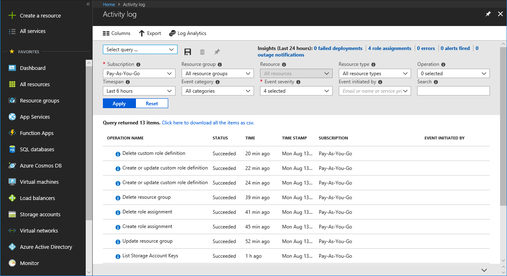
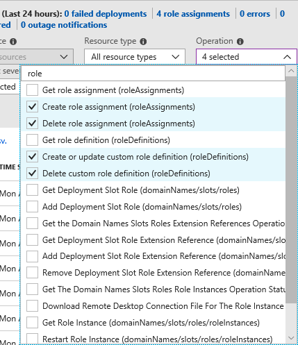
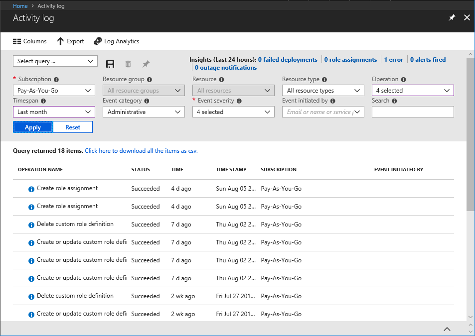

## Exercise

First Up Consultants reviews RBAC changes quarterly for auditing and troubleshooting purposes. You know that changes get logged in [Azure Activity Log](/azure/monitoring-and-diagnostics/monitoring-overview-activity-logs). Your manager has asked if you can generate a report of the role assignment and custom role changes for the last month.

In this exercise, you learn how to:

> [!div class="checklist"]
> * View activity logs for RBAC changes

## RBAC operations that are logged

Here are the RBAC-related operations that are logged in Activity Log. The activity logs are retained for 90 days.

- Create role assignment
- Delete role assignment
- Create or update custom role definition
- Delete custom role definition

## View activity logs

The easiest way to get started is to view the activity logs with the Azure portal.

1. Sign in to the [Azure portal](https://portal.azure.com/).

1. Click **All services** and then **Activity log**.

    

1. Set the **Timespan** filter to **Last month**.

1. Set the **Event category** filter to **Administrative**.

1. In the **Operation** filter, type **role** to filter the list.

1. Select the following RBAC operations:

    - Create or update custom role definition (roleDefinitions)
    - Delete custom role definition (roleDefinitions)
    - Create role assignment (roleAssignments)
    - Delete role assignment (roleAssignments)

    

1. Click **Apply** to apply your filters.

    You'll see all the role assignment and role definition operations for the last month.

    

1. Click the **Click here to download all the items as csv** link to download the activity logs as a CSV file.

## Summary

In this unit, you learned how to use Activity Log to list RBAC changes in the portal and generate a simple report.
