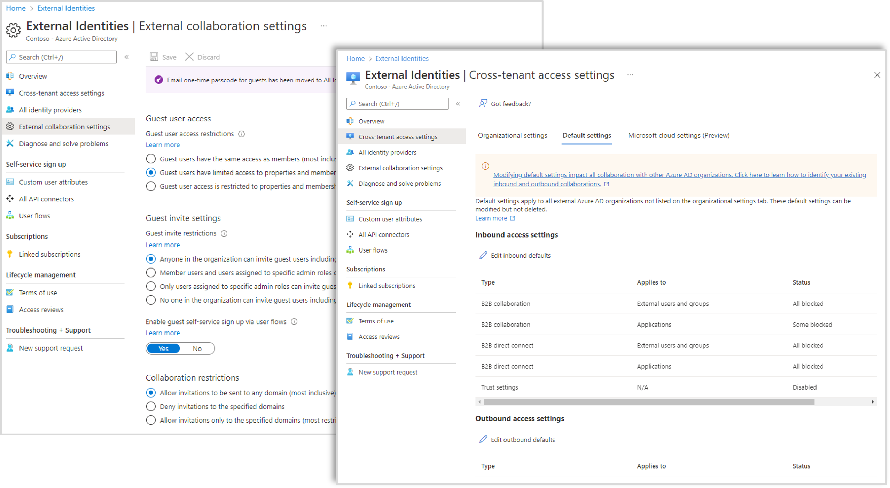
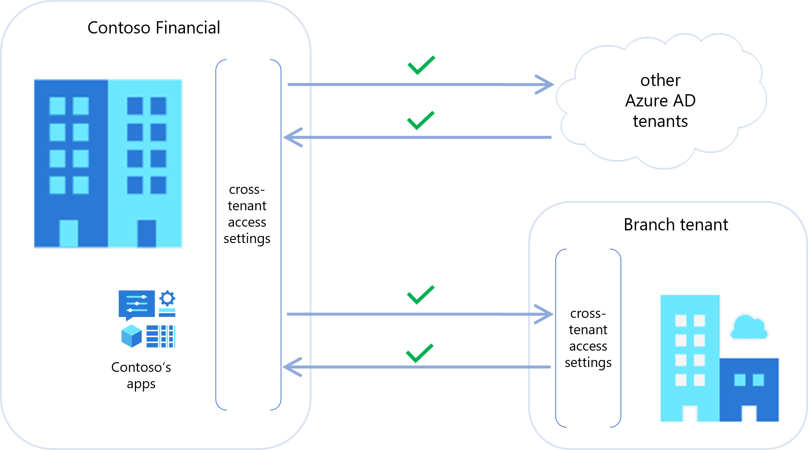
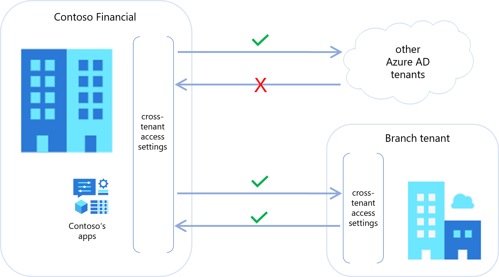
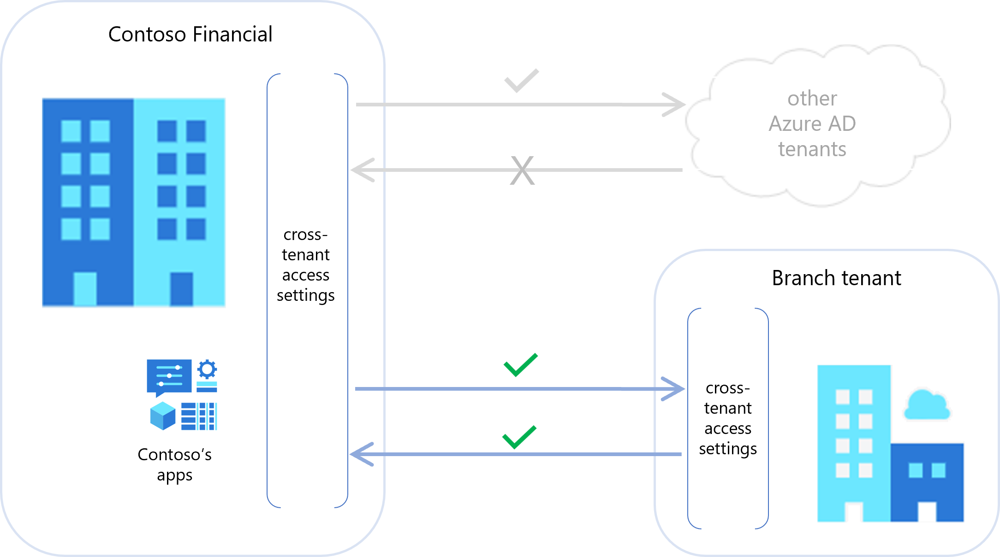
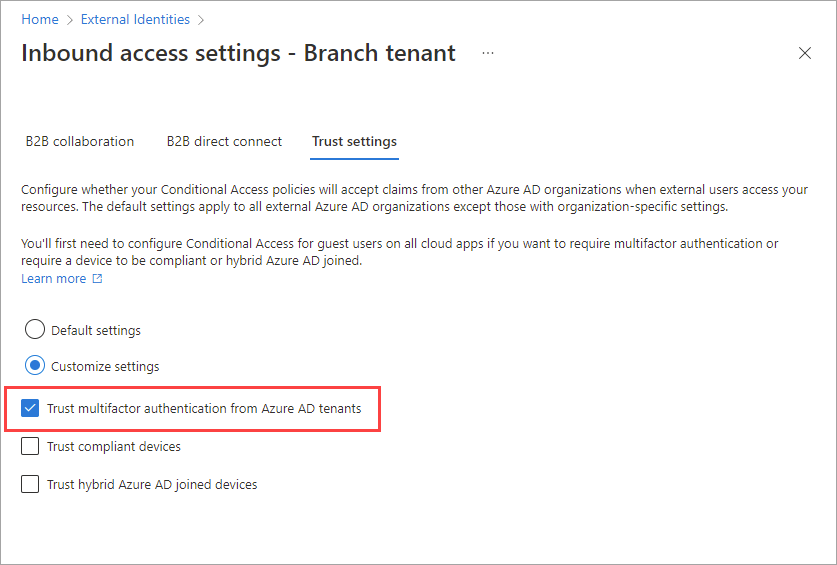

With Azure AD B2B collaboration, an organization can invite external people to sign in to their applications and services. For added security, organizations can use cross-tenant access settings to create detailed policies that determine who has access to which resources.

Here, you'll learn the cross-tenant access settings that let you allow or block B2B collaboration with other organizations by default.

## Managing B2B collaboration

There are different settings that let you control your inbound and outbound B2B collaboration. The setting you use depends on who you collaborate with and what you want to manage:

|When you're collaborating with  |And you want to manage  |Use these settings |
|---------|---------|---------|
|Other Azure AD organizations     |- Inbound and outbound B2B collaboration - Access to internal and external applications - Access for specific users, groups, and applications         | Cross-tenant access settings |
|Anyone (Azure AD orgs, non-Azure AD orgs, individuals)     | - Who in your organization can invite external users  - Whether specific domains are allowed or blocked - How much of your directory you want guest users to be able to access        |External collaboration settings |

When you use cross-tenant access settings, you're setting policies for collaboration with users who are part of another Azure AD organization. By contrast, External collaboration settings apply across all types of external users and organizations. When you plan your overall B2B collaboration policies, organizations need to be aware that all of these settings can affect their B2B collaboration experience.

## Default cross-tenant access settings

By default, both inbound and outbound B2B collaboration settings are "Allowed" before any cross-tenant access settings are updated. This means that your users can invite external guests to access your resources, and they can be invited to external organizations as guests. 

As we saw in our financial institution scenario, you might want more control over who has access to your internal applications. For example, you might want to allow everyone in your organization to collaborate with external partners using the partners' applications. But if you have internal applications with data that you need to restrict access to, you can block all inbound B2B collaboration with external Azure AD organizations. All of these policies can be set using cross-tenant access settings.

Even though your default settings come pre-configured, you can change them. When you do, the new default settings go into effect for all external Azure AD organizations.

If you want to allow outbound B2B collaboration with other Azure AD organizations, you would make sure your default settings are set to "Allowed".

But let's say that by default, you want to block all inbound B2B collaboration so that external Azure AD users can't access your restricted internal applications. You would update your default settings by choosing to block all inbound B2B collaboration. This is the case with our financial institution scenario.

## Creating organization-specific settings

Sometimes organizations have different sets of B2B collaboration requirements for different partners. For example, an organization might want to block B2B collaboration with all Azure AD organizations by default, but allow collaboration with one organization. In the financial institution scenario, the IT admin needed to create organization-specific settings for the branch office and allow B2B collaboration so their users could access the main branch's applications.

Through your cross-tenant access settings, you have the option of adding an organization and modifying the inbound and outbound B2B collaboration settings for that organization. These organizational settings then take precedence over the default settings.

The same B2B collaboration settings that are available at the default level are also available at the organizational level. Inbound settings control whether users from the other organization can be invited to your organization, and outbound settings either allow or block your users from being invited to the other organization. The settings can apply to all users and applications, or if you have an Azure AD premium license, they can apply to specific users, groups, or applications.

In our financial institution scenario, the main branch's internal applications contain highly sensitive data, so the IT admin blocked inbound B2B collaboration with other Azure AD organizations by default. However, the firm acquired a branch, which is managed in a separate Azure AD tenant. Because the branch employees needed access to the main applications, the IT admin wants to create an exception to allow inbound B2B collaboration for users in the branch.

## Trust multifactor authentication from another organization

One of the features of cross-tenant access settings is the ability to trust an external Azure AD organization's multifactor authentication claims. When an external user has already completed multifactor authentication in their home Azure AD tenant, not having to complete it again in your tenant makes for more a more streamlined sign-in experience.

This trust setting is available at both the default level and at the organizational level. This means you can choose to always trust multifactor authentication claims from all external Azure AD organizations, and you can trust these claims for individual organizations.

This feature is especially useful in our example scenario. Users in the newly acquired branch are considered part of the larger organization. Ideally they wouldn't be asked to perform multifactor authentication more than once while signing into their applications. To accomplish this, the IT admin can configure their branch-specific organizational settings to trust multifactor authentication claims from the branch.

Along with multifactor authentication trust settings, cross-tenant access settings also provide options for trusting device claims (compliant claims and hybrid Azure AD joined claims) from other Azure AD organizations.

