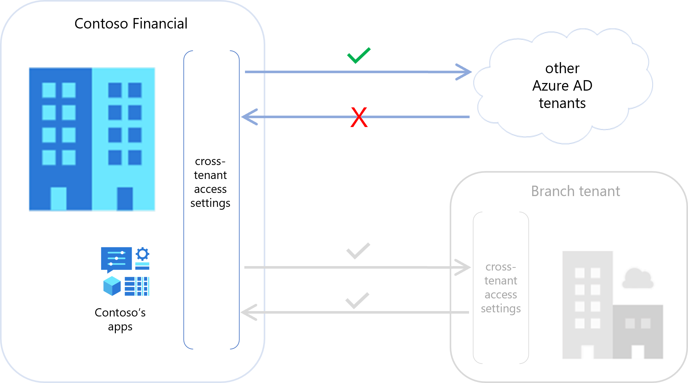
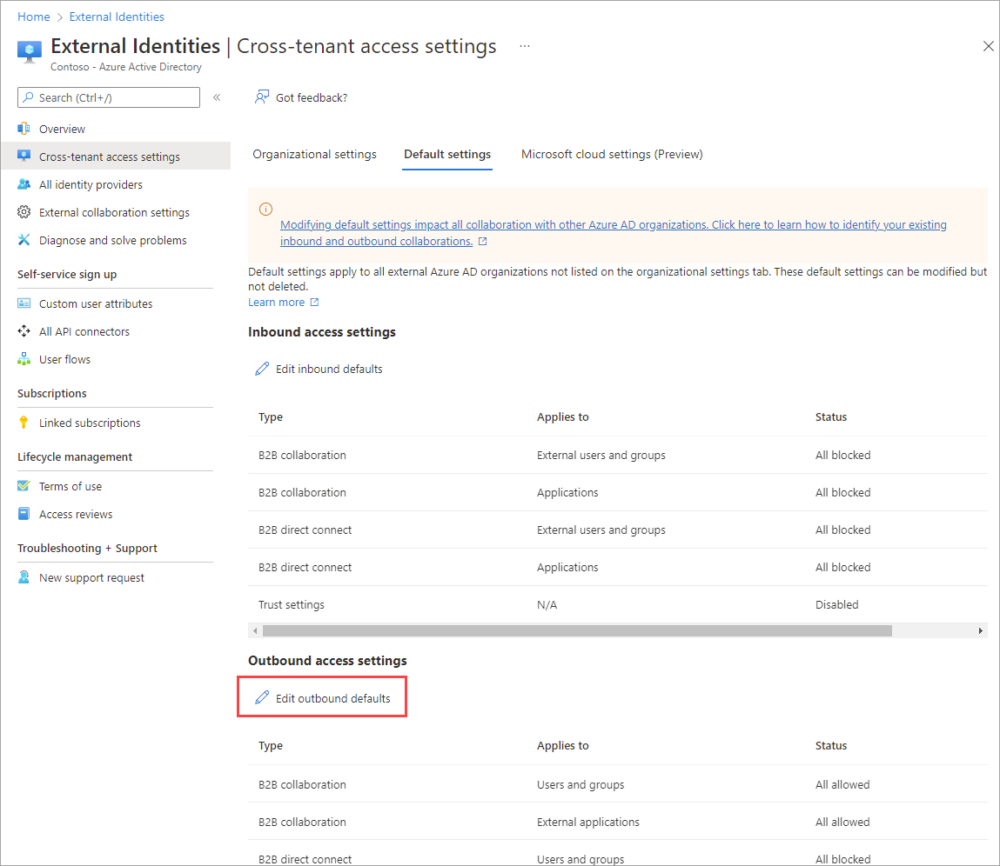
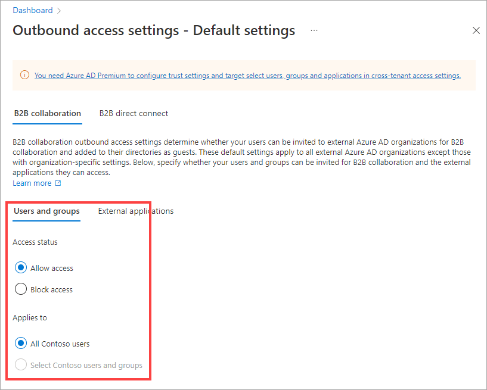
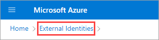
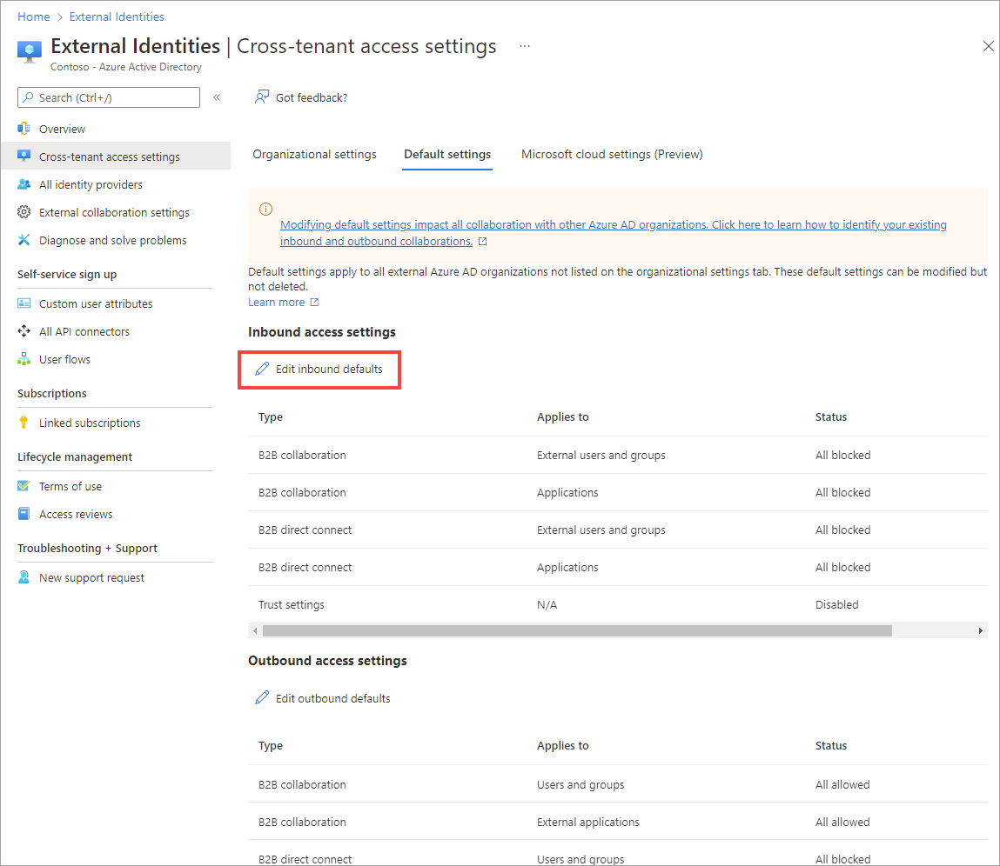
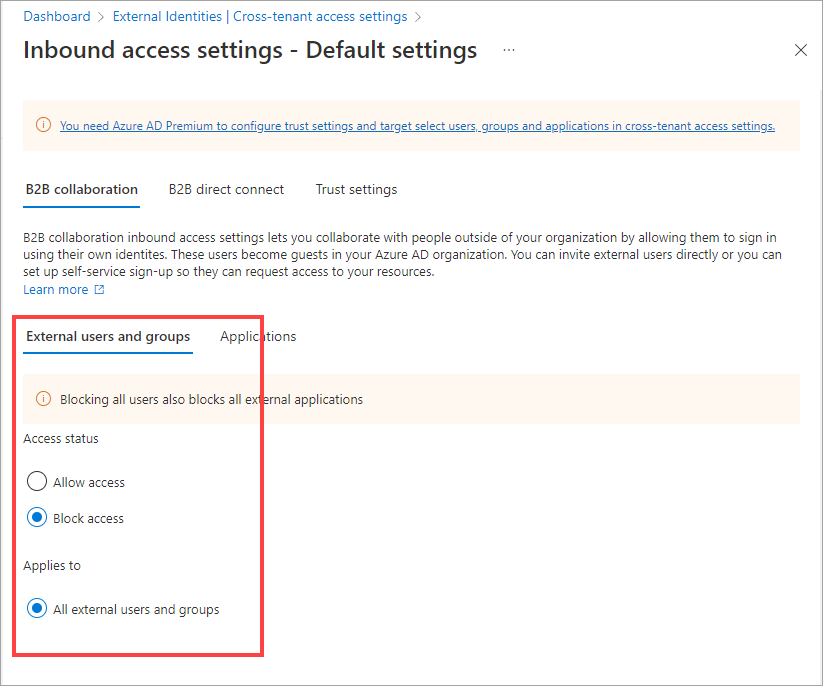
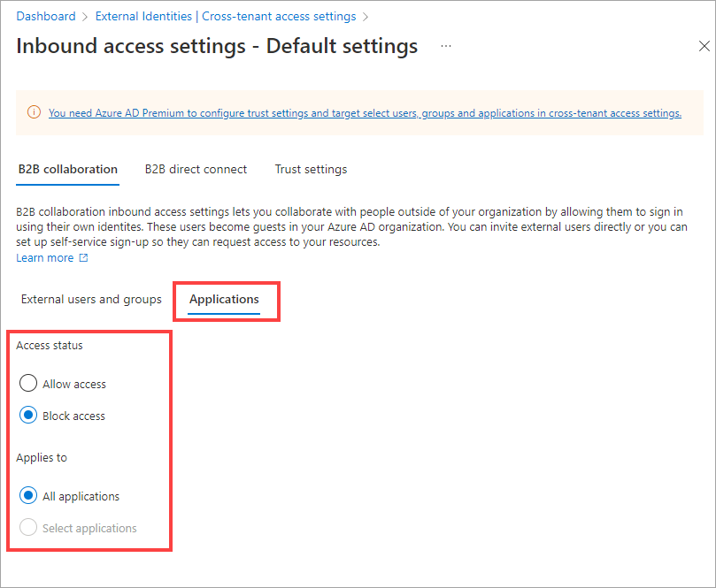
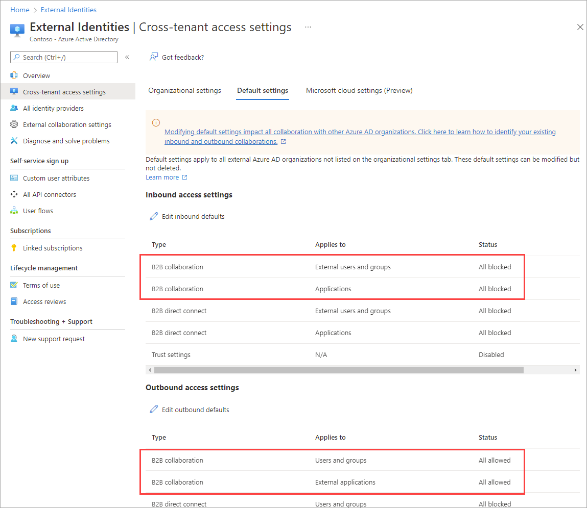

In this exercise, we'll configure default cross-tenant access settings. These settings represent the B2B collaboration policies you generally want to apply to all external Azure AD organizations.

Recall that in the financial institution example, you want to allow outbound B2B collaboration for all of your internal employees. But you want to protect your internal accounting applications by blocking all inbound B2B collaboration by default. The only users you want to be able to access your internal accounting applications are users from the newly acquired branch, which we'll configure later. Right now, we'll configure your default cross-tenant access settings for B2B collaboration with other Azure AD organizations in general.

To try this exercise yourself, you need an Azure subscription. If you don't have an Azure subscription, create a [free account](https://azure.microsoft.com/free/?azure-portal=true) and add a subscription before you begin. If you're a student, you can take advantage of the [Azure for students](https://azure.microsoft.com/free/students/?azure-portal=true) offer.

## Set default outbound cross-tenant access

Here, you'll configure your default outbound settings for B2B collaboration. You'll make sure your cross-tenant access settings will allow other Azure AD organizations to invite your users to their organization for B2B collaboration.

### Open the Azure Active Directory service in the portal

1. Open a web browser.
1. In the address bar, type https://portal.azure.com.
1. Sign in using your Azure AD admin account.
1. Open the Azure Active Directory service by following these steps:
   - Under **Azure services**, select **Azure Active Directory**, or
   - Use the search box search for "Azure Active Directory" and then select it.

### Configure default outbound settings

1. On the left navigation bar, select **External Identities**.
1. Select **Cross-tenant access settings**.
1. Select the **Default settings** tab.
1. Under **Outbound access settings**, select **Edit outbound defaults**.

   

1. Select **B2B collaboration**.
1. With **Users and groups** selected, make sure **Access status** is set to **Allow access**.
2. Under **Applies to**, make sure **All &lt;your organization name&gt; users** is selected.

   

1. Select **External applications**.
1. Make sure **Access status** is set to **Allow access** and make sure **Applies to** is set to **All applications**.
1. Select **Save**. Select **External Identities** in the breadcrumbs at the top of the page to return to the main **Cross-tenant access settings** page. Then go on to the next section.

    

## Set default inbound cross-tenant access

Now, you'll configure your default inbound settings to block all inbound B2B collaboration. You'll make sure your cross-tenant access settings will block everyone in other Azure AD organizations from being invited to your organization for B2B collaboration.

1. On the main **Cross-tenant access settings**, select the **Default settings** tab.
1. Under **Inbound access settings**, select **Edit inbound defaults**.

   

1. Select **B2B collaboration**.
1. With **External users and groups** selected, make sure **Access status** is set to **Block access**.
1. Under **Applies to**, make sure **All external users and groups** is selected.

   

1. Because the users and groups setting and the applications setting need to match, select **Applications**, and then select **Block Access**. Make sure **All applications** is selected.

   

1. Select **Save**. Select **External Identities** in the breadcrumbs at the top of the page to return to the main **Cross-tenant access settings** page. Then go on to the next section.

    
## Check your work

On the main **Cross-tenant access settings** page:

- In the **Inbound access settings** section, you should see two **B2B collaboration** rows. The **External users and groups** and **Applications** rows should both have a **Status** of **All blocked**.
- In the **Outbound access settings** section, you should see two **B2B collaboration** rows. Both of these rows should have a **Status** of **All allowed**.

   

All your users can now be invited by other Azure AD organizations to use B2B collaboration, but all external Azure AD users are blocked from using B2B collaboration to access your applications.