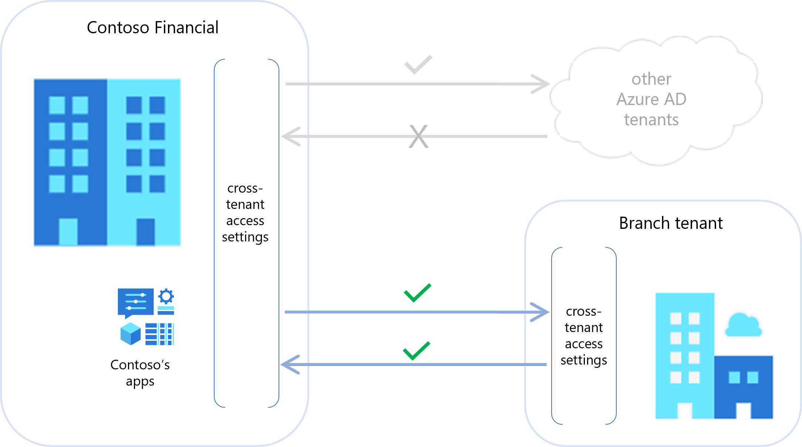
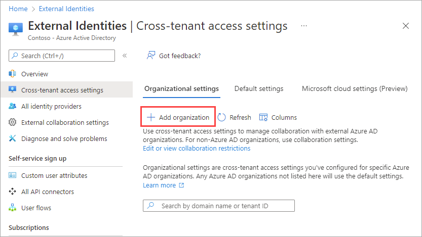
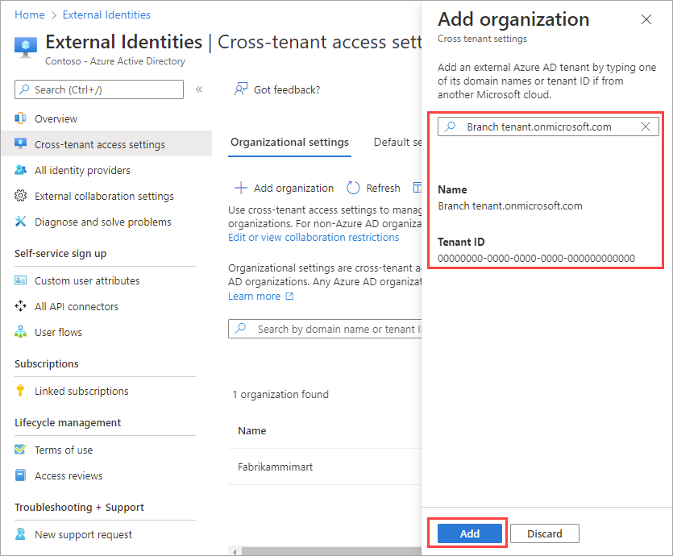
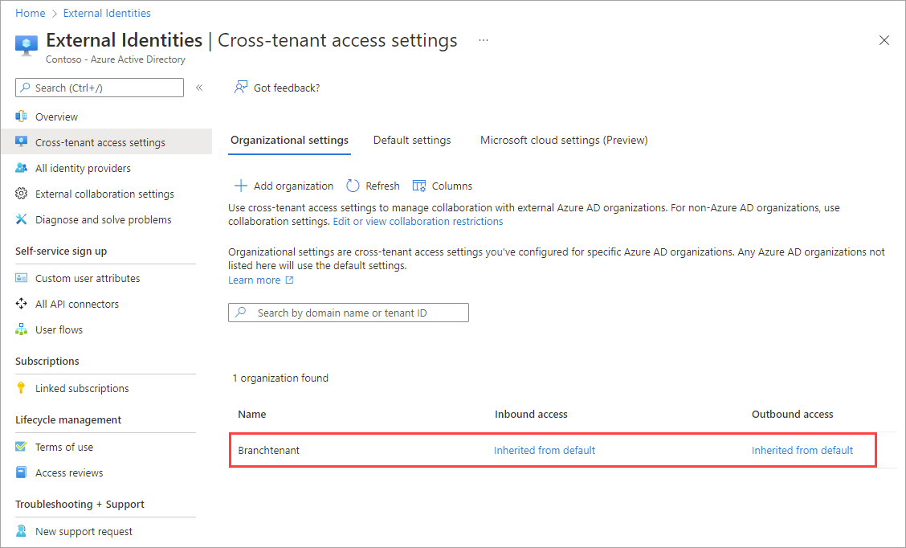
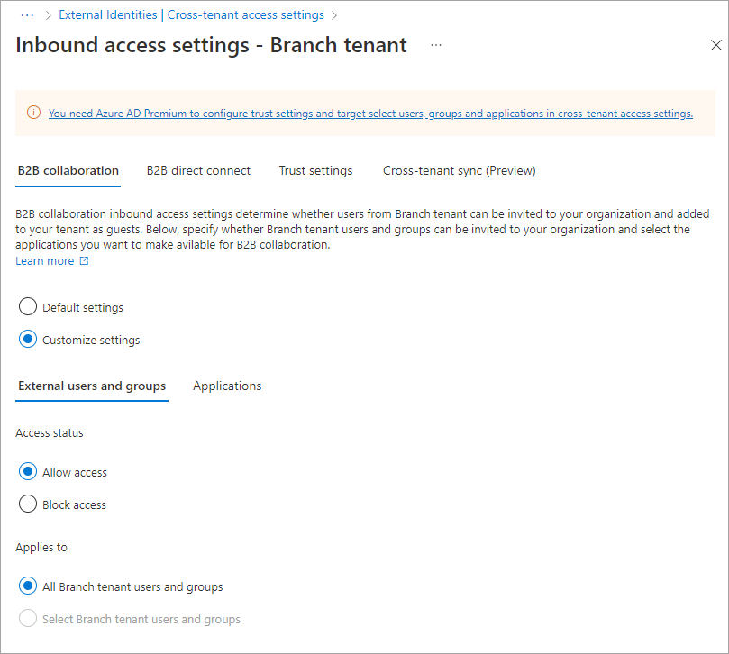
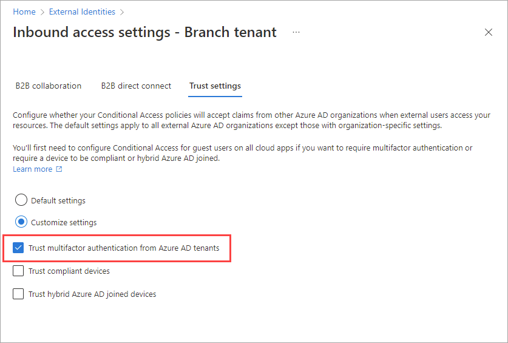

In this exercise, we'll configure cross-tenant access settings for a specific organization. These settings will take precedence over the default cross-tenant access settings for this organization only.

Recall that in the financial institution example, your default cross-tenant access settings allow outbound B2B collaboration and block inbound B2B collaboration for all external Azure AD organizations. Now that your financial institution has acquired a branch, you want to allow users in the branch to access your internal accounting applications using B2B collaboration. You also want to make sure that if a user has completed multi-factor authentication in the branch tenant, they won't be asked to do so again.

To try this exercise yourself, you need an Azure subscription. If you don't have an Azure subscription, create a [free account](https://azure.microsoft.com/free/?azure-portal=true) and add a subscription before you begin. If you're a student, you can take advantage of the [Azure for students](https://azure.microsoft.com/free/students/?azure-portal=true) offer.

## Create organizational settings

Here, you'll add an organization to your cross-tenant access settings. Then you'll configure the organization's inbound cross-tenant access settings to allow the organization's users to access your applications through B2B collaboration. You won't make any changes to the organization's outbound settings, which means your default settings will apply and other Azure AD organizations will be able to invite your users to their organization for B2B collaboration.

### Open the Azure Active Directory service in the portal

1. Open a web browser.
1. In the address bar, type https://portal.azure.com.
1. Sign in using your Azure AD admin account.
1. Open the Azure Active Directory service with the following steps:
   - Under **Azure services**, select **Azure Active Directory**, or
   - Use the search box search for "Azure Active Directory" and then select it.

## Add an organization

1. On the left navigation bar, select **External Identities**.
1. Select **Cross-tenant access settings**.
1. Select the **Organizational settings** tab.
1. Select **Add organization**.

   

1. On the **Add organization** pane, type the full domain name (or tenant ID) for the organization.
1. Select the organization in the search results, and the select **Add**.

   

Now the organization appears in the **Organizational settings** list. You'll notice that the settings in the **Inbound access** and **Outbound access** columns are all set to **Inherited from default**. Stay on this page and go to the next section to modify the inbound access settings for the organization.

   

## Modify the inbound settings for the organization

1. In the **Organizational settings** list, find the organization in the list and select the link in the **Inbound access** column.
1. Select **B2B collaboration**.
1. Select **Customize settings**.
1. Select **External users and groups**.
1. Under **Access status**, select **Allow access**.
1. Under **Applies to**, make sure **All &lt;organization name&gt; users and groups** is selected.

   

1. Select **Save**. Select **External Identities** in the breadcrumbs at the top of the page to return to the main **Cross-tenant access settings** page. Then go on to the next section.

    

## Trust multi-factor authentication from the organization

When you choose to trust multi-factor authentication, your Conditional Access policies will trust claims from the external organization about whether their user has completed multi-factor authentication in their home tenant. During authentication, Azure AD will check a user's credentials, and if a claim exists indicating that the user has completed multi-factor authentication, they won't be asked to do so again.

1. In the **Organizational settings** list, find the organization in the list and select the link in the **Inbound access** column.
1. Select the **Trust settings** tab.
1. Select **Customize settings**.
1. Select **Trust multi-factor authentication from Azure AD tenants**.

   

1. Select **Save**. Select **External Identities** in the breadcrumbs at the top of the page to return to the main **Cross-tenant access settings** page. Then go on to the next section.

    

## Check your work

On the main **Cross-tenant access settings** page, select the Organizational settings tab. Make sure the organization you added appears in the list and has the following settings:

- The **Inbound access** column should show **Configured**.
- The **Outbound access** column should show **Inherited from default**.

All users from the external organization can now be invited to your organization for B2B collaboration. And because this organization inherits outbound settings from your defaults, your users can also be invited to the external organization for B2B collaboration.