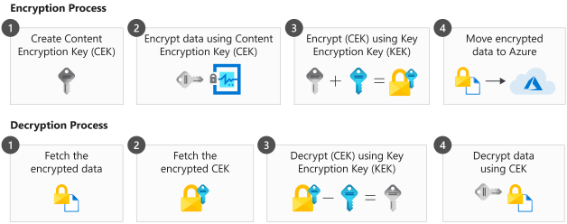

Your organization has data spread across various systems. These systems can be physical, or can be virtual and still rely on physical infrastructure somewhere. Your organization's data should be protected at different levels. You can encrypt disks to encrypt the data physically. If you are dealing with virtual machines, you can also encrypt the data on the VHDs. You can also use client-side encryption and encrypt data inside of the files that store the data.

Here, you'll learn about encryption at rest, and the various tools and services available to you to ensure your data is encrypted.

## Secure storage accounts with SSE

Based on the type of classification, when your data is stored it will need continuous protection. You can use Azure Storage Service Encryption (SSE) to encrypt data stored at rest in your Azure storage accounts. Data in storage accounts is physically stored on hard drives. It's unlikely that a physical hard disk in an Azure data center would be stolen. Personal devices and laptops are easier targets. However, it's important to have safeguards that meet your organization's regulatory obligations, and strategy for keeping data secure.

Azure Storage Service Encryption uses 256-bit AES encryption. When your data is in any tier of Azure storage account it's encrypted by default. Each storage account is automatically encrypted as it's created. In fact, you can't disable encryption for storage accounts even if you wanted to. You do have the option to choose whether you want to use your own customer-managed keys (BYOK) or the default Microsoft-managed keys that are kept secure in Azure Key Vault.

Azure Storage Service supports encryption for the following types of storage:

- Azure Blob
- Azure Table Storage
- Azure Files
- Azure Queue Storage
- Azure-Managed Disks

## Secure disks with Azure 

Just like Azure Storage Service Encryption, Azure Disk Encryption (ADE) helps to ensure your data is secured. This encryption keeps you compliant with your organization's strategy and regulatory legal obligations. Your virtual machines on Azure all have disks allocated to them. Azure Disk Encryption ensures that these disks are encrypted.

With Azure Disk Encryption, you can choose to add an additional layer of security for your data by encrypting the VHD files. This way, you ensure all of the operating system disks and the data disks are encrypted. The storage account the disks are on is already encrypted through Azure Storage Service Encryption. This encryption is achieved through DM-Crypt if you're dealing with Linux- based virtual machines. If you're working with Windows-based virtual machines, BitLocker handles the encryption.

Always take a snapshot of the VM, or create a backup, before enabling disk encryption. This action keeps your VM safe in case a problem occurs during the disk encryption process. Another thing to keep in mind is that when you are encrypting Linux OS disks, you should consider those Linux machines unusable while encryption is ongoing. And finally, the Azure Key Vault for the keys and the virtual machine should always be in the same region.

When you've taken the appropriate precautions, you can enable disk encryption on a VM. You can also keep all of your disk encryption keys secure in Azure Key Vault. Below is an example in Azure CLI, encrypting a VM running on Azure:

```azurecli
az vm encryption enable \
--resource-group "YourVirtualMachineResourceGroup" \
--name "YourSecureVM" \
--disk-encryption-keyvault "YourSecureVault"\
--volume-type [All|OS|Data]
```

Finally, ensure that the disks have indeed been encrypted by verifying:

```azurecli
az vm encryption show --name "YourSecureVM" --resource-group "YourVirtualMachineResourceGroup"
```

## Secure data with client-side encryption

How do you ensure that the actual data resident in files is encrypted? You need to be able to encrypt this data yourself before it is moved and stored in Azure storage.

That's where client-side encryption comes in. Your application can encrypt all of the data before it lands in Azure. The data is then decrypted by the application when it fetches this data back. You can use .NET, Python, or Java Azure Storage Client libraries to encrypt the data. You use Azure Key Vault with all of these libraries to take care of your encryption keys.



### Encryption

To encrypt the data, you would use the storage client library to first create a content encryption key (CEK). You then encrypt the data on your end, using this content encryption key. This key will then be encrypted using a key encryption key (KEK). A KEK can either be one you already have, or one that's stored in Azure Key Vault. Finally, the encrypted data can then be stored into Azure Storage. This is referred to as envelope encryption.

### Decryption

To decrypt the data, the key encryption key is needed. However, you don't need to know the actual key encryption key that was used to encrypt the content encryption key. You would typically use a key resolver, which goes through a group of keys and fetches the correct one.

Your storage client library can then fetch the data that was encrypted previously. To start decrypting the data, the content encryption key is decrypted using the key encryption key. The library calls the key provider, whether Azure Key Vault or your own, to decrypt the content encryption key with the appropriate key encryption key. The library has no access to this key. When the content encryption key is decrypted, the data is finally decrypted.
