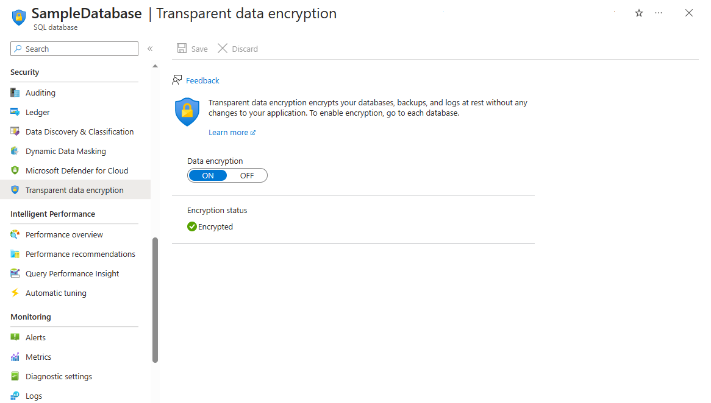

To follow regulations, your company wants to ensure that all data in its databases is encrypted when it's stored in Azure.

- By the end of this unit, you'll:

  - Understand why you should enable encryption at rest on a database in Azure.
  - Understand how encryption at rest works in the background on a database in Azure.
  - Understand what's happening in the background for encryption in Azure databases.
  - Understand how to enable encryption at rest on a database in Azure.
  
## Secure your SQL database with transparent data encryption (TDE)

SQL databases store your data in a structured format – in data files.  These files can be encrypted so that, if either the hard drives that store the data are compromised, or the data files are stolen, the data will be secure. For Azure SQL Database, you can achieve this encryption at rest through transparent data encryption (TDE).  Transparent data encryption in Azure SQL Database encrypts not only the data files, but also the transaction log files, and any backups for your databases. This process is encrypted, and entirely transparent to the applications using the databases.  For older SQL Databases, transparent data encryption isn't enabled by default.

Transparent data encryption ensures that an entire database is encrypted through a defined process.  A database encryption key is used to encrypt the database.  This key is then secured by a transparent data encryption protector. The protector can be a key you've stored in Azure Key Vault or a certificate managed for you.  The database encryption key is decrypted at the moment the database is started.  Afterwards, this same database encryption key is used to decrypt the database, and encrypt it again when the time comes.

You can manually enable transparent data encryption for a SQL Database on Azure, through Azure PowerShell, Transact-SQL, or the Azure portal.  In the Azure portal, look for transparent data encryption under the settings in your SQL Database, then select **ON** under data encryption.  

Below is an example showing how you can enable TDE in the portal:

## Secure your Cosmos DB with automatic encryption at rest

Cosmos DB databases allow your data to be stored in an unstructured format. Databases for Cosmos DB are physically stored in hard drives – solid state for Cosmos DB. Cosmos DB components, like backups, are stored in HDDs, not solid-state drives. Despite this, you can protect components simultaneously with encryption at rest, regardless of the type of physical storage. Your media attachments, the actual databases, or back-ups can all be protected at rest.  At the same time, none of this encryption affects the latency and throughput SLAs that Cosmos DB sets out to meet.

<!--  Link to original image: https://docs.microsoft.com/en-us/azure/cosmos-db/media/database-encryption-at-rest/design-diagram.png -->

Data in your Cosmos DB is protected using AES-256 encryption. In the background, the Azure Cosmos DB Management Service, with the help of a Secret Store, manages all of your encryption keys and unwraps them when necessary.  These keys are used to encrypt and decrypt your data.  Microsoft manages the keys for you – the encryption keys are also rotated to keep your data secure.

Encryption at rest is automatically enabled by default, whatever the region.  This situation means you can use turnkey global distribution, and confidently replicate your data to any region, knowing that all of your data is automatically encrypted.  In fact, you can't disable encryption even if you wanted to. Because encryption is enabled by default, there's nothing to do on your end to configure Cosmos DB  to encrypt all of your data.  

The process for how your data is secured is straightforward. The user establishes a secure connection with Cosmos DB and sends data. The data to be stored in Cosmos DB is securely encrypted, and written to secure storage together with any relevant indexing data. A secured backup is then created routinely.
