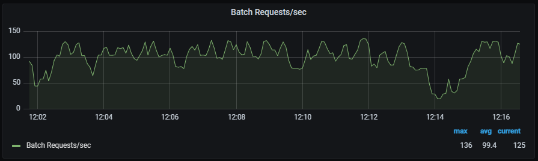
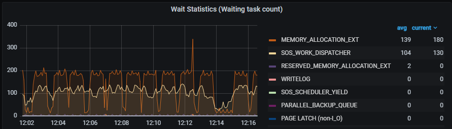
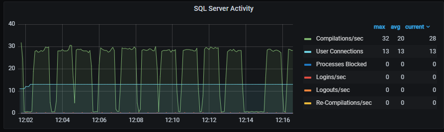
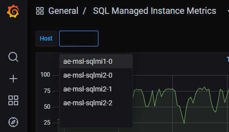

An Azure Arc-enabled SQL Managed Instance deployment provides the ability to monitor the environment locally using Azure Data Studio and Grafana out of the box. In this exercise, you'll learn how to access Grafana and what metrics are captured and provided by default. 

Utilizing the Grafana dashboards locally in your Arc-enabled SQL Managed Instance environment provides you with insights into the infrastructure (Kubernetes Cluster) as well as the performance of the Arc-enabled SQL Managed Instance.

> [!IMPORTANT]
> The modules in this learning path form a progression. To complete this exercise, you need to first complete the [preceding modules in this path](/training/paths/get-started-azure-arc-sql-managed-instance/).

1. Open Azure Data Studio.
1. Expand the **Connections** Tab.
1. Expand **Azure Arc Controllers**.
1. Expand your Arc data controller.
1. Right-click your Arc-enabled SQL Managed Instance and select **Manage**.

    

1. Select **Grafana Endpoint**.
1. Enter your `Metrics and Logs Dashboard credentials`
1. Discover the performance metric graphs for your Arc-enabled SQL Managed Instance:
    - Transactions/sec

    

    - Batch Requests/sec

    

    - Wait Statistics

    

    - Memory Broker Clerks

    

    - Database Activity

    

    - SQL Server Activity

    

    - Buffer Cache - Memory

    

    - Memory Manager

    

1. Swap to another deployed Arc-enabled SQL Managed Instance. Select the **Host** drop-down.

    

1. Investigate the Kubernetes Host Node Metrics.

    

1. Investigate the Kubernetes Pods and Containers Metrics.

    
