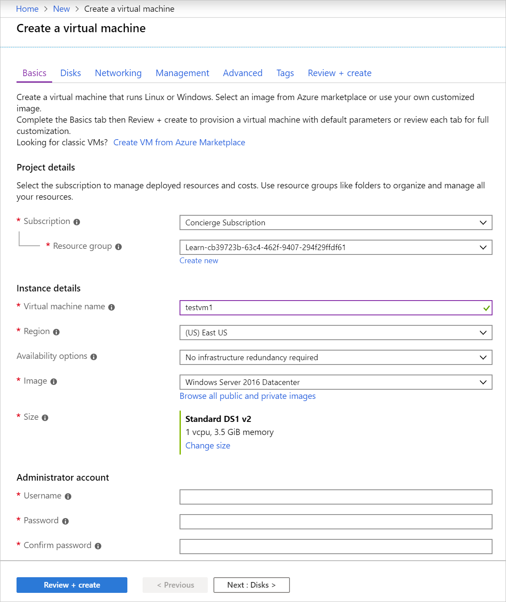

Computer systems that interact directly with users are considered _endpoint systems_. Systems on devices, such as laptops, smartphones, tablets, and computers, all need to be secured to help prevent them from acting as gateways for security attacks on an organization’s networked systems.

IaaS solutions such as virtual machines incurs more customer responsibility than PaaS and SaaS, and Azure Security Center provides the tools you need to harden your network, help secure your services, and stay on top of your security posture.

## Protect against malware

The first step is to always make sure your endpoint systems are protected against malware. Malware is malicious software intended to cause damage to a computer or network. It often exploits vulnerabilities in software or unsuspecting users who unknowingly install it.

You can protect against this scenario through several built-in features:

- Keep your servers up-to-date with the latest OS fixes and versions. Security Center will automatically alert you when monitored systems are unpatched.
- Install antimalware such as **Microsoft Antimalware for Azure Cloud Services and Virtual Machines** to help identify and remove viruses, spyware, and other malicious software.
- Integrate your antimalware solution with Azure Security Center to monitor the status of the antimalware protection.

This last step is crucial to a complete monitoring plan. Security Center highlights issues such as detected threats and insufficient protection, which make your VMs and computers vulnerable to malware threats. By using the information on Endpoint protection issues, you can make a plan to address any identified issues.

## Install and configure antimalware for VMs

**Microsoft Antimalware** is available as an extension that you can add to existing VMs, or include as part of the creation of a new VM. You can use the Azure portal, Azure CLI / Powershell, or ARM template to include the extension.

Let's use the Azure portal to create a new VM and install the extension.

1. Sign in to the [Azure portal](https://portal.azure.com/?azure-portal=true) using the same account you used to activate the Azure Sandbox.

1. Select **Create a resource** from the left sidebar.

1. Select **Windows Server 2016 Datacenter** from the quick pick list.

1. Fill out the **Basics** tab with the following information.
    - **Subscription**: select _Concierge subscription_.
    - **Resource group**: select _<rgn>[Learn sandbox resource group]</rgn>_ from the drop-down list.
    - **Virtual machine name**: enter a VM name such as _testvm1_.
    - **Region**: select a region such as _East US_.
    - **Username**: select a valid username you will remember.
    - **Password**: select a valid password you will remember.

    

1. Select the **Advanced** tab. Here you can add extensions to the new VM. Click the **Select an extension to instal** and use the search box to locate **Microsoft Antimalware** and select **Create** to install it.

1. The options for the extension include the ability to ignore certain folders, filenames, and control when and how the extension scans the disk for malware. You can leave the default options in place.

    

1. Select **OK** to move back to the **Advanced** tab and note that the malware extension is set to install.

    

1. Select **Review + Create**, verify the settings and create the new VM.

## Adding the extension to an existing VM

You can also add the antimalware extension to an existing VM after it has been created. This can be done with command-line tools (so it can be scripted), using the REST APIs, or through the Azure portal.

1. Select the VM you want to install the extension into.
1. Select the **Extensions** section under **Settings**.

    

1. Locate **Microsoft Antimalware** in the presented list and select **Create** on the details screen to add the extension to your VM.

1. The same extension options are available as seen above. Once it's installed (it will take a few minutes), the extensions pane will update and show the malware extension.

    

### Monitor the status of antimalware

Azure Security Center monitors the status of antimalware protection and reports this on the **Endpoint protection issues** view in the **Compute & apps** section.

Security Center notes issues, such as detected threats and insufficient protection, that might make your VMs and computers vulnerable to malware threats. By using the information on **Endpoint protection issues**, you can make a plan to address any identified issues.

Security Center reports the following endpoint protection issues:

- **Endpoint protection not installed on Azure VMs** - A supported antimalware solution isn’t installed on these Azure VMs.

- **Endpoint protection not installed on non-Azure computers** -  A supported antimalware solution isn’t installed on these non-Azure computers.

- **Endpoint protection health issues**:

  - *Signature out of date*. An antimalware solution is installed on these VMs and computers, but the solution doesn’t have the latest antimalware signatures.

  - *No real time protection*. An antimalware solution is installed on these VMs and computers, but it isn’t configured for real-time protection. The service might be disabled, or Security Center might be unable to obtain the status because the solution isn’t supported.

  - *Not reporting*. An antimalware solution is installed but not reporting data.

  - *Unknown*. An antimalware solution is installed, but either its status is unknown or it’s reporting an unknown error.
