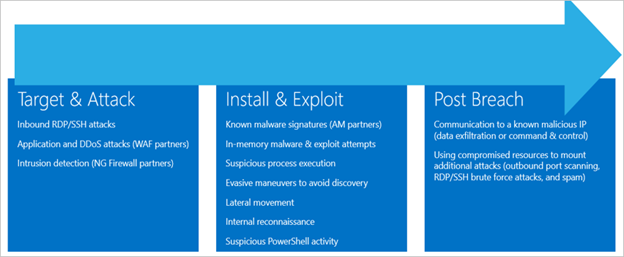

Azure Security Center automatically collects, analyzes, and integrates log data from several sources to identify credible threats to your workloads. Data from your Azure resources, the network, and connected partner solutions (like firewalls) is correlated and processed with machine learning and advanced security analytics to reduce false positives.

This allows Security Center to detect threats such as:

- Compromised VMs communicating with known malicious IP addresses.
- Advanced malware detected by Windows error reporting.
- Brute-force attacks against VMs.
- Security alerts from integrated partner security solutions, such as anti-malware or web application firewalls.

When a threat like this is detected, Security Center will generate a _security alert_.

## What is a security alert?

Alerts are the notifications that Security Center generates when it detects threats on your resources. Security Center prioritizes and lists the alerts, along with the information needed for you to quickly investigate the problem. Security Center also provides recommendations for how you can remediate an attack.

### Alert types

Azure Security Center provides a variety of alerts that align with the stages of the kill chain. The kill chain consists of three phases: **Target and Attack**, **Install and Exploit**, and **Post Breach**. Different types of attacks are associated with each stage, and they target different subsystems. For example, the target and attack phase include inbound RDP/SSH attacks and intrusion detection.

The alerts contain valuable information about what triggered the alert, the resources targeted, and the source of the attack. The information included in an alert varies based on the type of analytics used to detect the threat. Incidents might also contain additional contextual information that might be useful during the investigation of a threat. To address attacks during these stages, Security Center has categories of alerts:

- Virtual machine behavioral analysis
- Network analysis
- SQL database and SQL Data Warehouse analysis
- Contextual information

These alerts are triggered when either a threat or suspicious activity takes place.

## Viewing security alerts

You can view collected security alerts directly in Azure Security Center on the **Overview** page, through command-line tools, or using the REST API. The portal is the easiest way to view alerts - it displays a graph of your current alerts, colored by the severity level (high, medium, or low).

Selecting the **Threat protection** tile presents more detailed information as shown in the following image:

You can filter alerts based on the date, state, and severity. Filtering alerts might be useful for scenarios where you need to narrow the scope of the security alerts. For example, you might you want to address security alerts that occurred in the last 24 hours if you’re investigating a potential breach in the system.

Select **Filter** on the **Security alerts** page. The **Filter** area opens, and you select the date, state, and severity values you want to see.

### Analyzing an alert

Select a security alert to learn more about the events that triggered it and what steps, if any, you need to take to remediate an attack. Security alerts are grouped by type and date. Selecting a security alert opens a view containing a list of the grouped alerts, as the following figure depicts.

In this case, the alerts that were triggered refer to suspicious malware activity. The first column lists which resources were attacked, the second displays how many times the resource was attacked, the third displays the time of the attack, the fourth displays the state of the alert, and the fifth displays the severity of the attack. After reviewing this information, select a resource that was attacked to get specific information about:

1. **What happened?** (_Possible compromised machine detected_)
1. **When did it happen?** (_Sunday , August 11 2019 3:01:00 AM_)
1. **What resource was attacked?** (_vm4_)
1. **Where is the resource located?** (_Azure_)
1. **What should you do about it?** (Remediation steps)

### Responding to security alerts

The **DESCRIPTION** area has more details about this event. These details offer insight into what triggered the security alert, the target resource, the source IP address (when applicable), and recommendations about how to remediate the event. In some cases, the source IP address is empty (not available), because not all Windows security event logs include the IP address.

The remediation steps suggested by Security Center vary according to the security alert. In some cases, you might have to use other Azure capabilities to implement the recommended remediation. For example, the remediation for this attack is to run a full malware scan on the machine.

From this page, you can also start an investigation to better understand the timeline of the attack, how the attack took place, which systems were potentially compromised, and which credentials were used, and you can get a graphical representation of the entire attack chain.

## Relating security alerts together

Attacks against cloud-based resources often generate large amounts of data and picking through all the individual alerts can be a cumbersome process to identify the root cause. As seen above, Security Center tracks individual security alerts, but it also uses big data and machine learning technologies to combine individual alerts into _incidents_.

An incident is a collection of related individual alerts. Note that this combining of related alerts into incidents is an advanced capability of Security Center and requires at least the Standard tier for Azure Security Center.

By presenting related alerts together, a security engineer can quickly see the "big picture" of what's happening and start the process of blocking or remediating the attack.
