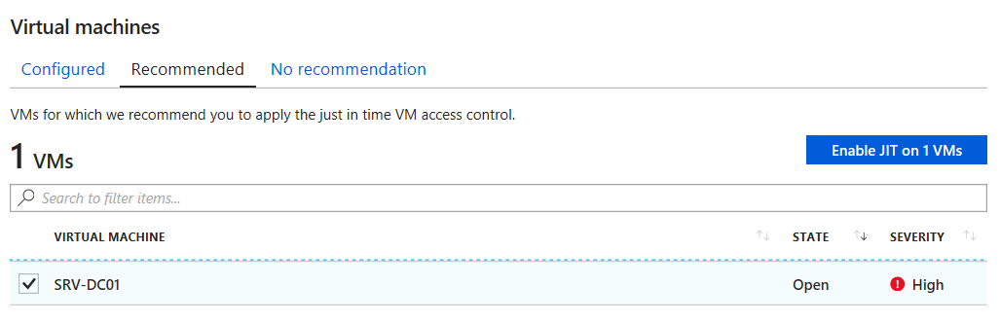
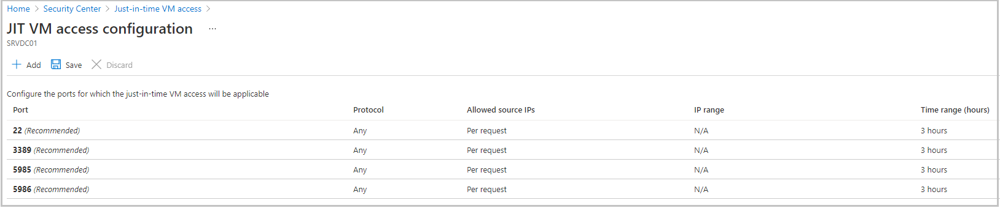
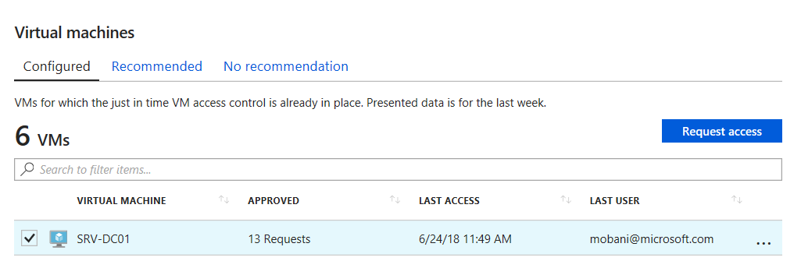
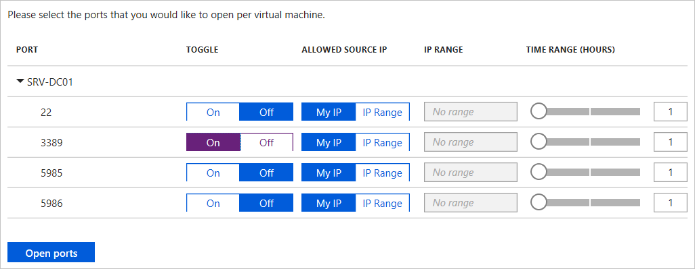

You need to have the enhanced security features of Microsoft Defender for Cloud to use this feature. After you activate a trial or enable enhanced security on your subscription, you can enable Just-in-time (JIT) virtual machine (VM) access for selected Azure virtual machines (VMs) in the subscription. If you don't want to start a trial now, you can read through the following instructions to see the required steps.

## Create a new VM

Let's start by creating a virtual machine using Azure Cloud Shell.

> [!NOTE]
> This exercise can't be performed in the Azure Sandbox. Make sure to select a subscription that has enhanced security features enabled for Defender for Cloud.

1. Sign in to the [Azure portal](https://portal.azure.com?azure-portal=true).

1. Select the Cloud Shell icon from the top right of the Azure portal toolbar. Cloud Shell appears at the bottom of the portal.

    Start by setting some default values, so you don't have to enter them multiple times.

1. Set a default location. Here, we use **eastus**, but feel free to change that to a location closer to you.

    ```azurecli
    az configure --defaults location=eastus
    ```

    <!-- Paste tip-->
    [!include[](../../../includes/azure-cloudshell-copy-paste-tip.md)]

1. Next, create a new Azure *resource group* to hold your VM resources. We used the name `mslearnDeleteMe` here to remind ourselves to delete this group when we're finished.

    ```azurecli
    az group create --name mslearnDeleteMe --location eastus
    ```

1. Go ahead and set `mslearnDeleteMe` as the default resource group.

    ```azurecli
    az configure --defaults group="mslearnDeleteMe"
    ```

1. Next, run the following command to create a new Windows-based VM. Make sure to replace the `<your-password-here>` value with your own valid password.

    ```azurecli
    az vm create \
        --name SRVDC01 \
        --image win2019datacenter \
        --resource-group mslearnDeleteMe \
        --admin-username azureuser \
        --admin-password <your-password-here>
    ```

    It takes a few minutes to create the VM and supporting resources. You should get a response similar to the following example.

    ```json
    {
      "fqdns": "",
      "id": "/subscriptions/abcd/resourceGroups/mslearnDeleteMe/providers/Microsoft.Compute/virtualMachines/SRVDC01",
      "location": "eastus",
      "macAddress": "00-00-00-00-00-00",
      "powerState": "VM running",
      "privateIpAddress": "10.1.0.4",
      "publicIpAddress": "52.123.123.123",
      "resourceGroup": "mslearnDeleteMe",
      "zones": ""
    }
    ```

1. To connect to the VM using Remote Desktop (RDP), use the public IP address in the response. Windows has a built-in RDP client. If you use a different client system, there are clients available for macOS and Linux.

You can connect and administer the VM. Let's add JIT for security!

## Enable JIT VM access in Defender for Cloud

1. On the home page of the [Azure portal](https://portal.azure.com?azure-portal=true) in the top search bar, search for and select  **Microsoft Defender for Cloud**. The **Overview** pane for *Microsoft Defender for Cloud* appears.

1. In the left menu pane, under **Cloud Security**, select **Workload protections**. The **Workload protections** pane displays.

1. In the main window, scroll down to **Advanced protection**. select **Just-in-time VM access**. The **Just-in-time VM access** pane appears.

1. Under **Virtual machines**, select the **Not Configured** tab.

1. Select the virtual machine from the resource group, *MSLEARNDELETEME*.

1. Select **Enable JIT on 1 VM** with your selected VM, as shown in the following screenshot.

    

    The **JIT VM access configuration** pane appears for your VM. After you enable the JIT rules, you can examine the Network Security Group for the VM. It has a new set of rules applied to block remote management access, as shown in the following image.

    

    Notice that the rules are applied to the internal address, and all management ports are included - both Remote Desktop Protocol (3389) and SSH (22).

1. On the top menu bar, select **Save**. The **Just-in-time VM access** pane reappears.

## Request Remote Desktop Access

If you try to RDP into the Windows VM at this point, access is blocked. When your admin needs access, they can come into Defender for Cloud to request access.

1. Under **Virtual machines**, select the **Configured** tab.

1. Select your VM, and then select **Request access** to open up the management ports.

    

    The **Request access** pane appears for SRVD01.

1. Select the ports you want to open; in this case, the Remote Desktop port (3389).

    

1. Select **Open ports** to finalize the request. You can set the number of hours to keep the port open from this pane as well. After the time expires, the port is closed, and access is denied.

Now, your Remote Desktop client can connect successfully - at least for the time period that you allotted through Defender for Cloud.
