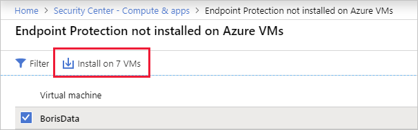
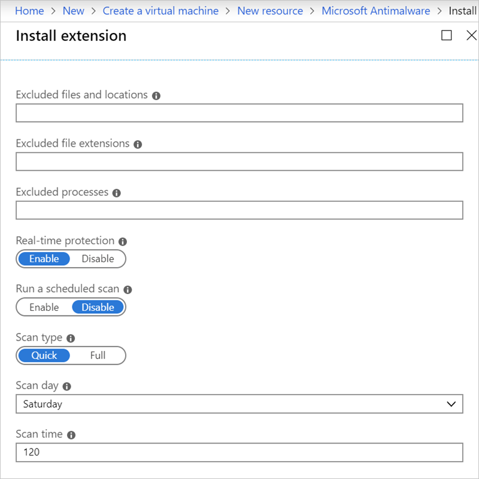
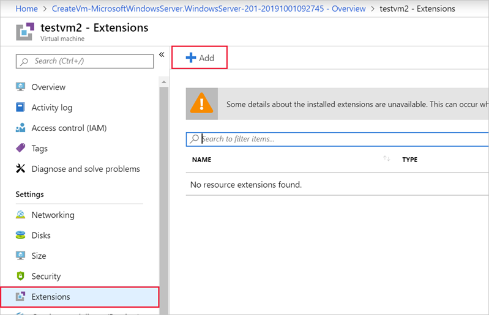
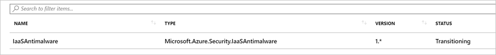

Azure Security Center monitors the status of antimalware protection for your VMs. Security Center notes issues, such as detected threats and insufficient protection, that might make your VMs and computers vulnerable to malware threats. By using the information on **Endpoint protection issues**, you can make a plan to address any identified issues.

1. Open the **Azure Security Center** overview page. Select the **Home** > **Azure Security Center** link in the upper left corner of the portal.

1. In the menu pane, select **Product overview**. The **Overview** pane for the Security Center appears.

1. Select the **Compute & apps** section under **RESOURCE SECURITY HYGIENE**.

1. You can either find the **Install endpoint protection solution on virtual machines** entry in the Overview, or filter your view to **VMs and Computers** where you can see recommendations based on the virtual machines.

Security Center reports the following endpoint protection issues:

- **Endpoint protection not installed on Azure VMs** - A supported antimalware solution isn't installed on these Azure VMs.

- **Endpoint protection not installed on non-Azure computers** -  A supported antimalware solution isn't installed on these non-Azure computers.

- **Endpoint protection health issues**:

  - *Signature out of date*. An antimalware solution is installed on these VMs and computers, but the solution doesn't have the latest antimalware signatures.

  - *No real-time protection*. An antimalware solution is installed on these VMs and computers, but it isn't configured for real-time protection. The service might be disabled, or Security Center might be unable to obtain the status because the solution isn't supported.

  - *Not reporting*. An antimalware solution is installed but not reporting data.

  - *Unknown*. An antimalware solution is installed, but either its status is unknown, or it's reporting an unknown error.

For VMs which are vulnerable, Security Center will offer to resolve the issue and install malware protection onto the unprotected VMs.

However, you can also install this protection yourself. Let's examine those steps.

## Install Antimalware in a new VM

**Microsoft Antimalware** is available as an extension that you can add to existing VMs, or include as part of the creation of a new VM. You can use the Azure portal, Azure CLI / PowerShell, or ARM template to add the extension.

Let's use the Azure portal to create a new VM, and install the extension.

1. Sign in to the [Azure portal](https://portal.azure.com/?azure-portal=true) with the same account and subscription you used in the previous exercise. We'll reuse the same resource group so we can delete both VMs at the same time.

1. On the Azure portal menu or the **home** page, select **Create a resource**. The **Create a resource** pane appears.

1. Select **Windows Server 2019 Datacenter** from *Popular products*. The **Create a virtual machine** pane appears.

1. On the **Basics** tab, enter the following values for each setting.

    | Setting | Value |
    |---|---|
    | **Project details** |
    | Subscription | Select your subscription. |
    | Resource group | Select the resource group you previously created (*mslearnDeleteMe*) from the dropdown list. |
    | **Instance details** |
    | Virtual machine name | Enter a VM name, such as *testvm1* .|
    | Region | Select a location closest to you from the dropdown list. |
    | **Administrator account** |
    | Username | Select a valid username you will remember. |
    | Password | Select a valid password you will remember. |

    

1. Select the **Advanced** tab. Here you can add extensions to the new VM. Select the **Select an extension to install** link, scroll down, and select **Microsoft Antimalware**. The **Microsoft Antimalware** pane appears.

1. Select **Create** to add it to the VM.

1. The options for the extension include the ability to ignore specific folders, filenames, and control when and how the extension scans the disk for malware. Accept all the defaults.

    

1. Select **OK** to move back to the **Advanced** tab and note that the malware extension is set to install.

    

1. Next, select the **Management** tab. This is where you can configure the monitoring capabilities for Azure Security Center:
    - Detailed monitoring which can be viewed in Azure Monitor.
    - Boot diagnostics
    - OS guest diagnostics

    If any of these options are selected, the VM will need an Azure Storage account to write the log data.

1. Select **Review + create**, verify the settings, and when validation passes, select **Create** to deploy the new VM.

This will take a few minutes to complete - you can monitor the deployment through the **Notifications** (bell icon) view, or by selecting the deployment message. While it deploys, let's examine how you'd add malware protection to an _existing_ VM.

## Add the extension to an existing VM

You can also add the antimalware extension to an existing VM after it's deployed. This can be done with command-line tools (so it can be scripted), using the REST APIs, or through the Azure portal. Here's the steps you'd use for the portal:

1. Select the VM onto which you want to install the extension.

1. In the left menu pane, under **Settings**, select **Extensions**.

    

1. Locate **Microsoft Antimalware** in the list that appears, and select **Add** on the details screen to add the extension to your VM. The **New resource** pane appears. The same extension options you used during VM creation are available here.

1. After it's installed (it will take a few minutes), the extensions pane will update and show the malware extension.

    
