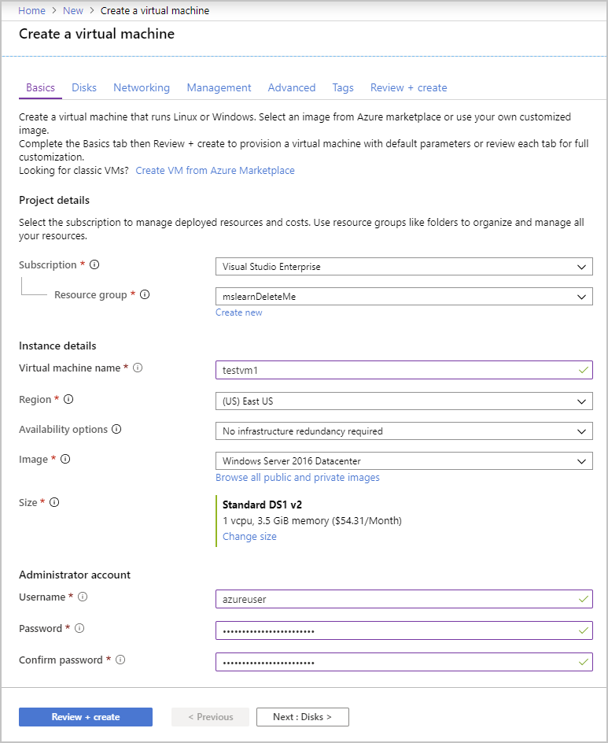
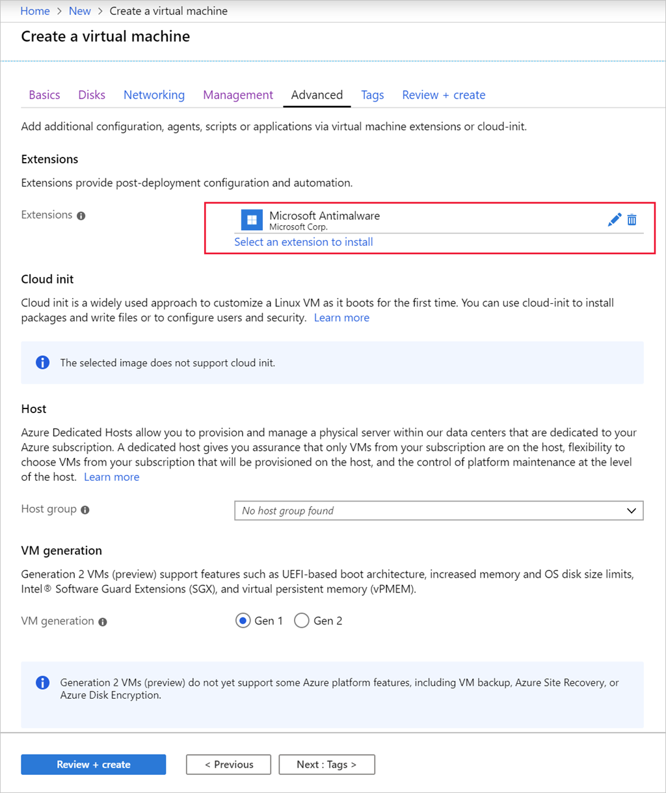

Microsoft Defender for Cloud monitors the status of antimalware protection for your virtual machines (VMs). Defender for Cloud notes issues, such as detected threats and insufficient protection that might make your VMs and computers vulnerable to malware threats. By using the information on **Endpoint protection issues**, you can make a plan to address any identified issues.

1. Sign in to the [Azure portal](https://portal.azure.com?azure-portal=true).

1. On the Azure homepage, search for and select **Microsoft Defender for Cloud**. The **Overview** pane for the Defender for Cloud displays.

1. Select **Recommendations**.

1. Filter your view to **Resource type: virtual machine**, and then scroll to **Enable endpoint protection** to see the recommendations.

Defender for Cloud reports the following endpoint protection issues:

- **Endpoint protection should be installed on your machines**

  - A supported antimalware solution isn't installed on these Azure VMs.

- **Endpoint protection health issues on machines should be resolved**

  - *Signature out of date*. An antimalware solution is installed on these VMs and computers, but the solution doesn't have the latest antimalware signatures.

  - *No real-time protection*. An antimalware solution is installed on these VMs and computers, but it isn't configured for real-time protection. For example, the service might be disabled. Defender for Cloud might also be unable to obtain the status because it doesn't support the solution.

  - *Not reporting*. An antimalware solution is installed but not reporting data.

  - *Unknown*. An antimalware solution is installed, but either its status is unknown, or it's reporting an unknown error.

For VMs that are vulnerable, Defender for Cloud offers to resolve the issue and install malware protection onto the unprotected VMs.

:::image type="content" source="../media/5-defender-for-cloud-endpoint-protection-fix.png" alt-text="Screenshot that shows the option to fix unprotected VMs.":::

However, you can also install this protection yourself. Let's examine those steps.

## Install Antimalware in a new VM

**Microsoft Antimalware** is available as an extension that you can add to existing VMs, or include as part of the creation of a new virtual machine (VM). You can use the Azure portal, Azure CLI / PowerShell, or ARM template to add the extension.

Let's use the Azure portal to create a new VM, and install the extension.

1. Sign in to the [Azure portal](https://portal.azure.com/?azure-portal=true) with the same account and subscription you used in the previous exercise. We reuse the same resource group so we can delete both VMs at the same time.

1. On the Azure portal menu or the **home** page, select **Create a resource**. The **Create a resource** pane displays.

1. Search for and select **Virtual machine**. The **Create a virtual machine** pane displays.

1. On the **Basics** tab, enter the following values for each setting.

    | Setting | Value |
    |---|---|
    | **Project details** |
    | Subscription | Select your subscription. |
    | Resource group | Select the resource group you previously created (*mslearnDeleteMe*) from the dropdown list. |
    | **Instance details** |
    | Virtual machine name | Enter a VM name, such as *testvm1*.|
    | Region | Select a location closest to you from the dropdown list. |
    | **Administrator account** |
    | Username | Select a valid username that you can remember. |
    | Password | Select a valid password that you can remember. |

    

1. Select the **Advanced** tab. Here you can add extensions to the new VM. Select the **Select an extension to install** link. Search for and select **Microsoft Antimalware**, and then select **Next**. The **Configure Microsoft Antimalware Extension** pane displays.

1. The options for the extension include the ability to ignore specific folders, filenames, and control when and how the extension scans the disk for malware. Accept all the defaults.

    :::image type="content" source="../media/5-configure-microsoft-antimalware-vm-creation.png" alt-text="Screenshot that shows the default options for Microsoft malware.":::

1. Select **Create** to add it to the VM.

1. The **Advanced** tab now shows that the malware extension is set to install.

    

1. Next, select the **Management** tab and configure the monitoring capabilities for Microsoft Defender for Cloud.

    - Detailed monitoring you can view in Azure Monitor.
    - Boot diagnostics.
    - OS guest diagnostics.

    If any of these options are selected, the VM needs an Azure Storage account in which to write the log data.

1. Select **Review + create**, verify the settings, and when validation passes, select **Create** to deploy the new VM.

Deploying the VM takes a few minutes to complete. You can monitor the deployment through the **Notifications** (bell icon) view, or by selecting the deployment message. While it deploys, let's examine how you'd add malware protection to an *existing* VM.

## Add the extension to an existing VM

You can also add the antimalware extension after an existing VM is deployed. You can use command-line tools, so it can be scripted. You can also use the REST APIs or the Azure portal. Here are the steps to use for the portal:

1. Select the VM onto which you want to install the extension.

1. In the left menu pane, under **Settings**, select **Extensions + applications**.

    :::image type="content" source="../media/5-virtual-machine-add-extension.png" alt-text="Screenshot that shows the 'Add Extensions' option selected.":::

1. Select **Add**.

1. Search for and select **Microsoft Antimalware**, and then select **Next**. Accept the defaults, and select **Review + create**. After the extension validates, select **Create** to add the extension to your VM. The **Deployment is in progress** pane displays.

1. After the deployment succeeds, return to the **Extensions + applications** pane. The pane shows the malware extension installed.

    :::image type="content" source="../media/5-microsoft-malware-extension-installed.png" alt-text="Screenshot that shows the Microsoft malware extension installed on the VM.":::
