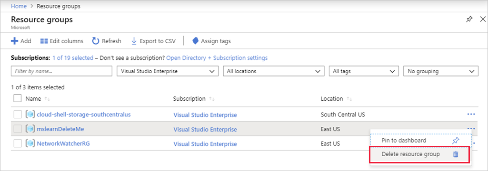

Microsoft Defender for Cloud offers built-in security management and threat protection for your cloud workloads. Defender for Cloud helps you find and fix vulnerabilities, block malicious access, and identify weak areas in your servers and network.

Defender for Cloud is available to every Azure subscription through a free, basic tier. You can activate a paid tier to get more features, including integration with on-premise resources and other cloud providers.

One of those standard tier features is _Just-in-time VM access_. When a JIT access request is approved for a VM behind an Azure Firewall, Microsoft Defender for Cloud pokes a hole into the firewall to allow management access to the VM for a specific time period. After the specified time period, Defender for Cloud restores the firewall and NSG rules to their previous state, so your VM is protected from attack. Each request is audited so security personal can identify each access request.

Finally, you can protect your VMs and servers with _antimalware software_ that's integrated into Microsoft Defender for Cloud so you can monitor all your resources in a single place.

## Cleanup

We created two VM resources in this module. To ensure you don't continue to get charged for these VMs, go ahead and delete the **mslearnDeleteMe** resource group.

1. In Azure portal, search for and select **Resource groups**.

1. Locate the **mslearnDeleteMe** resource group in the list and select the "..." context menu on the right side of the entry.

1. Select **Delete resource group** from the menu.

    

1. Enter the resource group name (**mslearnDeleteMe**) into the entry, and select **Delete**.

## Further reading

To learn more about the topics in this module, check out the following links:

- [Microsoft Security Intelligence](https://www.microsoft.com/wdsi)
- [Microsoft Defender for Cloud overview](https://azure.microsoft.com/services/security-center/)
- [Microsoft Defender for Cloud documentation](/azure/security-center/)
- [Microsoft Antimalware](/azure/security/fundamentals/antimalware)
- [Azure Security blog](https://azure.microsoft.com/blog/topics/security/)
- [ARM template to test a virus attack on an Azure VM](https://azure.microsoft.com/resources/templates/vm-virus-attack-prevention/)
