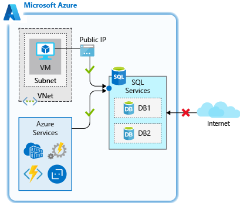
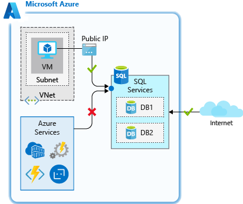
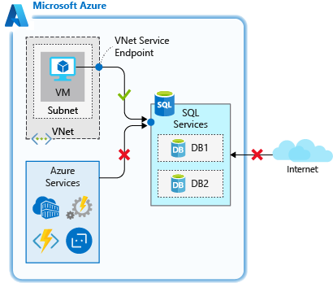
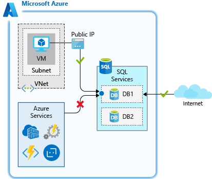
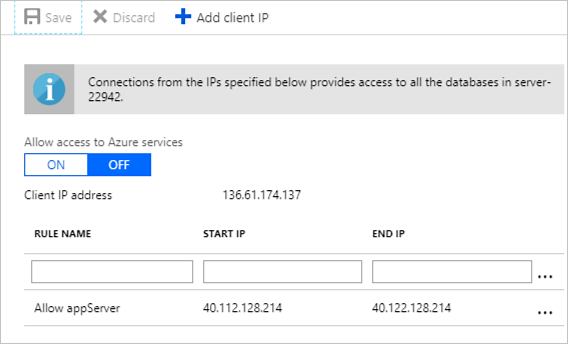

Users will connect to our app server to enter orders, update their account, and perform similar activities, which will in turn update the database with these changes. Because we have personal data stored in the database it's critical to ensure that we only allow access from trusted and necessary resources. Let's take a look at a number of ways you can control access to your SQL database over the network.

## Firewall rules

Azure SQL Database has a built-in firewall that is used to allow and deny network access to both the database server itself, as well as individual databases. Initially, all public access to your Azure SQL Database is blocked by the SQL Database firewall. To access a database server, you must specify one or more server-level IP firewall rules that enable access to your Azure SQL Database. You use the IP firewall rules to specify which IP address ranges from the Internet are allowed, and whether Azure applications can attempt to connect to your Azure SQL Database.

Firewall rules are configured at the server and/or database level, and will specifically state which network resources are allowed to establish a connection to the database. Depending on the level, the rules you can apply will be as follows:

- **Server-level firewall rules**
  - Allow access to Azure services
  - IP address rules
  - Virtual network rules
- **Database-level firewall rules**
  - IP address rules

> [!NOTE]
> SQL Data Warehouse only supports server-level IP firewall rules, and not database-level IP firewall rules.

Let's take a closer look at how these rules work.

### Server-level firewall rules

These rules enable clients to access your entire Azure SQL server, that is, all the databases within the same logical server. There are three types of rules that can be applied at the server level.

The **Allow access to Azure services** rule allows services within Azure to connect to your Azure SQL Database. When enabled, this setting allows communications from all Azure public IP addresses. This includes all Azure Platform as a Service (PaaS) services, such as Azure App Service and Azure Container Service, as well as Azure VMs that have outbound Internet access. This rule can be configured through the **ON/OFF** option in the firewall pane in the portal, or by an IP rule that has 0.0.0.0 as the start and end IP addresses.



This rule is used when you have applications running on PaaS services in Azure, such as Azure Logic Apps or Azure Functions, that need to access your Azure SQL Database. Many of these services don't have a static IP address, so this rule is needed to ensure they are able to connect to the database.

> [!IMPORTANT]
> This option configures the firewall to allow all connections from Azure including connections from the subscriptions of other customers. When selecting this option, make sure your login and user permissions limit access to only authorized users.

**IP address rules** are rules that are based on specific public IP address ranges. IP addresses connecting from an allowed public IP range will be permitted to connect to the database.



These rules can be used when you have a static public IP address that needs to access your database.

**Virtual network rules** allow you to explicitly allow connection from specified subnets inside one or more Azure virtual networks (VNets). Virtual network rules can provide greater access control to your databases and can be a preferred option depending on your scenario. Since Azure VNet address spaces are private, you can effectively eliminate exposure to public IP addresses and secure connectivity to those addresses you control.



Virtual network rules are used when you have Azure VMs that need to access your database.

For server-level rules, all of the above can be created and manipulated through the portal, PowerShell, the CLI and through Transact-SQL (T-SQL).

### Database-level firewall rules

These rules allow access to an individual database on a logical server and are stored in the database itself. For database-level rules, only **IP address rules** can be configured. They function the same as when applied at the server-level, but are scoped to the database only.



The benefits of database-level rules are their portability. When replicating a database to another server, the database-level rules will be replicated, since they are stored in the database itself.

The downside to database-level rules is that you can only use IP address rules. This may limit the flexibility you have and can increase administrative overhead.

Lastly, database-level firewall rules can be created and manipulated only through T-SQL.

## Restricting network access in practice

Whenever possible, as a best practice, use database-level IP firewall rules to enhance security and to make your database more portable. Use server-level IP firewall rules for administrators and when you have several databases with the same access requirements, and you don't want to spend time configuring each database individually.

Let's take a look at how these work in practice, and how you can secure network access to only allow what is necessary. Recall that we created an Azure SQL Database logical server, a database, and the _appServer_ Linux VM acting as an application server. This scenario is often seen when a database has been migrated to Azure SQL Database and resources inside of a virtual network need to access it. The firewall feature of Azure SQL Database can be used in many scenarios, but this is an example that has practical applicability and demonstrates how each of the rules functions.

Let's go through the firewall settings and see how they work. We'll use both the cloud shell and the portal for these exercises.

The database we created currently does not allow access from any connections. This is by design based on the commands that we ran to create the logical server and database. Let's confirm this.

1. In the cloud shell, SSH into your Linux VM if you aren't already connected.

    ```bash
    ssh nnn.nnn.nnn.nnn
    ```

    Where `nnn.nnn.nnn.nnn` is the value from the `publicIpAddress` in the previous unit.

1. Recall the `sqlcmd` command we retrieved earlier. Go ahead and run it to attempt to connect to the database. Make sure you replace `[username]` and `[password]` with the `ADMINUSER` credentials you specified in the previous unit. Make sure to keep the single quotes around the username and password so that any special characters aren't misinterpreted by the shell.

    ```bash
    sqlcmd -S tcp:serverNNNN.database.windows.net,1433 -d marketplaceDb -U '[username]' -P '[password]' -N -l 30
    ```

    You should receive an error when trying to connect. This is expected since we've not allowed any access to the database.

    ```output
    Sqlcmd: Error: Microsoft ODBC Driver 17 for SQL Server : Cannot open server 'securedb' requested by the login. Client with IP address '40.112.128.214' is not allowed to access the server.  To enable access, use the Windows Azure Management Portal or run sp_set_firewall_rule on the master database to create a firewall rule for this IP address or address range.  It may take up to five minutes for this change to take effect..
    ```

Let's grant access so we can connect.

### Use the server-level allow access to Azure services rule

Since our VM has outbound internet access, we can use the **Allow access to Azure services** rule to allow access from our VM.

1. Sign into the [Azure portal](https://portal.azure.com/learn.docs.microsoft.com?azure-portal=true) using the same account you activated the sandbox with.

1. In the **Search resources, services, and docs** box at the top, search for your database server name, `serverNNNN`. Select the SQL server.

1. In the SQL server panel, in the **Security** section in the left menu, select **Firewalls and virtual networks**.

1. Set **Allow access to Azure services** to **YES** and click **Save**.

1. Back in your SSH session, let's try to connect to your database again.

    ```bash
    sqlcmd -S tcp:serverNNNN.database.windows.net,1433 -d marketplaceDb -U '[username]' -P '[password]' -N -l 30
    ```

    At this point, you should be able to connect. If it's successful, you should see a sqlcmd prompt.

    ```sql
    1>
    ```

So we've opened up connectivity, but this setting currently allows access from _any_ Azure resource, including resources outside of our subscription. Let's restrict this further to limit network access to only resources that are within our control.

### Use a database-level IP address rule

Recall that database-level IP address rules allow only access to an individual database on a logical server. We'll use one here to grant access to the static IP of our _appServer_ VM.

To create a database-level IP rule, we'll need to run some T-SQL commands. You'll create a database rule using the following convention, where you pass in the rule name, the starting IP address, and the ending IP address. By specifying the start and end IP to be the same, we're limiting access to a single IP, though we could expand the range if we had a larger block of addresses that required access.

```sql
EXECUTE sp_set_database_firewall_rule N'My Firewall Rule', '40.112.128.214', '40.112.128.214'
```

1. While still at the sqlcmd prompt, run the following command, replacing the public IP address of your _appServer_ VM in both locations below.

    > [!TIP]
    > When running T-SQL commands such as the following, the `GO` on the second line may not copy through to the `sqlcmd` prompt, so you will likely need to type this out. The T-SQL command won't execute without it, so make sure to run the `GO` command.

    ```sql
    EXECUTE sp_set_database_firewall_rule N'Allow appServer database level rule', '[From IP Address]', '[To IP Address]';
    GO
    ```

    Once the command completes, type `exit` to exit sqlcmd. Remain connected via SSH.

1. In the portal, on the **Firewalls and virtual networks** panel for your SQL server, set **Allow access to Azure services** to **OFF** and click **Save**. This will disable access from all Azure services, but we'll still be able to connect since we have a database-level IP rule for our server.

1. Back in cloud shell, in the VM you are connected via SSH to, try connecting to your database again.

    ```bash
    sqlcmd -S tcp:serverNNNN.database.windows.net,1433 -d marketplaceDb -U '[username]' -P '[password]' -N -l 30
    ```

    At this point, you should be able to connect. If it's successful, you should see a sqlcmd prompt.

    ```sql
    1>
    ```

Using a database-level rule allows access to be isolated specifically to the database. This can be useful if you'd like to keep your network access configured per database. If multiple databases share the same level of network access, you can simplify administration by using a server-level rule to apply the same access to all databases on the server.

#### Use a server-level IP address rule

Database-level rules are a great option, but what if we had multiple databases on the same server that our _appServer_ VM needed to connect to? We could add a database-level rule to each database, this can take more work as we add more databases. It would reduce our administration efforts to allow access with a server-level rule, which would apply to all databases on the server.

Let's now use a server-level IP rule to restrict the systems that can connect.

1. While still at the sqlcmd prompt, run the following command to delete the database-level IP address rule.

    ```sql
    EXECUTE sp_delete_database_firewall_rule N'Allow appServer database level rule';
    GO
    ```

    Once the command completes, type `exit` to exit sqlcmd. Remain connected via SSH.

1. Back in the portal, on the **Firewalls and virtual networks** panel for your SQL server,  add a new rule with a **RULE NAME** of **Allow appServer** and with the **START IP** and **END IP** set to the public IP address of the _appServer_ VM.

    Click **Save**

    

1. Back in cloud shell, on your _appServer_ VM, try connecting to your database again.

    ```bash
    sqlcmd -S tcp:serverNNNN.database.windows.net,1433 -d marketplaceDb -U '[username]' -P '[password]' -N -l 30
    ```

    At this point you should be able to connect, since the server-level rule is allowing access based on the public IP address of the _appServer_ VM. If it's successful, you should see a sqlcmd prompt.

    ```sql
    1>
    ```

    Type `exit` to exit sqlcmd. Remain connected via SSH.

So we've isolated connectivity to only the IP address we specified in the rule. This works great, but can still be an administrative challenge as you add more systems that need to connect. It also requires a static IP or an IP from a defined IP address range; if the IP is dynamic and changes, we'd have to update the rule to ensure connectivity. The _appServer_ VM is currently configured with a dynamic IP address, so this IP address is likely to change at some point, breaking our access as soon as that happens. Let's now look at how virtual network rules can be beneficial in our configuration.

#### Use a server-level virtual network rule

In this case, since our VM is running in Azure, we can use a server-level virtual network rule to isolate access and make it easy to enable future services to gain access to the database.

1. Back in the portal and still on the **Firewalls and virtual networks** panel, in the **Virtual networks** section click the **+ Add existing virtual network** option.

1. The Create/Update virtual network rule dialog will show. Set the following values:

    | _Setting_                        | _Value_                                  |
    | -------------------------------- | ---------------------------------------- |
    | **Name**                         | Leave the default value                  |
    | **Subscription**                 | Concierge Subscription                   |
    | **Virtual network**              | appServerVNET                            |
    | **Subnet name / Address prefix** | appServerSubnet / 10.0.0.0/24            |

    Click **Enable** to enable the service endpoint on the subnet, then **OK** once the endpoint is enabled to create the rule.

1. Now, let's remove the IP address rule. Click the **...** next to your **Allow appServer** rule and click **Delete**, then click **Save**.

1. Back in cloud shell, on your _appServer_ VM, try connecting to your database again.

    ```bash
    sqlcmd -S tcp:serverNNNN.database.windows.net,1433 -d marketplaceDb -U '[username]' -P '[password]' -N -l 30
    ```

    At this point, you should be able to connect. If it's successful, you should see a sqlcmd prompt.

    ```sql
    1>
    ```

What we've done here effectively removes any public access to the SQL server, and only permits access from the specific subnet in the Azure VNet we defined. If we were to add additional app servers in that subnet, no additional configuration would be necessary, as any server in that subnet would have the ability to connect to the SQL server. This limits our exposure to services outside of our scope of control, and eases administration if we were to add additional servers. This is an effective method of securing network access to an Azure SQL Database.
