Let's assume you're running an online business, and you're publishing your database to Azure. By default, an Azure SQL Server database will be accessible to any Azure application or service running within Azure. Even if you only allow services within Azure to connect, you should still restrict connections to the database to approved applications and services.

In this unit, we'll look at how to restrict access to the Azure SQL database via IP address ranges.

<!-- Activate the sandbox -->
[!INCLUDE [azure-sandbox-activate](../../../includes/azure-sandbox-activate.md)]

## Overview

A new Azure SQL database will, by default, only allow Azure services to connect to it. This configuration doesn’t mean a connecting service can gain access to the database contents, only that it can try to authenticate against the database. Requiring a service to authenticate is safer than unrestricted public Internet access. You should still restrict access to your database to only the applications and services that need it.

For example, you may have an ASP.NET Core application talking to an Azure SQL database. It's the ASP.NET Core application that should access your Azure SQL Server database. Let’s look at how we would restrict the network access to the database from the web application.

## Restricting network access to the database

You restrict network access to your database by only allowing access from a specific IP address range.

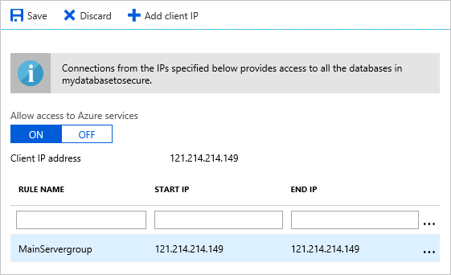

1. To create a server firewall rule, you'll enter a **RULE NAME**, the **START IP** address, and the **END IP** address.
1. Then click **Save** to record the changes.

Only the IP addresses listed in the rules you create will have access to the database.

## Locking down access at the database level

Let's assume you're running an Azure SQL Server failover group. With a failover group, the secondary servers are normally located at different regions. If the main server goes offline, the server firewall rules may no longer apply. Server firewall rules are set up per server hosting the database. Setting up a firewall rule at the database level will ensure that your rules replicate to the backup databases.

To create a database firewall rule, connect to the database using either SQL Server Management Studio or SQL Operations Studio and create a new query. You'll create a database rule using the following convention, where you pass in the rule name, the starting IP address, and the ending IP address.

```sql
EXECUTE sp_set_database_firewall_rule N'<Rule Name>', '<From IP Address>', '<To IP Address>'
```

For example, to restrict access to the database from the IP address range **10.21.2.33** – **10.21.2.54**, you'll use a rule similar to the following SQL:

```sql
EXECUTE sp_set_database_firewall_rule N'Web Apps Firewall Rule', '10.21.2.33', '10.21.2.54'
```

## Enabling Transparent Data Encryption

### What is Transparent Data Encryption?

Transparent Data Encryption (TDE)  performs real-time encryption and decryption of the database, backup files, and log files.

When new Azure SQL databases are created, they'll have TDE enabled by default.

It's important to check that data encryption hasn’t been turned off, and older Azure SQL Server databases may not have TDE enabled.

To verify and enable TDE:

1. Select the database in the portal.
1. Select the **Transparent data encryption** option.
1. In the data encryption option, select **On**.
1. Click **Save**.

## Create a secure connection to the server

Your applications should connect to your databases in a secure manner. You use a connection string with the right level of security to create a secure connection. These connections need to be encrypted to reduce the likelihood of a man-in-the-middle attack.

Let's look at how to get the connection string for a database.

Using the portal, navigate to your SQL Server. Select the database you wish to gain access to.

Select the *Show Database Connection Strings* option.

Now, from the available options, select the tab that matches your programming language and copy the displayed connection string. You'll have to complete the password, as it is kept secret and not displayed here.

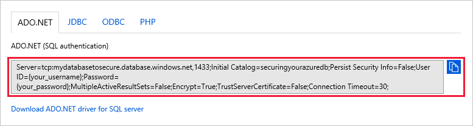

It's important to protect the connection string from outside eyes. Connection strings should be stored in Azure Key Vault, not in your project, version control, or continuous integration systems.

### What is the Azure Key Vault?

The Azure Key Vault is a tool used to securely store credentials and other keys and secrets. These secrets can be protected either by software or hardware.

## Open the correct ports for server access

Your Azure database allows outbound communication over port 1433. If you don’t have access to this port, talk to your network administrators to allow network traffic.

## Restrict server access with Azure virtual networks

### What is a virtual network?

A virtual network is a logically isolated network created within the Azure network. You can use a virtual network to control what Azure resources can connect to other resources.

Imagine you're running a web application that connects to a database. You'll use subnets to isolate different parts of the network. A subnet is a part of a network based upon a range of IP addresses.

To configure these subnets, you'll create a virtual network and then subdivide the network into subnets. The web application will operate on one subnet and the database on another subnet. Each subnet will have its own rules for communicating to and from the other network. These rules give you the ability to restrict access from the database to the web application.

### What is a network security group?

A network security group defines rules, which allow or deny network traffic to and from source and destination addresses. Each subnet will have a network security group assigned to it.

The diagram below shows an example of the groupings that are created. The web subnet allows access to the Internet, but only for HTTP connections. The database subnet only allows access from the web subnet. Setting up the virtual network adds restrictions about how services can be accessed, and acts as a firewall around hosted services.

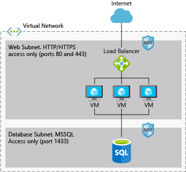

The next example assumes you're using virtual machines that will act as your web hosts and connect to your database. Let’s look at how to create a virtual network to set up this planned infrastructure.

1. From the Azure portal, select the **Create a resource** link.
1. From the Azure Marketplace, select **Networking** > **Virtual network**. If it requests to select a deployment model, select **Resource Manager**
1. Click the **Create** button.
1. Enter the **Name** for the virtual network.
1. Provide an **Address space** that can be used. An address space is a way of outlining a range of IP addresses. In our example, `172.16.0.0/16` refers to a range of addresses from 172.16.0.0 to 172.16.255.255.

   An address space that is not already in use will be recommended. Where an IP address is detected from this range, it will be defined as being on this subnet.

1. Select your Azure **Subscription**.
1. Either select or create a new **Resource group**.
1. Enter the **Name** of the subnet that you will create.
1. Provide an **Address range**.
1. Click the **Create** button to create the virtual network.

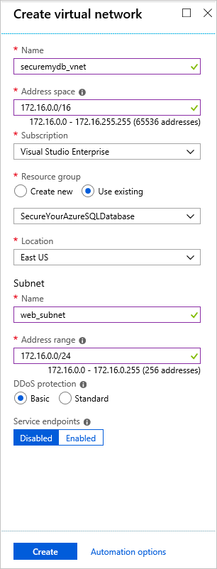

You'll receive a notification once the virtual network is created. Click on the **Go to resource** button in the notification.

You'll now be taken to the virtual network blade. Select the **Settings** > **Subnets** configuration section. At this point, you'll have the subnet you created when you set up the initial network, called web_subnet.

You need to create another subnet that will represent the IP addresses for the database servers.

1. Click on the __+ Subnet__ button to start the process of adding a new subnet for the database.

1. Enter a **Name** for the subnet. In the above example, we called it database_subnet.

1. Review the **Address range (CIDR block)**. You'll see that the address range is again populated with a range that isn't in conflict with other subnets in the system.

1. **Network security group** is a core setting that you'll need to apply to the subnet. For now, leave this setting blank. Later you'll create the network security group and come back and set this value.

1. Click the **OK** button to save the subnet.

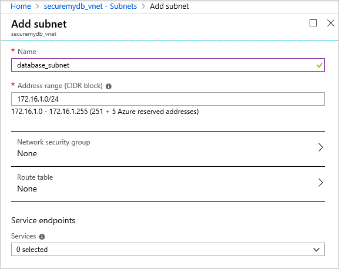

## Creating a network security group

The job of the network security group is to act as a firewall, and it controls the flow of traffic in and out of a subnet. You'll create two network security groups. One is the web application subnet, and the other is for the database subnet.

1. Select **Create a resource** and select **Networking** > **Network security group**. If asked to select a deployment model, select Resource Manager.
1. Provide a **Name** for your network security group.
1. Select your Azure subscription, resource group, and desired location.
1. Click the **Create** button.

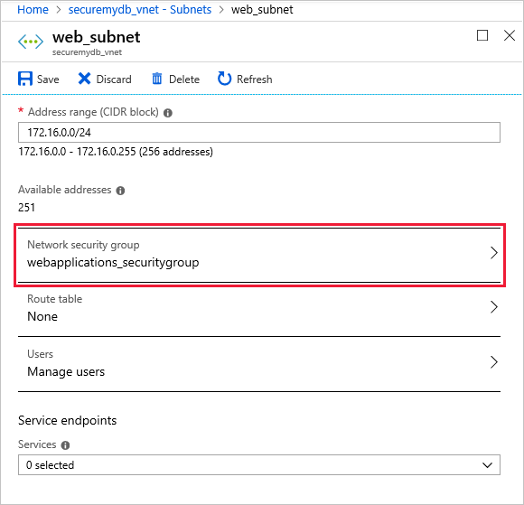

After the network security group has been created, it's then time to set up the inbound and outbound traffic rules for the security group.

1. Select the new network security group.
1. On the **Overview** display, you'll see the list of inbound and outbound rules that have been created. There are default rules already created that are used for internal Azure access.

    > [!NOTE]
    > While these rules can't be deleted, you can create additional rules with a higher priority that will take precedence over these rules.

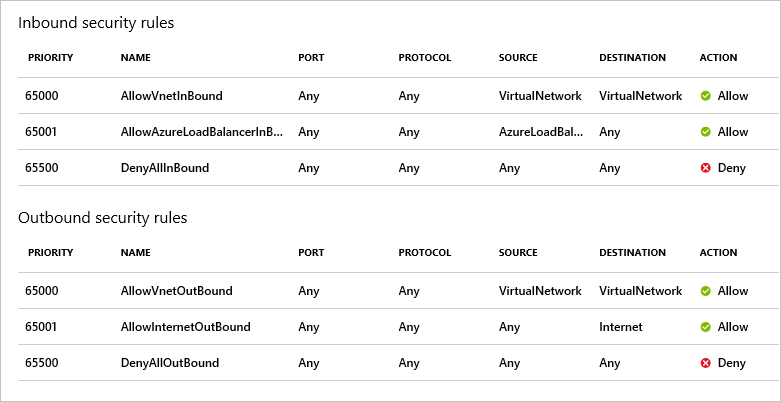

1. To create new rules, select the **Inbound security rules** section for the network security group.
1. Click the **Add** button. From here, you can configure the details for the network security rules.

    > [!NOTE]
    > By default, you'll see the advanced view to configure the rule, but by clicking the **Basic** button, you'll be able to select the protocol you want to allow.

1. You want to allow access to HTTP services from the Internet. To filter for the HTTP protocol, you'll select **Service Tag** as the **Source** value.
1. Then, verify the **Source service tag** is set to **Internet**.
1. Set the port ranges values to `80,443` to represent the ports that are used to access this service. (Port 80 is used for HTTP, and port 443 is used for HTTPS access.)
1. Select **TCP** for the **Protocol**.
1. Set **Action** to **Allow**.
1. Give the rule a **Priority** value of `100`.

    > [!NOTE]
    > The lower the number, the more important the rule is.

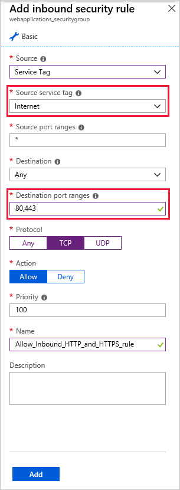

Now it’s time to set up the network security group settings for the database. For the database, you are going to set up a single incoming rule that allows for SQL requests from the IP range of the web applications subnet, and then deny other incoming and outgoing traffic. This will allow you to control access to the database and make sure that only database requests get through to the system from the website, and that no other access to the database is allowed.

1. Click on the **Create a resource** again to create another **Networking** > **Network security group** that uses Resource Manager as the deployment model.

    This time you'll create one for the database.

1. Provide a **Name** for your network security group.
1. Select your Azure subscription, resource group, and desired location.
1. Click the **Create** button to create the new network security group.

    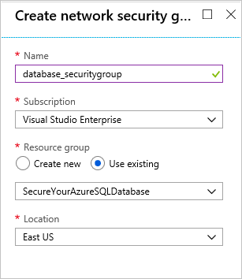

    You'll need to wait until the network security group is created.

1. Once done, select the **Go to resource** option in the notification to start configuring the rules for the network security group you created.

For the network security group, the main focus is to allow database requests from the web application subnet only. You need to set up incoming TCP requests on port 1433 from the IP range of the web subnet.

2. In the **Inbound security rules** settings, select the **Add** button to create a new rule. In this case, you want to only allow access from the web application subnet.
1. You'll create an inbound rule that sets the **Source** to **IP Addresses**.
1. When the **Source IP addresses/CIDR ranges** are displayed, enter the CIDR range from the web subnet that was created earlier.
1. For the **Destination port ranges**, enter `1433` to indicate Azure SQL Server access only.
1. Set the **Protocol** to **TCP** to further limit inbound connections.
1. You want to **Allow** access for **Action**.
1. Give it a **Priority** of `100`.
1. **Name** the security rule appropriately.
1. Click **Add** to add the rule.

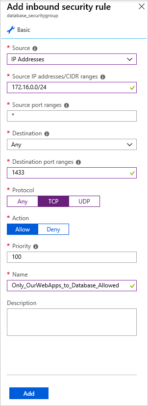

The basic security rules are now in place to limit access to the database system. What is left is to assign the network security groups to the subnets.

1. Open the virtual network you created earlier. Select the **Settings** > **Subnets** section.
1. Select the web subnet created earlier.
1. Select the **Network security group** option and the network security group created specifically for the web.
1. Click **Save** and the network security group will be applied against the subnet.

    

You want to repeat the same process for the database subnet.

1. Navigate back to the subnets.
1. Select the database subnet
1. Set its **Network security group** to the network security group for the database.
1. Click **Save** to save the changes.

    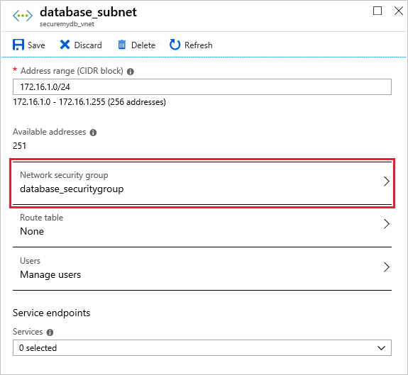

Now that you've configured access, it is a matter of applying the virtual networks and subnets against the database server and web servers.

Let’s begin with the database server.

1. Select the database.
1. From the database, select the **Firewalls and virtual networks** configuration setting.

On the left, you'll see details about the configuration. You have a number of settings at play here.

1. First, turn **Allow access to Azure services** to **OFF**. This is to ensure that only the services that you want to use are enabled.

    You'll also notice that it shows a Client IP address. The Client IP address is the IP address of your computer connecting to the Azure SQL Server database. You could have added a Client IP to the rule name list. This is useful if you want to connect SQL Server Management Studio or SQL Operations Studio to your server. It will add a rule that indicates which IP addresses can connect. You won’t be doing that in this case, but you'll be setting up the virtual network.

1. Click on **Add existing virtual network**, and you will be presented with an options screen to enter the details for the new rule.

1. Enter the **Name** of the rule you would like to use.
1. Select the subscription that you were using.
1. Most importantly, select the virtual network that you are using.
1. Select the subnet with the appropriate network security group rules for database access.
1. After you have configured all the settings, select the **Enable** button. It will then apply the database to the subnet within your virtual network.

Once the database subnet is configured, you will perform similar steps with the web server. Regardless of how you've configured your application, it is a matter of ensuring that the web applications use the subnet for web access.

If you have a single virtual machine or a load balancer with virtual machines in a scale set, make sure that they are using the web subnet so they have access to the database. When you create resources such as virtual machines, make sure that their virtual network and subnets are configured to control the information that goes in and out of those services.

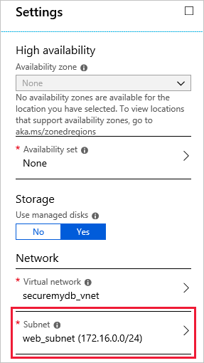

Once the subnets are applied to both the database and the virtual machines running the web apps, then the appropriate configuration will be in place. Then there is tighter access between your apps and database.

Network security is the first core point of protection. Making sure that only the apps and services that should connect to the database do connect to the database will make your system more secure.
