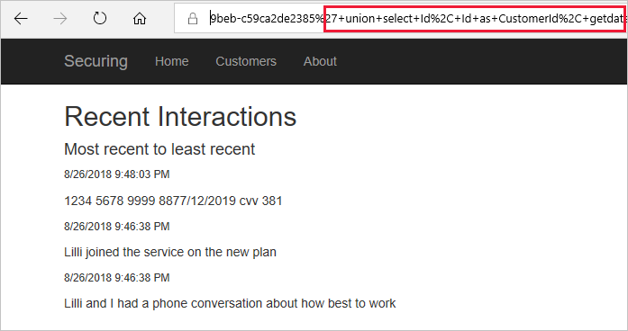
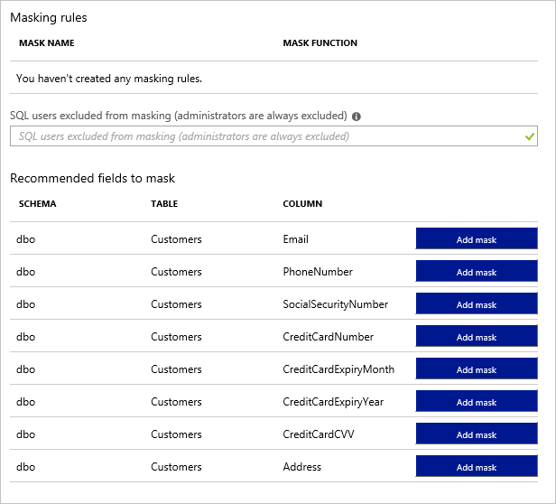
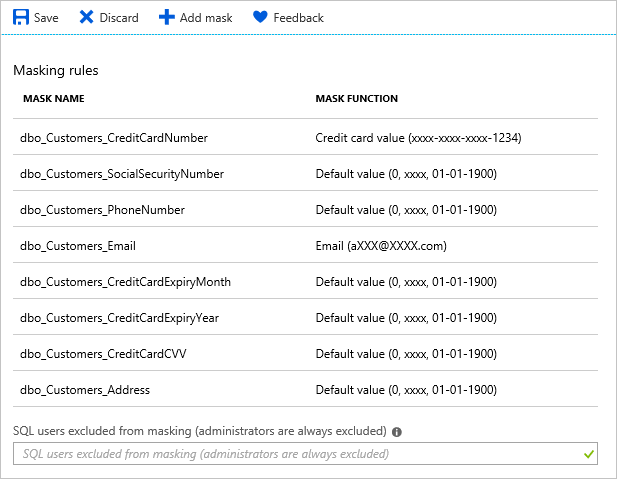
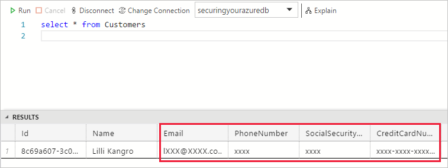

Imagine that a hacker is trying to access your database. Applications that connect to the database are vulnerable spots to attack. Those applications may not be connecting to the database using secure methods.

Databases need their own security, but how the database is accessed can play an important role in data security. Successful database breaches are normally the result of SQL injection attacks. SQL injection attacks are the result of applications not using preferred practices for accessing a database.

Let's look at techniques to secure your database at the application layer.

## SQL injection attacks

The [OWASP foundation](https://owasp.org) is a not-for-profit organization that is designed to build standards for applications to be trusted. It publishes regularly a list of the top 10 security vulnerabilities.

The most common vulnerability according to the OWASP is injection attacks, which normally take the form of SQL injection attacks. In a SQL injection attack, information that is passed to a SQL statement is modified. These modified queries either return sensitive information, or perform malicious operations on the database.

Let’s look at the following ASP.NET Core code using ADO.NET to fetch the interactions with a particular customer.

```csharp
public List<CustomerInteraction> GetCustomerInteractions(string customerId)
{
    var result = new List<CustomerInteraction>();

    using (var conn = new SqlConnection(ConnectionString))
    {
        var sql = "select Id, CustomerId, InteractionDate, Details " +
            "from CustomerInteractions where CustomerId = '" + customerId + "'";

        using (var command = conn.CreateCommand())
        {
            command.CommandText = sql;
            conn.Open();

            using (var reader = command.ExecuteReader())
            {
                if (reader.HasRows)
                {
                    while (reader.Read())
                        result.Add(GetInteractionsFromReader(reader));
                }
            }
        }
        return result.OrderByDescending(i => i.InteractionDate).ToList();
    }
}
```

The query itself is primed for an SQL attack, as the `customerId` parameter isn't sanitized before going into the query and so could be modified. The website that is calling the query is passing the customerId parameter on the URL query string as follows:

```
.../Home/ViewInteractions?customerId=8c69a607-3c09-45ac-9beb-c59ca2de2385
```

The problem with this strategy is that the `customerId` parameter can be modified. For example, you could modify the customerId parameter to put additional information into the query and select data from a different table.

```sql
select Id, CustomerId, InteractionDate, Details from CustomerInteractions where CustomerId = '8c69a607-3c09-45ac-9beb-c59ca2de2385'
```

It can now be modified to add additional information via a UNION statement to add additional information, by adding the following to the query:

```sql
union select Id, Id as CustomerId, getdate() as InteractionDate, CreditCardNumber + '/' + STR(CreditCardExpiryMonth, 2) + '/' + STR(CreditCardExpiryYear, 4) + ' cvv ' + STR(CreditCardCVV, 3) as Details from Customers --
```

The SQL query is URL-encoded so that the value is accepted as a valid web URL part. The URL is passed to the website and the additional SQL query executed on the database.

```sql
%27+union+select+Id%2C+Id+as+CustomerId%2C+getdate%28%29+as+InteractionDate%2C+CreditCardNumber+%2B+%27%2F%27+%2B+STR%28CreditCardExpiryMonth%2C+2%29+%2B+%27%2F%27+%2B+STR%28CreditCardExpiryYear%2C+4%29+%2B+%27+cvv+%27+%2B+STR%28CreditCardCVV%2C+3%29+as+Details+from+Customers+--
```

This example demonstrates how not sanitizing the information from the site can lead to data security issues.



> [!Note]
> To find out more about injection attacks, visit the [OWASP Foundation](https://www.owasp.org/).

## Avoiding SQL injection attacks

To avoid SQL injection attacks, you should always make sure that any user-entered input is sanitized. User input used as parameters for queries shouldn't be constructed through string concatenation, but passed as actual query parameters.

In the following example, you can see how the CustomerId is now passed in as a parameter using the @ symbol. Parameters are defined explicitly and values passed into the query.

```csharp
using (var command = conn.CreateCommand())
{
    var sql = "select Id, CustomerId, InteractionDate, Details " +
        "from CustomerInteractions where CustomerId = @CustomerId order by InteractionDate";

    command.CommandText = sql;
    var prmCustomerId = command.Parameters.Add("@CustomerId", SqlDbType.UniqueIdentifier);
    prmCustomerId.Value = Guid.Parse(customerId);

    conn.Open();

    using (var reader = command.ExecuteReader())
    {
        if (reader.HasRows)
        {
            while (reader.Read())
                result.Add(GetInteractionsFromReader(reader));
        }
    }
}
```

The core lines of code are:

```csharp
    var prmCustomerId = command.Parameters.Add("@CustomerId", SqlDbType.UniqueIdentifier);
    prmCustomerId.Value = Guid.Parse(customerId);
```

Using sanitized data input and parameterized queries reduces the chances of SQL injection attacks on your database.

Our example used ASP.NET Core to demonstrate the concepts. However, keep in mind that all programming systems that support access to SQL Server have mechanisms to pass parameters into the values for queries.

## Dynamic data masking

You might have noticed that some of the information in the database is particularly sensitive; perhaps credit card information. In a real-world system, you would never store credit card information unencrypted. Unfortunately, the credit card information is not encrypted, and you'll need to find another way to hide the data.

Let's assume you're building a shopping website, and during the order process the site has to display credit card details. You want to display the first 12 digits blocked out from the user, to appear like xxxx-xxxx-xxxx-1234.

This technique is called dynamic data masking. Dynamic data masking allows you to add masks against the columns within your database.

1. Using the portal, you select the database you want to apply the masks to, and then select the **Dynamic Data Masking** option from the **Security** setting.

    The Masking rules screen shows a list of existing dynamic data masks, and recommendations for columns that should potentially have a dynamic data mask applied.

    

1. To add a mask to a column, click the **Add mask** button to add the recommended mask to the column.

    

1. Each new mask will be added to the Masking rules list. Click the **Save** button to apply the masks.

When querying the columns, database administrators will still see the original values, but non-administrators will see the masked values.

You can allow other users to see the non-masked versions by adding them to the SQL users excluded from masking list.

You can see here what the masked data looks like when queried by a non-administrator.



The masks on the displays are ones added based on recommendations, but you can add a mask manually too. Select the + Add mask button, and then the pop-over will allow you to select the schema, table, and column to use. You then define the masking that is used. There are standard masks that can be used such as:

- Default value, which displays the default value for that data type instead;
- Credit card value, which only shows the last four digits of the number, converting all other numbers to lower case x’s;
- Email, which hides the domain name and all but the first character of the email account name;
- Number, which specifies a random number between a range of values. For example, on the credit card expiry month and year, you could select random months from 1 to 12 and set the year range from 2018 to 3000; or
- Custom string. This allows you to set the number of characters exposed from the start of the data, the number of characters exposed from the end of the data, and the characters to repeat for the remainder of the data.
