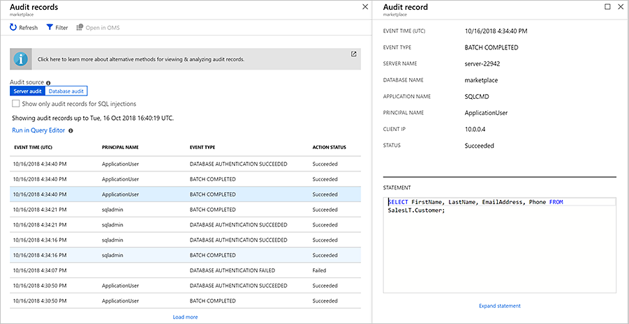
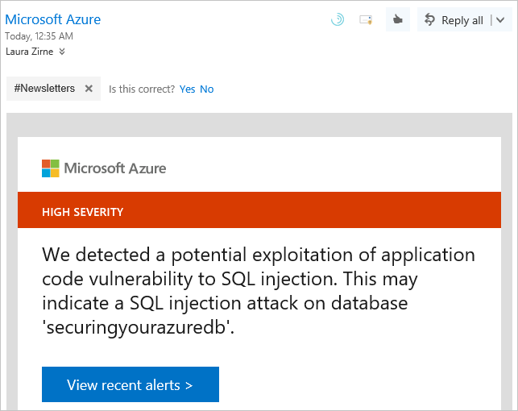
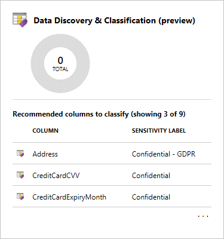
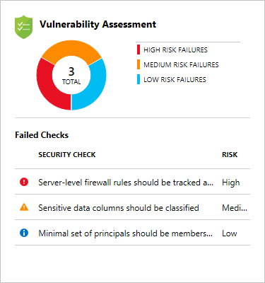
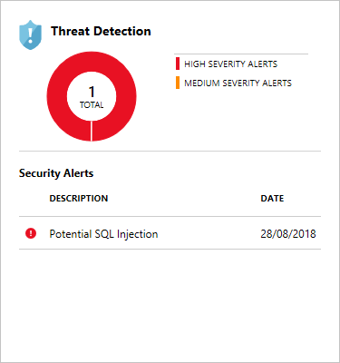

Imagine you receive an alert from your company's security administrator that a potential security breach has been detected on your network. It's suspected that an unauthorized individual may have accessed your database through malicious activity. How would you track this down? You know you need to be actively monitoring your database for suspicious activity, but what can you do to not only gain visibility into what's happening in your database, but to also prevent malicious activity from occurring?

Azure SQL Database has built-in features that can help you track what's happening in your database, and will monitor and alert you if malicious activity is identified.

## Azure SQL Database auditing

By enabling auditing, operations that occur on the database are stored for later inspection or to have automated tools analyze them. Auditing is also used for compliance management or understanding how your database is used. Auditing is also required if you wish to use Azure threat detection on your Azure SQL database.

Audit logs are written to Append Blobs in an Azure Blob storage account that you designate. Audit policies can be applied at the server-level or database-level. Once enabled, you can use the Azure portal to view the logs, or send them to Log Analytics or Event Hub for further processing and analysis.

Let's look at the steps you take to set up auditing on your system.

1. Sign into the [Azure portal](https://portal.azure.com/learn.docs.microsoft.com?azure-portal=true) using the same account you activated the sandbox with.

1. In the search bar at the top of the portal, search for **server<12345>**, then select the server in the portal.

1. In the left menu, in the **Security** section, select the **Auditing** option.

1. Auditing is turned off by default. To enable it on your database server, tap the **ON** button.

1. Once the ON button is selected, select the **Storage** checkbox, then click **Storage details** to define the storage account.

1. In the **Storage settings** dialog, you can select an existing storage account or create a new storage account to store your audits. The storage account must be configured to use the same region as your server. In this case, we'll define a new storage account. Click **Storage account**, which will then open up the **Create storage account** dialog. Name the storage account `server<12345>auditing` replacing the `<12345>` with the number from your logical server name. Leave the rest of the options at their defaults and select **OK**. Back in the **Storage settings** dialog, leave the defaults and click **OK**.

1. Click the **Save** button in the toolbar to save your changes and enable auditing on your database server.

Now let's generate some audit records and take a look at what you can expect.

1. Let's log back in to the database as the _ApplicationUser_ user.

    ```bash
    sqlcmd -S tcp:server<12345>.database.windows.net,1433 -d marketplaceDb -U ApplicationUser -P <password> -N -l 30
    ```

1. Run the following query.

    ```sql
    SELECT FirstName, LastName, EmailAddress, Phone FROM SalesLT.Customer;
    GO
    ```

1. Back in the portal on your SQL server, select **SQL databases** in the left menu and select the _marketplace_ database.

1. In the left menu on your _marketplace_ database, in the **Security** section select **Auditing**.

1. Since we enabled auditing at the server-level, you should see that it's enabled here. Select **View audit logs** in the top menu bar to view the logs.

1. You should see one or more audit records with **PRINCIPAL NAME** of _ApplicationUser_ and **EVENT TYPE** of **BATCH COMPLETED**. One of them should contain the details of the query you just executed. You might also see other events such as authentication failures and success. Select any record to see the full details of the event.



These actions configure the audits at the database server level and will apply to all databases on the server. You can also configure auditing at a database level.

Let's take a look at another feature that leverages these logs to increase the security of your database.

## Advanced Threat Protection for Azure SQL Database

The Advanced Threat Protection system analyzes audit logs to look for potential problems and threats against your database. It includes functionality for discovering and classifying sensitive data, surfacing and mitigating potential database vulnerabilities, and detecting anomalous activities that could indicate a threat to your database. It provides a single go-to location for enabling and managing these capabilities. With one click, you can enable ATP on your entire database server, applying to all databases on the server.

### Setup and configuration

Let's enable Advanced Threat Protection on our database. Advanced Threat Protection is a server-level setting, so we'll start there.

1. Back in the portal, navigate to your SQL server. In the search bar at the top of the portal, search for **server<12345>**, then select the server.

1. In the left menu, in the **Security** section, select the **Advanced Threat Protection** option.

1. Click the **ON** button to enable Advanced Threat Protection.

1. You can optionally define where notification emails will be delivered as a list of semicolon separated email addresses. **Email service and co-administrators** are enabled by default to send the threats to the service administrators.

1. You can optionally specify a storage account for historical logging of suspicious queries that have been alerted on. It is not a requirement for enabling Advanced Threat Protection, but can be useful for historical tracking. Click **Storage details** to open up the **Storage settings** dialog.

1. In the **Choose storage account** dialog, select the **server<12345>auditing** storage account you created in the previous section. Leave the other settings at the default and click **OK**.

1. Finally, select **Threat Detection types** to take a quick look at those. The preferred option is All, which is the default setting.

    **All** represents the following values:
    - SQL injection reports where SQL injections attacks have occurred;
    - SQL injection vulnerability reports where the possibility of a SQL injection is likely; and
    - Anomalous client login looks at logins that are irregular and could be cause for concern, such as a potential attacker gaining access.

1. Click the **Save** button to apply the changes and enable Advanced Threat Protection on your server.

There is one database-level setting that we'll want to enable as well, and that's the Vulnerability Assessment.

1. Navigate to your *marketplace* database. In the search bar at the top of the portal, search for **marketplace**, then select the database in the portal.

1. In the left menu, in the **Security** section, select the **Advanced Threat Protection** option.

1. In the **Vulnerability Assessment** box, you should see a message that says "Click to configure a storage account for storing scan results". You'll need to do this to enable this feature, so go ahead and click to configure.

1. In the **Choose storage account** dialog, select the **server<12345>auditing** storage account you created in the previous section.

1. You can also turn on **periodic recurring scans** to configure Vulnerability Assessment to run automatic scans once per week. A scan result summary is sent to the email address(es) you provide. In this case, we'll leave this **OFF**. Go ahead and click **Save** at the top to save your settings and enable Vulnerability Assessment.

1. Back in the main Vulnerability Assessment panel, go ahead and click **Scan** to initiate a scan of your database. When it's complete, you'll see recommendations to enhance the security of your database.

Once Advanced Threat Protection is enabled, you'll view details and results at a database level.

You'll receive email notifications as vulnerabilities are detected. The email will outline what occurred and the actions to take.



### Data Discovery & Classification

Click on the **Data Discovery & Classification** panel.

The Data Discovery & Classification panel shows columns within your tables that need to be protected. Some of the columns may have sensitive information or may be considered classified in different countries or regions.



A message will be displayed if any columns need protection configured. This message will be formatted like *"We have found 10 columns with classification recommendations"*. You can click on the text to view the recommendations.

Select the columns that you want to classify by clicking the checkmark next to the column, or select the checkbox to the left of the schema header. Select the Accept selected recommendations options to apply the classification recommendations.

Next, you'll edit the columns and then define the information type and the sensitivity label for the database. Click on the Save button to save the changes.

No active recommendations should be listed once you've managed the recommendations successfully.

### Vulnerability Assessment

Click on the **Vulnerability Assessment** panel.



The Vulnerability Assessment lists configuration issues on your database and the associated risk. For example, in the image above, you can see the server-level firewall needs to be set up.

Click on the Vulnerability Assessment panel to review a full list of vulnerabilities. From here, you can click on each individual vulnerability.

On the vulnerability page you will see the details such as the risk level, which database it applies to, a description of the vulnerability, and the recommended remediation to fix the issue. Apply the remediation to fix the issue or issues. Make sure to address all the vulnerabilities.

### Threat Detection

Click on the **Threat Detection** panel.

This displays a list of detected threats. For example, in this list you one potential SQL injection attacks.



 Address any issues by following the recommendations. For issues such as the SQL injection warnings, you'll be able to look at the query and work backward to where the query is being executed in code. Once found, you should rewrite the code so it will no longer have the issue.