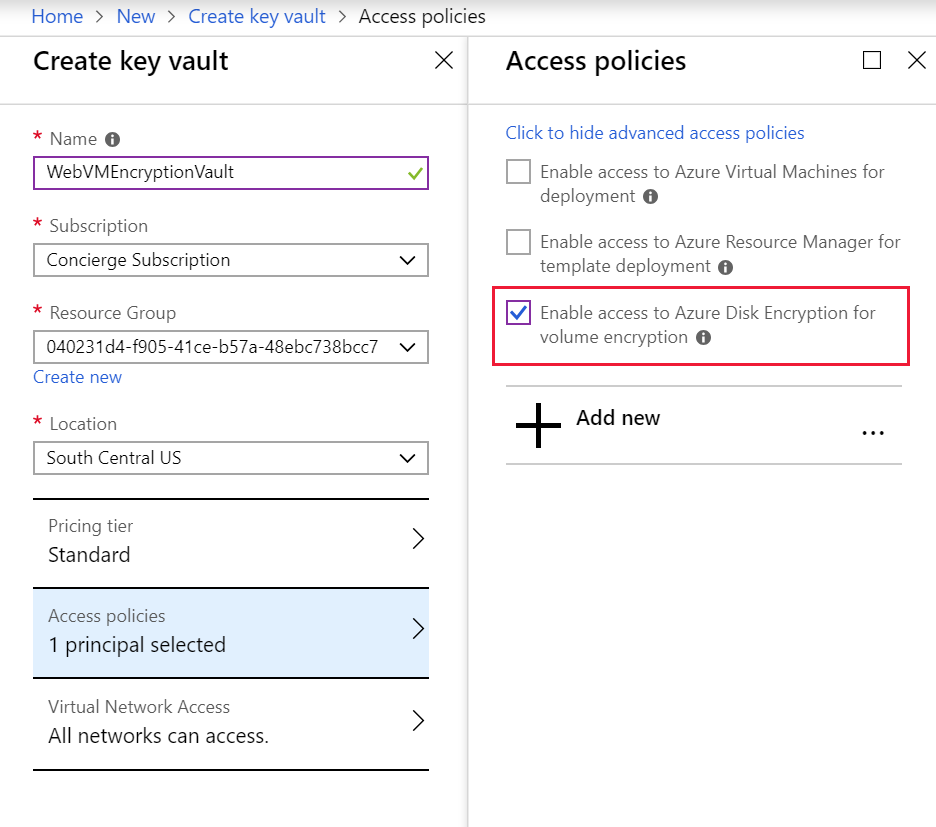

Suppose your company has decided to implement Azure Disk Encryption (ADE) across all VMs. You need to evaluate how to roll out encryption to existing VM volumes. Here, we'll look at the requirements for ADE, and the steps involved in encrypting disks on existing Linux and Windows VMs.

## Azure Disk Encryption prerequisites

Before you can encrypt your VM disks, you need to:

1. Create a key vault.
1. Set the key vault access policy to support disk encryption.
1. Use the key vault to store the encryption keys for ADE.

### Azure Key Vault

The encryption keys used by ADE can be stored in Azure Key Vault. Azure Key Vault is a tool for securely storing and accessing secrets. A secret is anything that you want to tightly control access to, such as API keys, passwords, or certificates. This provides highly available and scalable secure storage, as defined in Federal Information Processing Standards (FIPS) 140-2 Level 2 validated Hardware Security Modules (HSMs). Using Key Vault, you keep full control of the keys used to encrypt your data, and you can manage and audit your key usage. 

> [!NOTE]
> Azure Disk Encryption requires that your key vault and your VMs are in the same Azure region; this ensures that encryption secrets do not cross regional boundaries.

You can configure and manage your key vault with:

#### Powershell

```powershell
New-AzKeyVault -Location <location> `
    -ResourceGroupName <resource-group> `
    -VaultName "myKeyVault" `
    -EnabledForDiskEncryption
```

### Azure CLI

```azurecli
az keyvault create \
    --name "myKeyVault" \
    --resource-group <resource-group> \
    --location <location> \
    --enabled-for-disk-encryption True
```

### Azure portal

An Azure Key Vault is a resource that can be created in the [Azure portal](https://aka.ms/portal) using the normal resource creation process.

1. On the Azure portal menu or from the **Home** page, select **Create a resource**.

1. Search for "Key vault". Click **Create** in the details window.

    

1. Enter the details for the new Key Vault:
    - Enter a **Name** for the Key Vault
    - Select the subscription to place it in (defaults to your current subscription).
    - Select a **Resource Group**, or create a new resource group to own the Key Vault.
    - Select a **Location** for the Key Vault. Make sure to select the location the VM is in.
    - You can choose either Standard or Premium for the pricing tier. The main difference is that the premium tier allows for Hardware-encryption backed keys.

1. You must change the Access policies to support Disk Encryption. By default it adds _your_ account to the policy.
    - Select **Access policies**.
    - Select **Advanced access policies**.
    - Check the **Enable access to Azure Disk Encryption for volume encryption**.
    - You can remove your account if you like, it's not necessary if you only intend to use the Key Vault for disk encryption.
    - To save the changes, select **OK**.

    

1. To create the new Key Vault, select **Create**.

## Enable access policies in the key vault
Azure needs access to the encryption keys or secrets in your key vault to make them available to the VM for booting and decrypting the volumes. This was covered for the portal which you previously changed the **Advanced access policies**.

There are three policies you can enable.
1. **Disk encryption** - Required for Azure Disk encryption.
1. **Deployment** - (Optional) Enables the Microsoft.Compute resource provider to retrieve secrets from this key vault when this key vault is referenced in resource creation, for example when creating a VM.
1. **Template deployment** - (Optional) Enables Azure Resource Manager to get secrets from this key vault when this key vault is referenced in a template deployment.

Here's how to enable the disk encryption policy. The other two are similar but use different flags.

```powershell
Set-AzKeyVaultAccessPolicy -VaultName <keyvault-name> -ResourceGroupName <resource-group> -EnabledForDiskEncryption
```

```azurecli
az keyvault update --name <keyvault-name> --resource-group <resource-group> --enabled-for-disk-encryption "true"
```

## Encrypt an existing VM disk

After you have the Key Vault set up, you can encrypt the VM using either Azure CLI or Azure PowerShell. The first time you encrypt a Windows VM, you can choose to encrypt either all disks or the OS disk only. On some Linux distributions, only the data disks may be encrypted. To be eligible for encryption, your Windows disks must be formatted as NTFS volumes.

> [!WARNING]
> Before you can turn on encryption, you must take a snapshot or a backup of managed disks. The following `SkipVmBackup` flag tells the tool that the backup is complete on managed disks. Without the backup, you will be unable to recover the VM if the encryption fails for some reason.

With PowerShell, to enable encryption, run the `Set-AzVmDiskEncryptionExtension` cmdlet.

```powershell

Set-AzVmDiskEncryptionExtension `
	-ResourceGroupName <resource-group> `
    -VMName <vm-name> `
    -VolumeType [All | OS | Data]
	-DiskEncryptionKeyVaultId <keyVault.ResourceId> `
	-DiskEncryptionKeyVaultUrl <keyVault.VaultUri> `
     -SkipVmBackup
```

For the Azure CLI, to enable encryption, run the `az vm encryption enable` command.

```azurecli
az vm encryption enable \
    --resource-group <resource-group> \
    --name <vm-name> \
    --disk-encryption-keyvault <keyvault-name> \
    --volume-type [all | os | data]
```

## View the status of the disk

You can check whether specific disks are encrypted or not.

```powershell
Get-AzVmDiskEncryptionStatus  -ResourceGroupName <resource-group> -VMName <vm-name>
```

```azurecli
az vm encryption show --resource-group <resource-group> --name <vm-name>
```

Both of these commands will return the status of each disk attached to the specified VM.

## Decrypting drives

To reverse the encryption through PowerShell, use `Disable-AzVMDiskEncryption`.

```powershell
Disable-AzVMDiskEncryption -ResourceGroupName <resource-group> -VMName <vm-name>
```

For the Azure CLI, run the `vm encryption disable` command.

```azurecli
az vm encryption disable --resource-group <resource-group> --name <vm-name>
```

These commands disable encryption for volumes of type all for the specified VM. Just like the encrypt version, to decide what disks to decrypt, you can specify a `-VolumeType` parameter `[All | OS | Data]`. It defaults to `All`, if not supplied.

> [!WARNING]
> Disabling data disk encryption on Windows VM when both OS and data disks have been encrypted doesn't work as expected. You must disable encryption on all disks instead.

In the next exercise, you'll try some of these commands out on a new VM.
