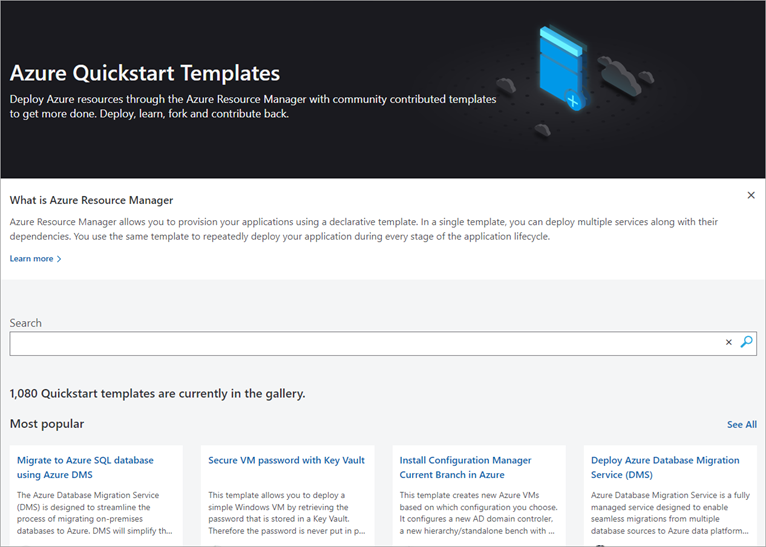
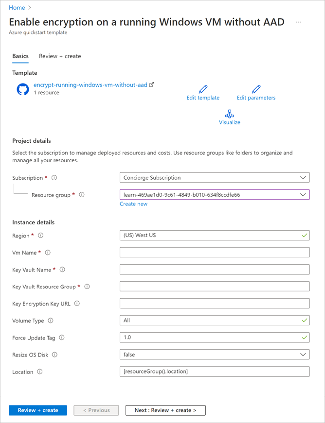

Suppose your company is deploying several servers as part of their cloud transition. VM disks must be encrypted during the deployment, so there's no time when the disks are vulnerable. You want to automate this process, and have to modify the Azure Resource Manager templates to automatically enable encryption.

Here, you'll look at how to use an Azure Resource Manager template to automatically enable encryption for new Windows VMs.

## What are Azure Resource Manager templates?

Resource Manager templates are JSON files used to define a set of resources to deploy to Azure. You can write them from scratch, and for some Azure resources, including VMs, you can use the Azure portal to generate them. You'll need to complete the required information for a manual VM deployment, but instead of deploying the VM to Azure, you save the template. You can then _reuse_ the template to create that specific VM configuration.

To automate all sorts of administrative tasks, there are [example templates available in docs](https://azure.microsoft.com/resources/templates). In fact, you could have used one of these templates to encrypt your VM that you just did manually!



## Use GitHub templates

The actual template source is stored in GitHub. You can browse to a template in GitHub and deploy right to Azure from the page.

:::image type="content" source="../media/5-deploy-from-github.png" alt-text="Screenshot showing GitHub template with the Deploy to Azure button highlighted." loc-scope="third-party"::: <!-- no-loc -->

When the template is deployed, Azure will display a list of required input fields.



You can then execute the template to create, modify, or remove resources.

### Run templates in Azure portal

If you already know the template you want to use, or you have saved templates in your Azure account, to locate and run defined templates in the portal, you can use the **Create a resource** > **Template Deployment** resource. You can search through templates by name, edit a template to change the parameters or behavior, and execute the template right from the GUI.

### Run templates from command line

Given a URL to a template, you can execute it with Azure PowerShell. For example, you could run the disk encryption template with the following PowerShell command.

```powershell
New-AzResourceGroupDeployment `
    -Name encrypt-disk `
    -ResourceGroupName <resource-group-name> `
    -TemplateUri https://raw.githubusercontent.com/azure/azure-quickstart-templates/master/201-encrypt-running-windows-vm-without-aad/azuredeploy.json
```

Or, if you prefer the Azure CLI, with the `group deployment create` command.

```azurecli
az group deployment create --resource-group <my-resource-group> --name <my-deployment-name> \ 
    --template-uri https://raw.githubusercontent.com/azure/azure-quickstart-templates/master/201-encrypt-running-windows-vm-without-aad/azuredeploy.json
```
