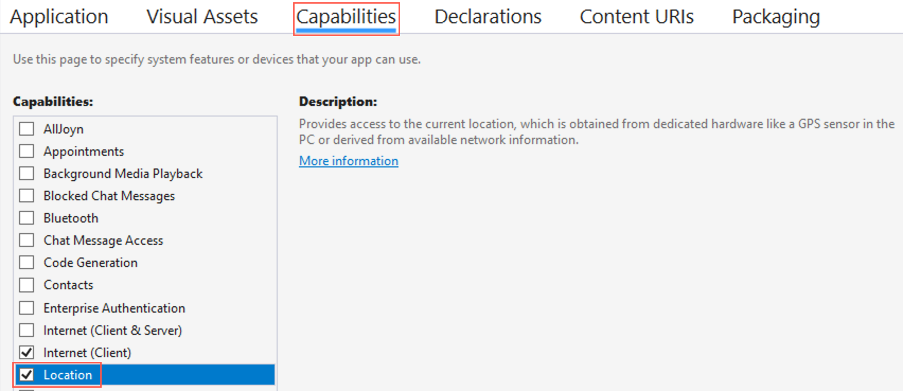
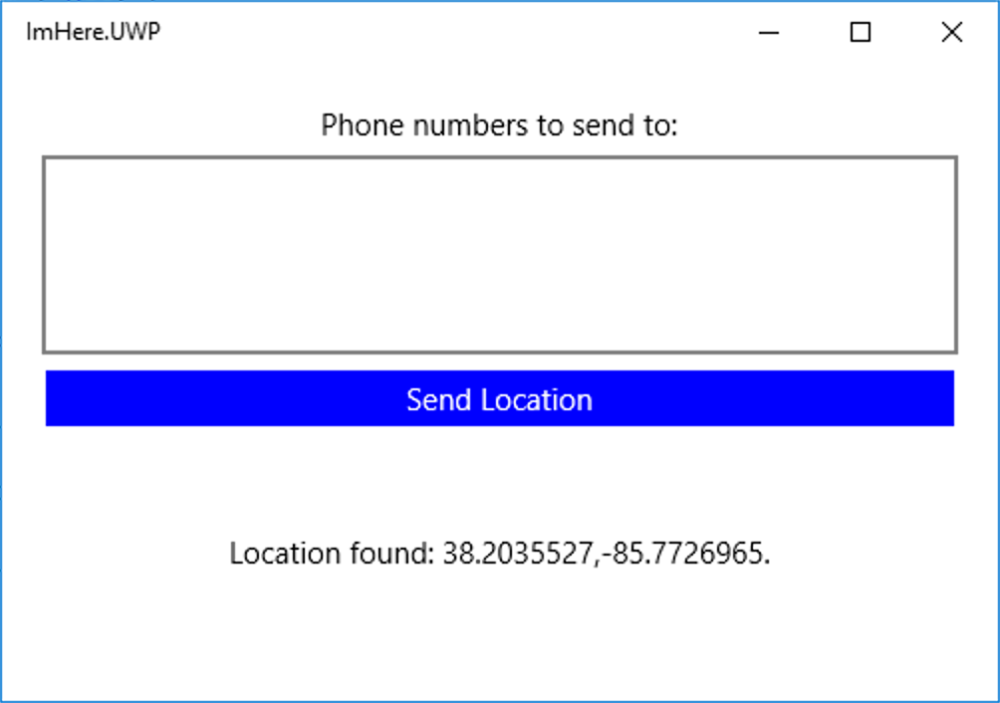

The app has a UI and a ViewModel. In this unit, you add location lookup to the view model using Xamarin Essentials.

## Enable location permissions

All mobile platforms have security around user information and certain hardware, such as the camera, photo library, and the users location. Before an app can access the users location, the user has to grant permission - either by implicitly granting these permissions at install time, or by choosing to grant a permission at run time. When you view a UWP app on the store, the listing will show the permissions that the app needs, and by installing the app you implicitly grant permission. These permissions are configured in an app manifest file.

1. In the `ImHere.UWP` app project, open the `Package.appxmanifest` file.

2. Head to the **Capabilities** tab, and check the *Location* capability.

    

> If you want to support Android or iOS, the permissions need to be configured differently, and this is detailed in the [Xamarin Essentials Geolocation docs](https://docs.microsoft.com/xamarin/essentials/geolocation?tabs=android#getting-started).

## Query for the users location

There are two ways to get the users location - the last know or the current. The current location can take some time to get as the device may need to establish a GPS link and wait for the accurate location to be retrieved. The fastest way is to get the last know location detected by the device. The last known location is potentially less accurate, but is a much faster call. Locations come as the latitude and longitude in [decimal degrees](https://en.wikipedia.org/wiki/Decimal_degrees), and the altitude of the device in meters above sea level.

1. Open the `MainViewModel` class in the `ImHere` .NET standard project.

2. In the `SendLocation` method, make a call to the `GetLastKnownLocationAsync` static method on the `Geolocation` class in the `Xamarin.Essentials` namespace.

    ```cs
    Location location = await Geolocation.GetLastKnownLocationAsync();
    ```

3. Update the `Message` property with the users location if one is found.

    ```cs
    if (location != null)
    {
        Message = $"Location found: {location.Latitude}, {location.Longitude}.";
    }
    ```

The full code for this method is below.

```cs
async Task SendLocation()
{
    Location location = await Geolocation.GetLastKnownLocationAsync();

    if (location != null)
    {
        Message = $"Location found: {location.Latitude}, {location.Longitude}.";
    }
}
```

Run the app and click the **Send Location** button to see the location on the UI.



> This app uses the last known location. In a production-quality app you would want to get the current accurate location with a time out, and if one is not found in time, fall back to the last known. You can read more on how to do this in the [Xamarin Essentials Geolocation docs](https://docs.microsoft.com/xamarin/essentials/geolocation?tabs=uwp#using-geolocation).
> This app does not have error handling. In a production-quality app you should handle any exceptions that occur, for example if the location was not available and an exception was thrown.

## Summary

In this unit, you learned how to use Xamarin Essentials to get the users location. In the next unit, you'll create an Azure Function to act as a back end for the mobile app.