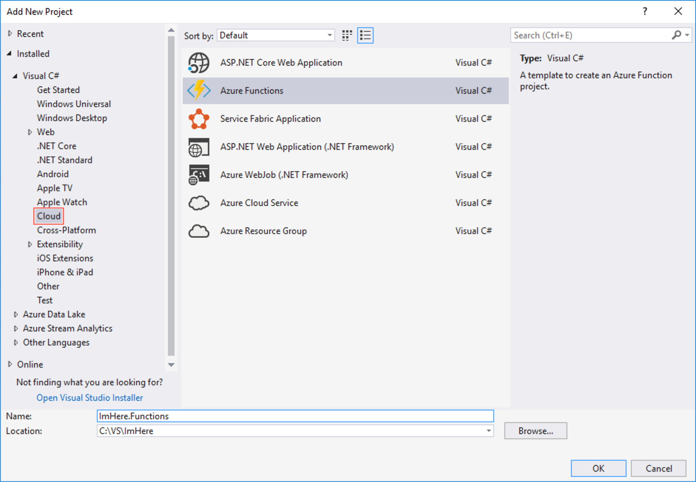
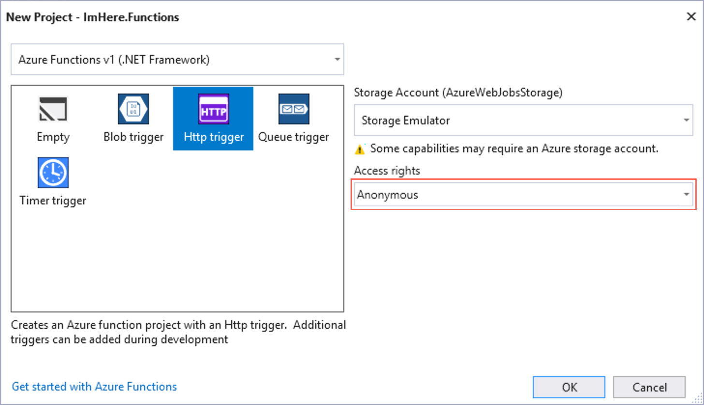
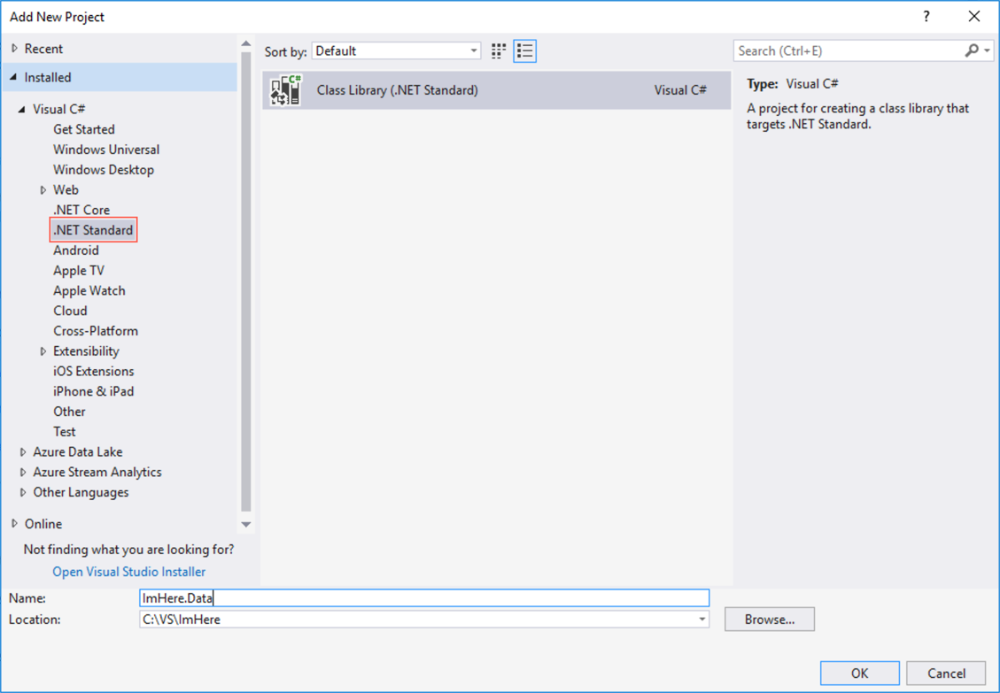
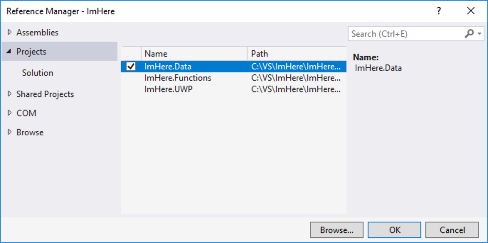
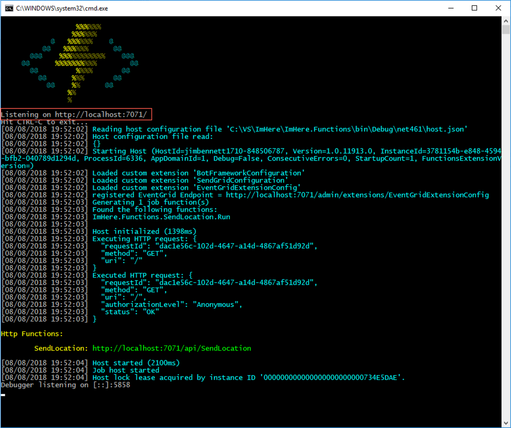

At this point, the app is working to get the users location, ready to be sent to an Azure Function. In this unit, you build the Azure Function.

## Create an Azure Functions project

1. Add a new project to the `ImHere` solution, by right-clicking on the solution and selecting *Add->New Project...*.

2. From the tree on the left-hand side select *Visual C#->Cloud*, then select *Azure Functions* from the panel in the center.

3. Name the project "ImHere.Functions", then click **OK**.

    

4. In the **New Project** configuration dialog, leave the functions version set to *Azure Functions v1 (.NET Framework)*. Select *Http Trigger*, leave the storage account set to *Storage Emulator*, and set the access rights to *Anonymous*. Then click **OK**.

    

The new project will be created and have a default function called `Function1`.

> This function was created with anonymous access. Once published to Azure anybody who knows the URL will be able to call this function. In a real-world scenario you would protect this with some form of authentication - such as [Azure App Service authentication](https://docs.microsoft.com/azure/app-service/app-service-authentication-overview) or [Azure Active Directory B2C](https://docs.microsoft.com/azure/active-directory-b2c).

## Create the function

The Azure Functions project is created with a single HTTP Trigger function called `Function1`. The function itself is implemented as a static `Run` method in the `Function1` class.

1. Rename the file in the solution explorer from "Function1.cs" to "SendLocation.cs". When prompted to rename all references to the code element `Function1`, click **Yes**.

2. Rename the function name in the attribute to "SendLocation".

    ```cs
    [FunctionName("SendLocation")]
    ```

3. Delete the contents of the function, except the first line that writes an information message to the logger.

    ```cs
    public static async Task<HttpResponseMessage> Run([HttpTrigger(AuthorizationLevel.Anonymous,
                                                                   "get", "post",
                                                                   Route = null)]HttpRequestMessage req,
                                                       TraceWriter log)
    {
        log.Info("C# HTTP trigger function processed a request.");
    }
    ```

## Create a class to share data between the mobile app and function

When data is sent to the Azure Function, it will be sent as JSON. The mobile app will serialize data into JSON, and the function will deserialize from JSON. To keep this data consistent between the mobile app and the function, create a new project that contains a class to hold the location and phone number data. This project will then be referenced by the app and function.

1. Create a new project under the `ImHere` solution, by right-clicking on the solution and selecting *Add->New Project...*.

2. From the tree on the left-hand side select *Visual C#->.NET Standard*, then select *Class Library (.NET Standard)* from the panel in the center.

3. Name the project "ImHere.Data", then click **OK**.

    

4. Delete the auto-generated "Class1.cs" file.

5. Create a new class in the `ImHere.Data` project called `PostData` by right-clicking on the project, selecting *Add->Class...*. Name the new class "PostData" and click **OK**.

6. Add `double` properties for the latitude and longitude, as well as a `string[]` property for the phone numbers to send to.

    ```cs
    public class PostData
    {
        public double Latitude { get; set; }
        public double Longitude { get; set; }
        public string[] ToNumbers { get; set; }
    }
    ```

7. Add a reference to this project to both the `ImHere.Functions` and `ImHere` projects by right-clicking on the project, selecting *Add->Reference...*. Select *Projects* from the tree on the left-hand side, then check the box next to *ImHere.Data*.

    

## Read the data sent to the function

In the Azure Function, the `req` parameter contains the HTTP request that was made, and the data inside this request will be a JSON serialized `PostData` object.

1. Open the `SendLocation` class in the `ImHere.Functions` project.

2. Read the contents of the HTTP request into a `PostData` object, adding a using directive for the `ImHere.Data` namespace.

    ```cs
    PostData data = await req.Content.ReadAsAsync<PostData>();
    ```

3. Construct a Google Maps URL using the latitude and longitude from the `PostData`.

   ```cs
   string url = $"https://www.google.com/maps/search/?api=1&query={data.Latitude},{data.Longitude}";
   ```

4. Log the URL.

    ```cs
    log.Info($"URL created - {url}");
    ```

5. Return a 200 status code to show the function completed without error.

    ```cs
    return req.CreateResponse(HttpStatusCode.OK);
    ```

The complete function is shown below.

```cs
public static async Task<HttpResponseMessage> Run([HttpTrigger(AuthorizationLevel.Anonymous,
                                                                "get", "post",
                                                                Route = null)]HttpRequestMessage req,
                                                    TraceWriter log)
{
    log.Info("C# HTTP trigger function processed a request.");
    PostData data = await req.Content.ReadAsAsync<PostData>();
    string url = $"https://www.google.com/maps/search/?api=1&query={data.Latitude},{data.Longitude}";
    log.Info($"URL created - {url}");
    return req.CreateResponse(HttpStatusCode.OK);
}
```

## Run the Azure Function locally

Azure Functions can be run locally using a local storage account and local functions runtime. This local runtime allows you to test out your function before deploying it to Azure.

1. Right-click on the `ImHere.Functions` project in the solution explorer, and select *Set as StartUp project*.

2. From the *Debug* menu, select *Start Without Debugging*. The local Azure Functions runtime will launch inside a console window and start your function, listening on an available port on `localhost`.

    

3. Take a note of the port that the function is listening on. You'll need this in the next unit to test out the mobile app. In the image above, the function is listening on port **7071**.

    ```sh
    Listening on http://localhost:7071/
    ```

4. Leave the function running so that you can test the mobile app in the next unit.

## Summary

In this unit, you learned how to create an Azure Functions project in Visual Studio, added a shared project with a data object to be shared between the mobile app and the function, and learned how to create a basic implementation of the function to deserialize the data passed in. You also learned how to run an Azure Function locally. In the next unit, you'll call the Azure Function from the mobile app.