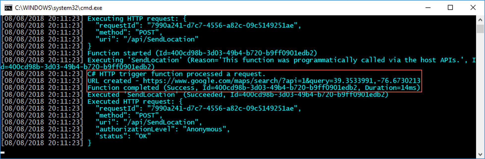

The mobile app runs, and the initial version of the Azure Function has been created. In this unit, you call the Azure Function from the mobile app, passing in the users location and the list of phone numbers they want to send SMS messages to.

## Calling the Azure Function from the mobile app

1. Open the `MainViewModel`.

2. In this class, add a private `HttpClient` field called `client`. You'll need to add a reference to the `System.Net.Http` namespace.

    ```cs
    HttpClient client = new HttpClient();
    ```

3. Add a constant field for the base url for the function. Set this to the address that the local functions runtime is listening on. Once the function is deployed to Azure, this constant can be changed to be the Azure URL.

    ```cs
    const string baseUrl = "http://localhost:7071";
    ```

4. Inside the `SendLocation` method, after the location has been found, create a new instance of `PostData` using the location and the list of phone numbers entered by the user. You'll need to add a using directive for the `ImHere.Data` namespace.

    ```cs
    PostData postData = new PostData
    {
        Latitude = location.Latitude,
        Longitude = location.Longitude,
        ToNumbers = PhoneNumbers.Split('\n')
    };
    ```

    > This assumes that the phone numbers have been entered in the correct format, one per line in the `Editor` control. In a production-quality app there would be validation around this to ensure one or more phone numbers were entered, and were in the correct format.

5. To serialize the `PostData` as JSON, the easiest way it to use the Newtonsoft.JSON NuGet package. Add this NuGet package to the `ImHere` project in the same way that you added Xamarin Essentials in an earlier unit.

6. Serialize the `PostData` to a `string` using the `JsonConvert` static class. You'll need to add a using directive for the `Newtonsoft.Json` namespace. Encode this string into a `StringContent` class so that it can be passed to the Azure Function as JSON.

    ```cs
    string data = JsonConvert.SerializeObject(postData);
    StringContent content = new StringContent(data, Encoding.UTF8, "application/json");
    ```

7. Post this data to the function, getting the result back.

   ```cs
    HttpResponseMessage result = await client.PostAsync($"{baseUrl}/api/SendLocation",
                                                        content);
   ```

   Azure Functions are accessed using `/api/<function name>`, so assuming the port chosen by the local functions runtime is 7071, the `SendLocation` function will be accessible at `http://localhost:7071/api/SendLocation`.

8. Depending on the result, show a message on the UI.

    ```cs
    if (result.IsSuccessStatusCode)
        Message = "Location sent successfully";
    else
        Message = $"Error - {result.ReasonPhrase}";
    ```

The full code for the new fields and the `SendLocation` method is below.

```cs
HttpClient client = new HttpClient();
const string baseUrl = "http://localhost:7071";

async Task SendLocation()
{
    Location location = await Geolocation.GetLastKnownLocationAsync();

    if (location != null)
    {
        Message = $"Location found: {location.Latitude}, {location.Longitude}.";

        PostData postData = new PostData
        {
            Latitude = location.Latitude,
            Longitude = location.Longitude,
            ToNumbers = PhoneNumbers.Split('\n')
        };

        string data = JsonConvert.SerializeObject(postData);
        StringContent content = new StringContent(data, Encoding.UTF8, "application/json");
        HttpResponseMessage result = await client.PostAsync($"{baseUrl}/api/SendLocation",
                                                            content);

        if (result.IsSuccessStatusCode)
            Message = "Location sent successfully";
        else
            Message = $"Error - {result.ReasonPhrase}";
    }
}
```

## Testing it out

1. Make sure the Azure Function is still running locally, and the port matches the `SendLocation` method.

2. Set the UWP app as the startup app and run it. Click the **Send Location** button. You'll see output in the functions runtime console window showing the function being called, and the logging showing the generated URL.

    

3. To test the URL generation, paste it from the console into a browser. It should show your current location.

## Summary

In this unit you learned how to call an Azure Function from the mobile app. This call passed the users location and the phone numbers they entered as JSON. In the next unit, you'll bind the Azure Function to Twilio to send this location as an SMS message.