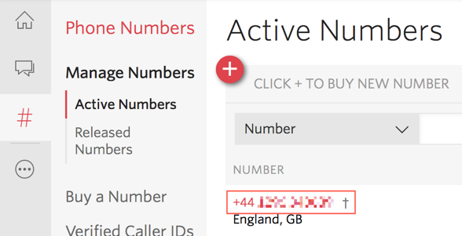
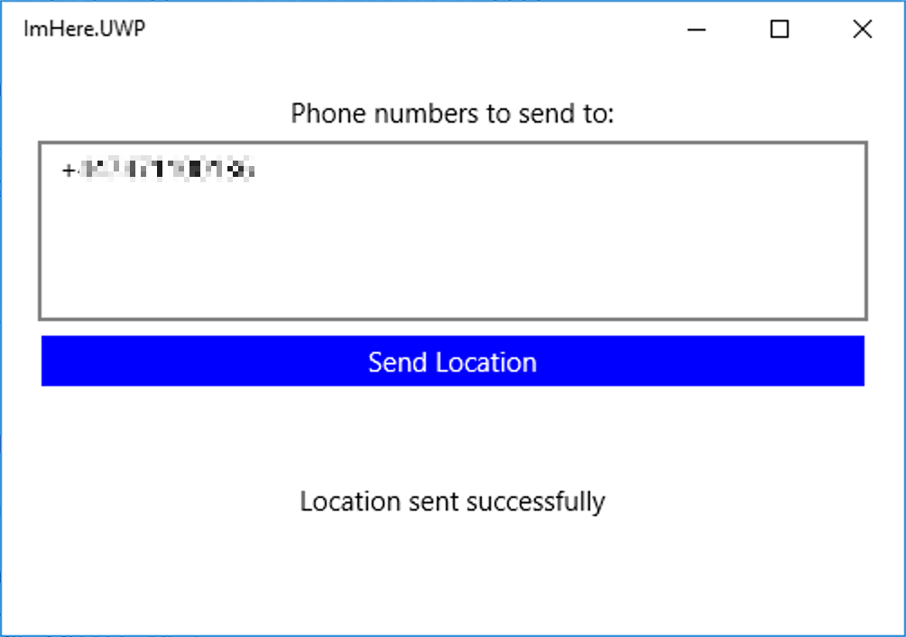
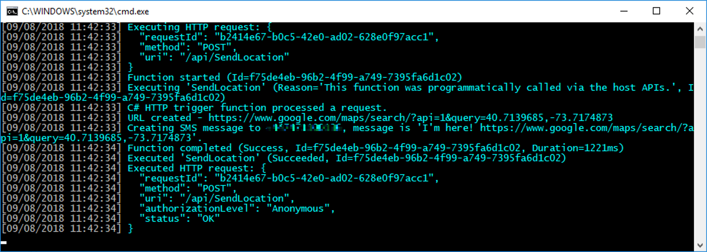
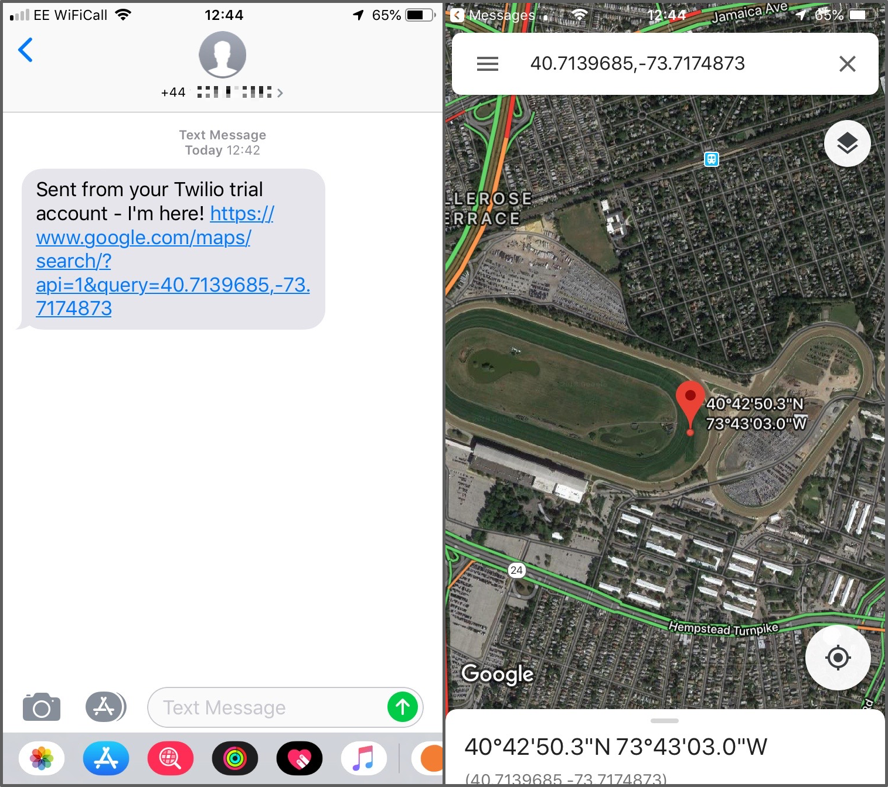

At this point, the mobile app is complete and sends the users location and list of phone numbers to an Azure Function that can deserialize the data. In this unit, you bind the Azure Function to Twilio to send SMS messages.

Azure Functions can be connected to other services, either services in Azure or third-party services. These connections, called bindings, exist in two forms - input and output bindings. Input bindings provide data to your function, output bindings take data from your function and send it to another service. You can read about bindings in the [Azure Functions Binding docs](https://docs.microsoft.com/azure/azure-functions/functions-triggers-bindings).

Bindings for Azure Functions created in Visual Studio are defined using parameters to the function, decorated with attributes.

## Bind the Azure Function to Twilio

Sending SMS messages via Twilio requires an output binding that is configured with your account SID and auth token.

1. Stop the local Azure Functions runtime if it's still running from the previous unit.

2. Add the "Microsoft.Azure.WebJobs.Extensions.Twilio" NuGet package to the `ImHere.Functions` project. This NuGet package contains the relevant classes for the binding.

3. Add a new parameter to the static `Run` method on the `SendLocation` static class called `messages`. This parameter will have a type of `ICollector<SMSMessage>`. You'll need to add a using directive for the `Twilio` namespace.

    ```cs
    [FunctionName("SendLocation")]
    public static async Task<HttpResponseMessage> Run([HttpTrigger(AuthorizationLevel.Anonymous,
                                                                   "get", "post",
                                                                   Route = null)]HttpRequestMessage req,
                                                      ICollector<SMSMessage> messages,
                                                      TraceWriter log)
    ```

4. Decorate the new `messages` parameter with the `TwilioSms` attribute. This attribute has three parameters you need to set.

    | Setting      |  Value   | Description                                        |
    | --- | --- | ---|
    | **AccountSidSetting** | "TwilioAccountSid" | The SID for your Twilio account. Rather than set the SID directly, this parameter is the name of a value in the Function app settings that will be used to retrieve the SID. |
    | **AuthTokenSetting** | "TwilioAuthToken" | The Auth Token for your Twilio account. Rather than set the Auth Token directly, this parameter is the name of a value in the Function app settings that will be used to retrieve the Auth Token. |
    | **From** | Your Twilio Phone number | The Twilio phone number that the SMS messages will come from in international format (+\<country code\>\<phone number\>, for example "+1555123456"). |

    When you create a Twilio account, you are assigned a phone number that you can send messages from. You can find this phone number from the Twilio **Phone Numbers** dashboard. From the Twilio site, select the ellipses at the bottom of the left-hand menu. Then select *SUPER NETWORK->Phone Numbers*. You can pin this dashboard to the left-hand menu using the pin icon. Your Twilio number will be under *Manage Numbers->Active Numbers*. You'll need to remove any spaces from the number.

    

    ```cs
    [TwilioSms(AccountSidSetting = "TwilioAccountSid",
               AuthTokenSetting = "TwilioAuthToken",
               From = "+1xxxxxxxxx")]ICollector<SMSMessage> messages,
    ```

5. Function app settings can be configured locally inside the `local.settings.json` file. Add your Twilio Account SID and Auth Token to this json file using the setting names that were passed to the `TwilioSMS` attribute.

    ```json
    {
        "IsEncrypted": false,
        "Values": {
            "AzureWebJobsStorage": "UseDevelopmentStorage=true",
            "AzureWebJobsDashboard": "UseDevelopmentStorage=true",
            "TwilioAccountSid": "<Your SID>",
            "TwilioAuthToken": "<Your Auth Token>"
        }
    }
    ```

    Replace \<Your SID\> and \<Your Auth Token\> with the values from your Twilio dashboard.

    > These local settings will only be for running locally. In a production app, these value would be your local development or test account credentials. Once the Azure Function has been deployed to Azure, you'll be able to configure the production values.
    > If you check your code into source control, these local application setting values will be checked in to, so be careful not to check in any actual values in these files if your code is open source or public in any form.

## Create the SMS messages

The `ICollector<SMSMessage>` parameter is a collection of `SMSMessage` instances, and is used to collect the SMS messages you want to send. After the function has finished running, any instances of `SMSMessage` added to this collection are passed to Twilio, and sent to the relevant recipients.

1. In the `SendLocation` function, add code to loop through the phone numbers in the `PostData` and create an SMS message for each one.

    ```cs
    foreach (string toNo in data.ToNumbers)
    {
        SMSMessage message = new SMSMessage
        {
            Body = $"I'm here! {url}",
            To = toNo
        };
    }
    ```

    The message needs the phone number to send to, and a body that contains the Google Maps URL created from the users location.

2. Log each message, then add it to the `messages` collection.

    ```cs
    foreach (string toNo in data.ToNumbers)
    {
        ...
        log.Info($"Creating SMS message to {message.To}, message is '{message.Body}'.");
        messages.Add(message);
    }
    ```

The complete `SendLocation` method is shown below.

```cs
[FunctionName("SendLocation")]
public static async Task<HttpResponseMessage> Run([HttpTrigger(AuthorizationLevel.Anonymous,
                                                                "get", "post",
                                                                Route = null)]HttpRequestMessage req,
                                                    [TwilioSms(AccountSidSetting = "TwilioAccountSid",
                                                                AuthTokenSetting = "TwilioAuthToken",
                                                                From = "<your Twilio phone number>")]ICollector<SMSMessage> messages,
                                                    TraceWriter log)
{
    log.Info("C# HTTP trigger function processed a request.");
    PostData data = await req.Content.ReadAsAsync<PostData>();
    string url = $"https://www.google.com/maps/search/?api=1&query={data.Latitude},{data.Longitude}";
    log.Info($"URL created - {url}");
    foreach (string toNo in data.ToNumbers)
    {
        SMSMessage message = new SMSMessage
        {
            Body = $"I'm here! {url}",
            To = toNo
        };
        log.Info($"Creating SMS message to {message.To}, message is '{message.Body}'.");
        messages.Add(message);
    }
    return req.CreateResponse(HttpStatusCode.OK);
}
```

## Test it out

1. Set the `ImHere.Functions` app as the startup project and start it without debugging.

2. Set the `ImHere.UWP` app as the startup project and run it.

3. Enter your own phone number in international format (+\<country code\>\<phone number\>) into the Xamarin.Forms app. Twilio trial accounts can only send messages to verified phone numbers, so for now you'll only be able to message yourself unless you upgrade to a paid account or verify other numbers.

4. Click the **Send Location** button. If the SMS message was sent successfully, you'll see a message in the Xamarin.Forms app saying "Location sent successfully".

    

5. You'll see in the console logs for the Azure Function the message being created and sent. If any errors occur (such as the to number is in the wrong format), they will be logged out here.

    

6. Check your phone for a message. Follow the link in the message to see your location.

    

## Summary

In this unit, you learned how to create a Twilio binding for the Azure Function, and send an SMS message with the users location to a function that was running locally. In the next unit, you publish the function to Azure.