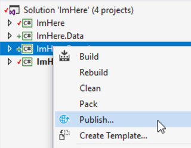
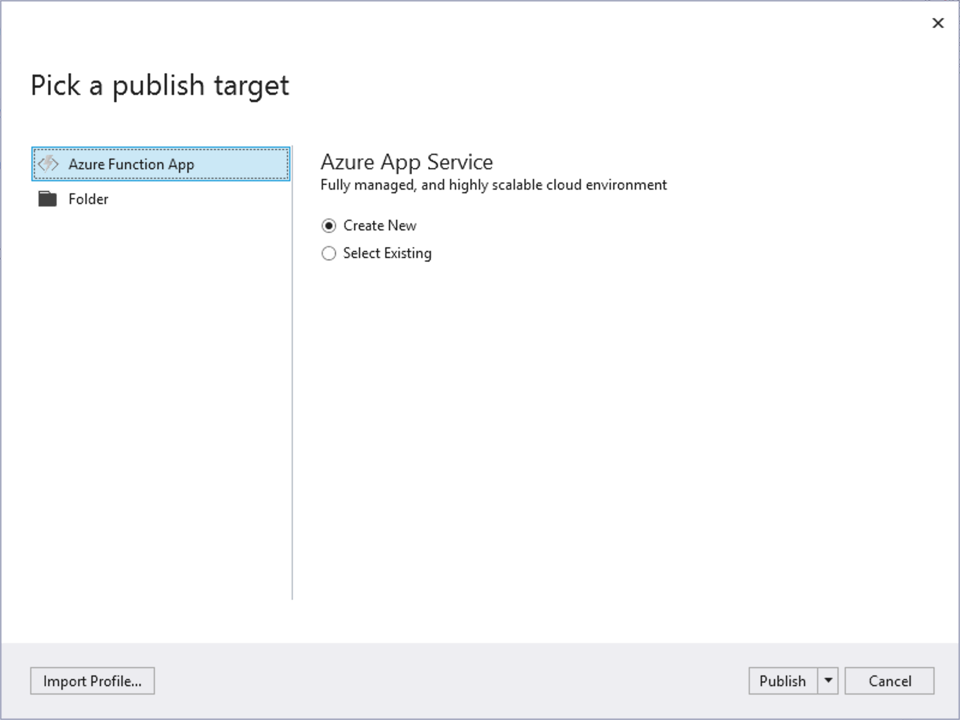
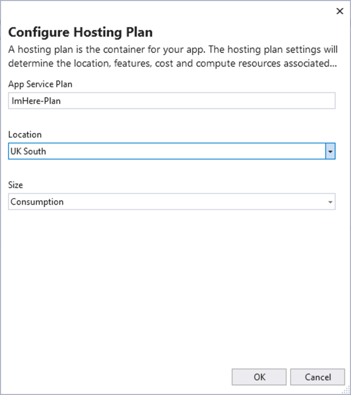
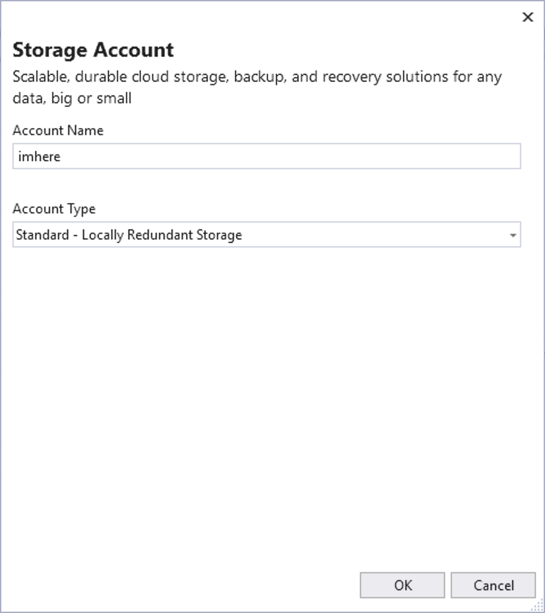
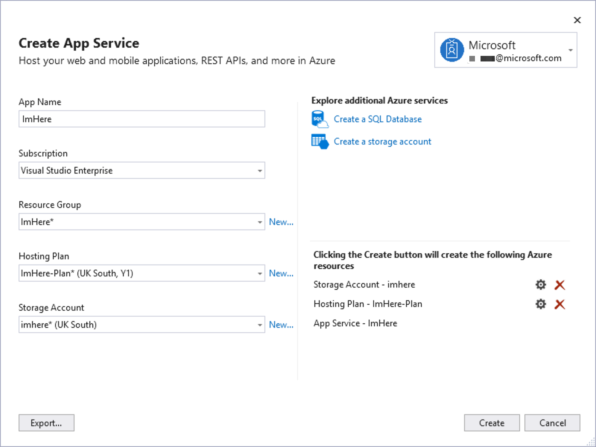
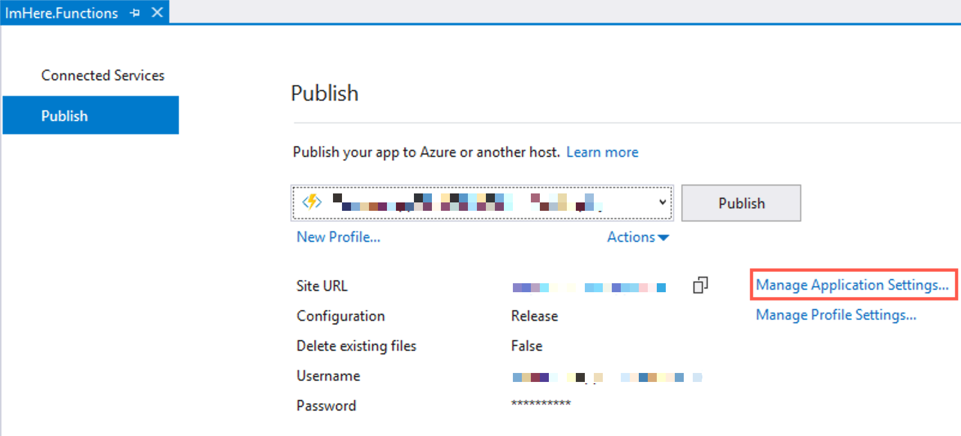
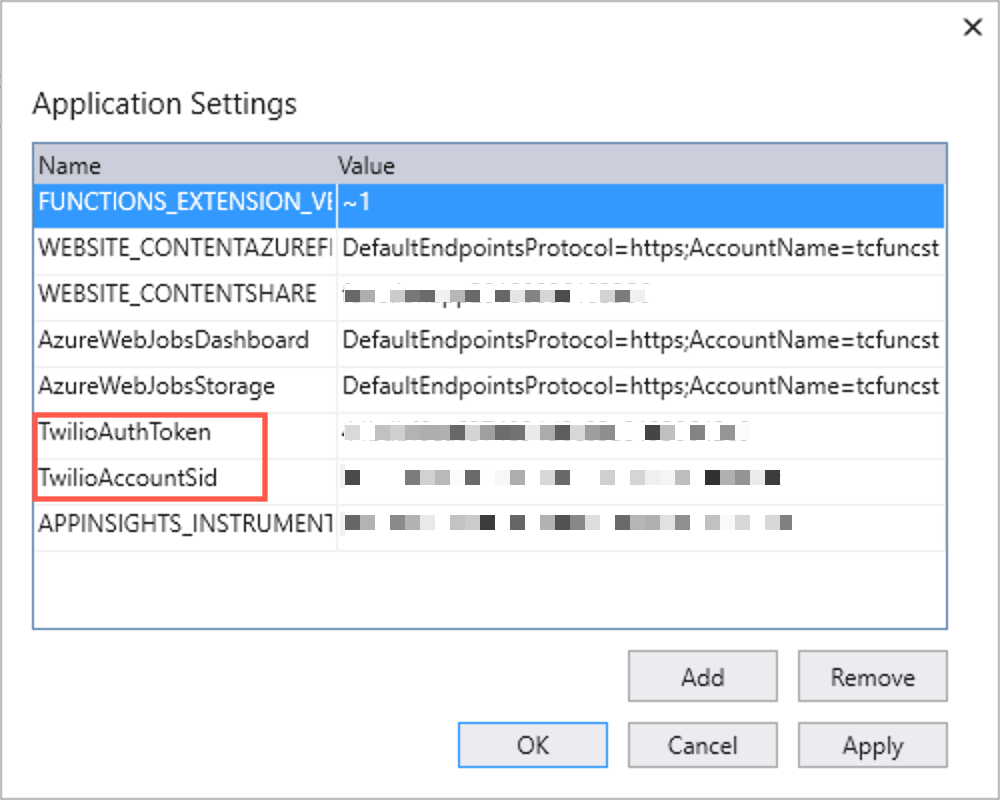
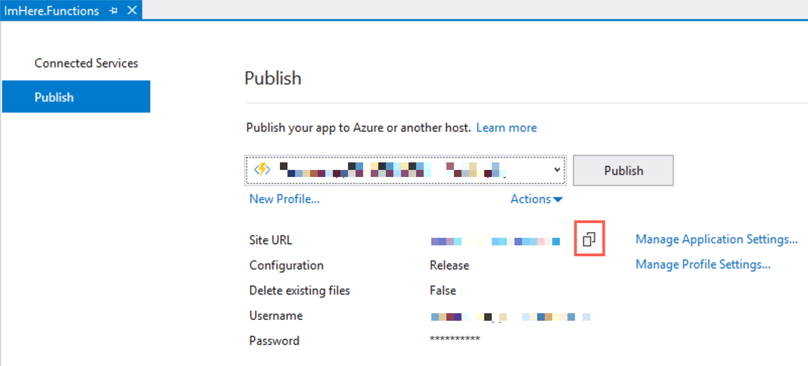

The app and Azure Function are now complete and running locally. In this unit, you publish the Azure Function to Azure to run in the cloud.

> In this unit you will publish your function from Visual Studio. This is a great way to get started for proof-of-concepts, prototypes and learning, but for a production-quality app you should **not** use this method. You should use some form of CI based deployment, and you can read more about doing this in the [Azure Functions Deployment docs](https://docs.microsoft.com/azure/azure-functions/functions-continuous-deployment).
>
> 

## Publishing your app to Azure

Azure Functions can be published to Azure from inside Visual Studio.

1. Stop the local Azure Functions runtime if it's still running from the previous unit.

2. Right-click on the `ImHere.Functions` app in the solution explorer and select *Publish...*.

    

3. From the **Pick a publish target** dialog, select *Azure Function App*, and for **Azure App Service**, select *Create New*. Click **Publish**.

    

4. Select your Azure account from the drop-down in the top-right corner if you have more than one Azure accounts and the right one isn't selected.

5. Give your function app a name. This name needs to be globally unique across all the function apps in the whole of Azure, so use something like "ImHere-\<YourName\>".

6. Select the subscription you want to create this Function app under.

7. Create a new resource group for this Function App by clicking the **New...** button next to the **Resource Group** drop-down and giving it a name such as "ImHere". Resource group names need to be unique to your subscription, not globally unique across Azure. Then click **OK**.

    

   Creating a new resource group makes it easier to clean up later. You can delete the resource group and know that everything you've created for this function app will all be deleted at the same time.

8. Create a new hosting plan by clicking the **New...** button next to the **Hosting Plan** drop-down. The app service plan name will default to your app name with "Plan" on the end. Set the **Location** to the closest location to you, and make sure **Size** is set to consumption. Then click **OK**.

    

9. Create a new storage account by clicking the **New...** button next to the **Storage Account** drop-down. A default name will be provided so keep all the default values and click **OK**.

    

10. Click **Create** to provision all the resources on Azure and publish your Azure Function app.

    

Provisioning will take a couple of minutes or so to run. The following resources will be provisioned:

* A storage account to store the files needed for the Azure Function app
* An App Service plan to manage the compute resources needed by the Azure Function app
* The App Service that runs the Azure Function

The function will now be published and available to call at https://<your-app-name>.azurewebsites.net/api/SendLocation.

## Configuring your app

When the Azure Function was running locally, it was using Twilio credentials that were stored in a `local.settings.json` file. As the name suggests, this file is for local settings, not Azure settings. Before the Azure Function can be called inside Azure, the `TwilioAccountSid` and `TwilioAuthToken` settings need to be configured.

1. From the Publish tab, click the **Manage Application Settings** option.

    

2. Click the **Add** button to add a new setting. Name it "TwilioAccountSid", and set the value to your Twilio Account SID. Repeat this step for your Auth Token using the name "TwilioAuthToken".

    

3. Click **OK**.

4. Click **Publish** to republish the Azure Functions app with the new application settings.

    

## Pointing the mobile app to Azure

1. From the Publish tab, copy the **Site URL** using the copy button next to the value.

    

2. Open the `MainViewModel` from the `ImHere` project.

3. Update the value of the `baseUrl` field to be the site URL copied from the publish tab.

4. Change the protocol for this value from `http` to `https`. The site URL is always given using HTTP, but you have to use HTTPS to call an Azure Function.

## Test it out

1. Set the `ImHere.UWP` app as the startup app and run it.

2. Enter a phone number and click the **Send Location** button.

3. You should receive the location as an SMS message.

## Summary

In this unit, you learned how to publish an Azure Functions project to Azure from inside Visual Studio, and configure application settings.