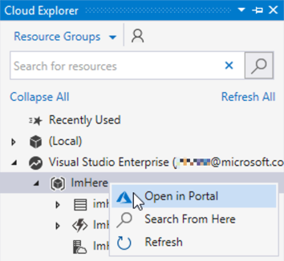
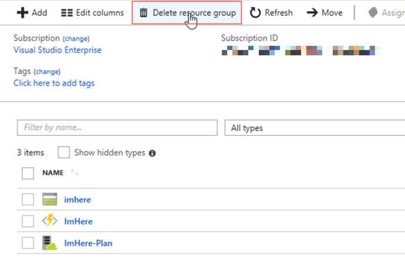
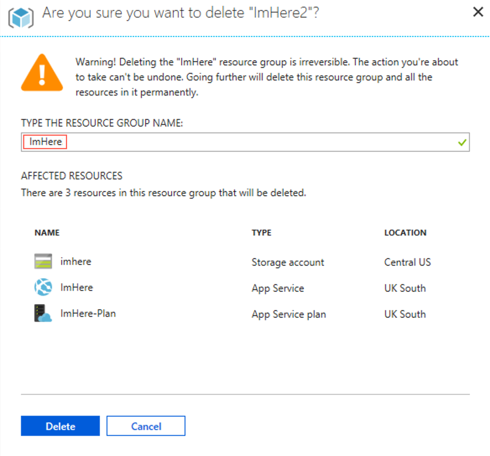

You've successfully created a cross-platform mobile app using Xamarin, and an Azure Function with a Twilio binding.

## Clean up resources

When you're done working with this Azure Function application, you can delete all resources created during the tutorial from the Azure portal.

1. From Visual Studio, select *View->Cloud Explorer*.

2. From the drop-down at the top of this panel, select *Resource Groups*.

3. Expand the subscription that you used to create the resource group. Right-click on the "ImHere" resource group and select *Open in Portal*.

    

4. Log into the Azure portal in your browser if necessary.

5. The portal will open on the "ImHere" resource group. Click the **Delete Resource Group** button.

    

6. Enter the name of the resource group to confirm the deletion, and click **Delete**.

    

## Summary

In this tutorial, you learned how to:
> [!div class="checklist"]
> * Create a cross-platform Xamarin.Forms app that uses Xamarin Essentials.
> * Create a cross-platform UI using XAML with application logic in a View Model, as well as bind properties in a ViewModel to the UI.
> * Detect the users location.
> * Create an Azure Function with an HTTP trigger and run it locally.
> * Call an Azure Function from a mobile app, passing data as JSON.
> * Bind an Azure Function to Twilio to send an SMS message.
> * Publish an Azure Function to Azure.
