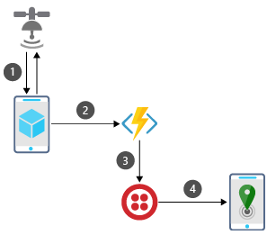
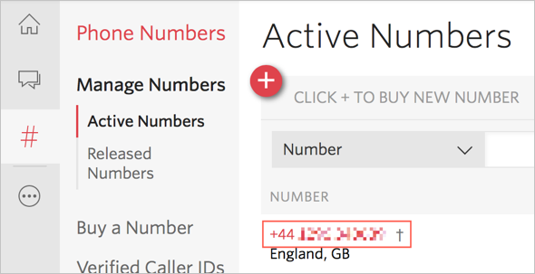

> [!TIP]
> The username and password you need to sign in to the VM are located on the **Resources** tab.

> [!NOTE]
> If you are using a Mac, after launching the VM you may need to use either the lightning icon on the toolbar, or the **Ctrl+Alt+Delete** option from the **Resources** tab next to the instructions to unlock the VM.

In this module, you'll create a cross-platform Xamarin.Forms app with a serverless back end. This app will get the user's location from their device and send it with a list of phone numbers to an Azure function. The function will then use a binding to a third-party service (Twilio) to send your location as an SMS message to all the phone numbers provided.

This process involves the following steps:

1. The app captures your location using Xamarin.Essentials as an abstraction over device-specific location APIs.

1. The location and phone numbers are packaged up into a JSON payload and sent to an Azure function.

1. The Azure function decodes the JSON payload and creates SMS messages.

1. The SMS messages are sent via [Twilio](https://www.twilio.com/?azure-portal=true).

The following illustration shows an overview of this process.

## Create a Twilio account

To be able to send SMS messages from an Azure function, you'll need a Twilio account. The free account is more than enough to get started.

1. Head to [twilio.com](https://www.twilio.com?azure-portal=true).

1. Click the red **Sign Up** button in the top-right corner.

1. Fill in your details and click **Get Started**.

1. You'll need to verify your phone number. Twilio free accounts let you send messages only to verified phone numbers to stop them being used for spam. Twilio will send you a verification code that you need to enter to verify your phone.

1. Select the **Products** tab, and click **Programmable SMS**, then click **Continue**.

1. Provide a name for your first project, such as "I'm here", then click **Continue**.

1. Skip the step to invite a team mate.

1. From the Twilio messaging dashboard, expand the **Project Info** panel.

1. Note your **ACCOUNT SID** and **AUTH TOKEN** because you will need these values later.

    When you create a Twilio account, you are assigned a phone number that you can send messages from. You can find this phone number on the Twilio **Phone Numbers** dashboard.

1. From the Twilio site, select the ellipses at the bottom of the left-hand menu. Then, select *SUPER NETWORK->Phone Numbers*. You can pin this dashboard to the left-hand menu using the pin icon. Your Twilio number will be under *Manage Numbers->Active Numbers*.

    

    > [!TIP]
    > If you don't have an active number yet, select **Get Started** in the Active Numbers page to begin the process of creating a number.

1. Note your active phone number. It will be used later in this module.

> [!NOTE]
> When you sign up, you will be assigned a Twilio phone number that will be used to send SMS messages. In some countries, these numbers may not be able to send SMS messages. The Twilio documentation lists [which countries have restrictions](https://support.twilio.com/hc/articles/223183068-Twilio-international-phone-number-availability-and-their-capabilities?azure-portal=true), and shows ways to send SMS messages using an [international number or AlphaNumeric sender Id](https://support.twilio.com/hc/articles/226690868-Using-Twilio-when-SMS-numbers-are-unavailable-in-your-country?azure-portal=true).

## Launch Visual Studio

For this module, you'll develop the mobile app and Azure Functions app using Visual Studio 2017, available via a virtual machine. Although Xamarin.Forms apps can be built to run on iOS, Android, and Universal Windows Platform (UWP), this module will just focus on UWP so that it works inside the lab virtual machine.

Launch Visual Studio 2017 from the VM's Start Menu, or from the desktop shortcut.

## Summary

In this unit, you created a Twilio account to use to send SMS messages and launched Visual Studio. Next, you learn how to create a Xamarin.Forms app and add the Xamarin.Essentials NuGet package.

> [!IMPORTANT]
> Keep note of the Twilio  **ACCOUNT SID** and **AUTH TOKEN** and **Active Phone Number** values that you gathered in this unit, because you'll need these values later.
