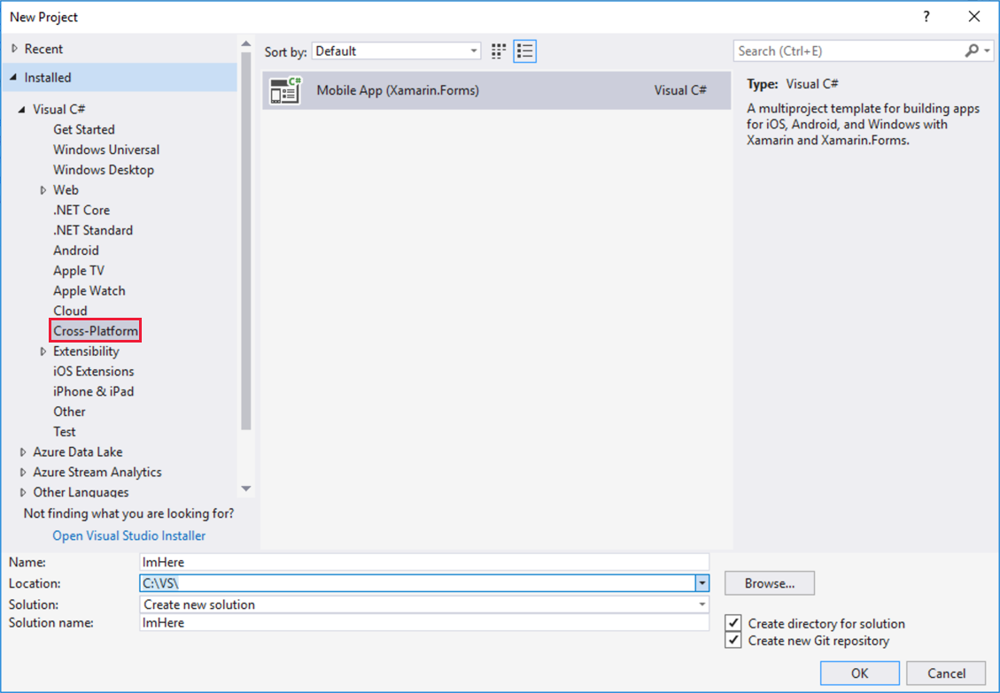
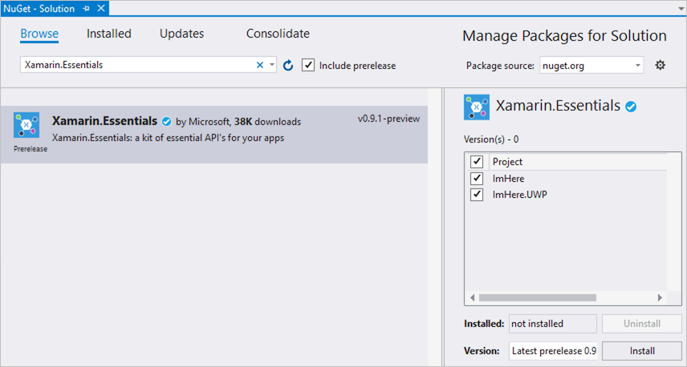
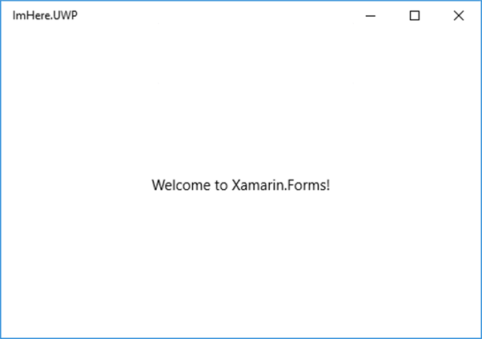

The application you're building is a cross-platform mobile app that talks to an Azure function to share your location. In this unit, you create the blank mobile app using Visual Studio and install a NuGet package that has an API for getting the user's location.

## Create the Xamarin.Forms project

1. From Visual Studio, select *File->New->Project...*.

1. From the tree on the left-hand side, select *Visual C#->Cross-Platform* and then select *Mobile App (Xamarin.Forms)* from the panel in the center.

1. Name the solution "ImHere".

1. Choose an appropriate location for the solution.

1. Click **OK**.

    

1. From the **New Cross Platform App** dialog, select the *Blank App* template.

1. For this module you will build a UWP app, so uncheck iOS and Android and leave UWP checked.

1. For the *Code Sharing Strategy*, select **.NET Standard**.

1. Click **OK**.

    

Visual Studio will create two projects for you - a UWP app called `ImHere.UWP` and a .NET Standard library, `ImHere`. Xamarin.Forms apps are made up of two parts - one or more platform-specific app projects and one (or more) .NET Standard libraries. The platform-specific app projects contain the platform-specific code needed to run an app on the relevant platform. These projects then launch a Xamarin.Forms app that is defined in a cross-platform .NET Standard library. You build your app in cross-platform code and, at runtime, any user interfaces you create are translated into the relevant platform-specific UI components.

## Adding Xamarin.Essentials

The UWP, Android, and iOS platforms provide numerous similar capabilities that take advantage of the operating system and hardware. Despite these similarities, the APIs are very different. Using these APIs from cross-platform code requires writing platform-specific code in your app projects that you expose to your .NET Standard libraries. [Xamarin.Essentials](https://docs.microsoft.com/xamarin/essentials/?azure-portal=true) is a NuGet package that provides a cross-platform abstraction over a number of these APIs so that you don't need to write platform-specific code. This includes the geolocation APIs that you will use in your app to get the user's location.

1. Right-click on the `ImHere` solution (the top level solution, not the `ImHere` .NET Standard project) in the Visual Studio Solution Explorer and select *Manage NuGet Packages for Solution...*.

1. Select the **Browse** tab and search for "Xamarin.Essentials". This package is currently available as a prerelease NuGet package, so check the *include prelease* box.

    > [!TIP]
    > If you do not see the Xamarin.Essentials NuGet package, double check that *include prelease* is checked. 

1. Select the **Xamarin.Essentials** NuGet package.

1. Check all your projects in the project list on the right-hand side.

1. Click the **Install** button to install the NuGet package. You'll need to accept the license to continue.

    

## Building and running the app

1. Right-click on the `ImHere.UWP` project in Solution Explorer and select *Set as StartUp project*.

1. Set the build configuration to **Debug**, the platform to **x86**, and the device to run on to **Local Machine**.

    

1. Start debugging the app.

    

## Summary

In this unit, you created a new Xamarin.Forms cross-platform mobile app and added the Xamarin.Essentials NuGet package. Next, you learn how to build up the mobile app UI and logic.