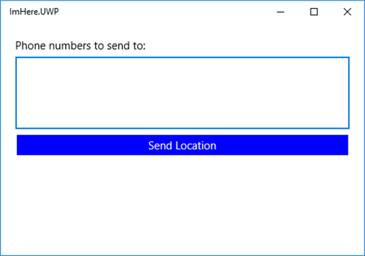

At this point, the mobile app is a simple "Hello World" app. In this unit, you add the UI and some basic application logic.

The UI for the app will consist of:

- A text-entry control to enter some phone numbers.
- A button to send your location to those numbers using an Azure function.
- A label that will show a message to the user of the current status, such as the location being sent and location sent successfully.

Xamarin.Forms supports a design pattern called Model-View-ViewModel (MVVM). You can read more about MVVM in the [Xamarin MVVM docs](https://docs.microsoft.com/xamarin/xamarin-forms/enterprise-application-patterns/mvvm?azure-portal=true), but the essence of it is, each page (View) has a ViewModel that exposes properties and behavior.

ViewModel properties are 'bound' to components on the UI by name, and this binding synchronizes data between the View and ViewModel. For example, a `string` property on a ViewModel called `Name` could be bound to the `Text` property of a text-entry control on the UI. The text-entry control shows the value in the `Name` property and, when the user changes the text in the UI, the `Name` property is updated. If the value of the `Name` property is changed in the ViewModel, an event is raised to tell the UI to update.

ViewModel behavior is exposed as command properties, a command being an object that wraps an action that is executed when the command is invoked. These commands are bound by name to controls like buttons, and tapping a button will invoke the command.

## Create a base ViewModel

ViewModels all implement the `INotifyPropertyChanged` interface. This interface has a single event, `PropertyChanged`, which is used to notify the UI of any updates. This event has event args that contain the name of the property that has changed. It's common practice to create a base ViewModel class implementing this interface and providing some helper methods.

1. Create a new class in the `ImHere` .NET Standard project called `BaseViewModel` by right-clicking on the project, and then selecting *Add->Class...*. Name the new class "BaseViewModel" and click **Add**.

1. Make the class `public` and derive from `INotifyPropertyChanged`. You'll need to add a using directive for `System.ComponentModel`.

1. Implement the `INotifyPropertyChanged` interface by adding the `PropertyChanged` event:

    ```cs
    public event PropertyChangedEventHandler PropertyChanged;
    ```

1. The common pattern for ViewModel properties is to have a public property with a private backing field. In the property setter, the backing field is checked against the new value. If the new value is different to the backing field, the backing field is updated and the `PropertyChanged` event is raised. This logic is easy to factor out into a method, so add the `Set` method. You'll need to add a using directive for the `System.Runtime.CompilerServices` namespace.

    ```cs
    protected void Set<T>(ref T field, T value, [CallerMemberName] string propertyName = null)
    {
        if (Equals(field, value)) return;
        field = value;
        PropertyChanged?.Invoke(this, new PropertyChangedEventArgs(propertyName));
    }
    ```

    This method takes a reference to the backing field, the new value, and the property name. If the field hasn't changed, the method returns, otherwise, the field is updated and the `PropertyChanged` event is raised. The `propertyName` parameter on the `Set` method is a default parameter and is marked with the `CallerMemberName` attribute. When this method is called from a property setter, this parameter is normally left as the default value. The compiler will then automatically set the parameter value to be the name of the calling property.

The full code for this class is below.

```cs
using System.ComponentModel;
using System.Runtime.CompilerServices;

namespace ImHere
{
    public class BaseViewModel : INotifyPropertyChanged
    {
        public event PropertyChangedEventHandler PropertyChanged;

        protected void Set<T>(ref T field, T value, [CallerMemberName] string propertyName = null)
        {
            if (Equals(field, value)) return;
            field = value;
            PropertyChanged?.Invoke(this, new PropertyChangedEventArgs(propertyName));
        }
    }
}
```

## Create a ViewModel for the page

The `MainPage` will have a text-entry control for phone numbers and a label to display a message. These controls will be bound to properties on a ViewModel.

1. Create a class called `MainViewModel` in the `ImHere` .NET Standard project.

1. Make this class public and derive from `BaseViewModel`.

1. Add two `string` properties, `PhoneNumbers` and `Message`, each with a backing field. In the property setter, use the base class `Set` method to update the value and raise the `PropertyChanged` event.

   ```cs
    string message = "";
    public string Message
    {
        get => message;
        set => Set(ref message, value);
    }

    string phoneNumbers = "";
    public string PhoneNumbers
    {
        get => phoneNumbers;
        set => Set(ref phoneNumbers, value);
    }
   ```

1. Add a read-only command property called `SendLocationCommand`. This command will have a type of `ICommand` from the `System.Windows.Input` namespace.

    ```cs
    public ICommand SendLocationCommand { get; }
    ```

1. Add a constructor to the class, and in this constructor, initialize the `SendLocationCommand` as a new Xamarin.Forms `Command`. You will need to add a using directive for the `Xamarin.Forms` namespace. The constructor for this command takes an `Action` to run when the command is invoked, so create an `async` method called `SendLocation` and pass a lambda function that `await`s this call to the constructor. The body of the `SendLocation` method will be implemented in later units in this module. You'll need to add a using directive for the `System.Threading.Tasks` namespace to be able to return a `Task`.

    ```cs
    public MainViewModel()
    {
        SendLocationCommand = new Command(async () => await SendLocation());
    }

    async Task SendLocation()
    {
    }
    ```

The code for this class is shown below.

```cs
using System.Threading.Tasks;
using System.Windows.Input;
using Xamarin.Forms;

namespace ImHere
{
    public class MainViewModel : BaseViewModel
    {
        string message = "";
        public string Message
        {
            get => message;
            set => Set(ref message, value);
        }

        string phoneNumbers = "";
        public string PhoneNumbers
        {
            get => phoneNumbers;
            set => Set(ref phoneNumbers, value);
        }

        public MainViewModel()
        {
            SendLocationCommand = new Command(async () => await SendLocation());
        }

        public ICommand SendLocationCommand { get; }

        async Task SendLocation()
        {
        }
    }
}
```

## Create the user interface

Xamarin.Forms UIs can be built using XAML.

1. Open the `MainPage.xaml` file from the `ImHere` project. The page will open in the XAML editor.

    > [!NOTE]
    >  The `ImHere.UWP` project also contains a file called `MainPage.xaml`. Make sure you're editing the one in the .NET Standard library.

1. Before you can bind controls to properties on a ViewModel, you have to set an instance of the ViewModel as the binding context of the page. Add the following XAML inside the top-level `ContentPage`.

    ```xml
    <ContentPage.BindingContext>
        <local:MainViewModel/>
    </ContentPage.BindingContext>
    ```

1. Overwrite the `StackLayout` with the following code:

     ```xml
    <StackLayout Padding="20">
        <Label Text="Phone numbers to send to:" HorizontalOptions="Start"/>
        <Editor Text="{Binding PhoneNumbers}" HeightRequest="100"/>
    </StackLayout>
    ```
    - The `Editor` control will be used to add phone numbers, and the `Label` above describes the purpose of this field to the user. 
    - `StackLayout`'s stack child controls either horizontally or vertically in the order in which the controls are added, so adding the `Label` first will put it above the `Editor`.
    - `Editor` controls are multi-line entry controls, allowing the user to enter multiple phone numbers, one per line.

   

    The `Text` property on the `Editor` is bound to the `PhoneNumbers` property on the `MainViewModel`. The syntax for binding is to set the property value to `"{Binding <property name>}"`. The curly braces will tell the XAML compiler that this value is special and should be treated differently from a simple `string`.

1. Add a `Button` below the `Editor` control. We'll use this button to send the user's location.

    ```xml
    <Button Text="Send Location" BackgroundColor="Blue" TextColor="White"
            Command="{Binding SendLocationCommand}" />
    ```

    The `Command` property is bound to the `SendLocationCommand` command on the ViewModel. When the button is tapped, the command will be executed.

1. Add a `Label` below the `Button` control. We'll display status messages in this label.

    ```xml
    <Label Text="{Binding Message}"
           HorizontalOptions="Center" VerticalOptions="CenterAndExpand" />
    ```

    The full code for this page is below.
    
    ```xml
    <?xml version="1.0" encoding="utf-8"?>
    <ContentPage xmlns="http://xamarin.com/schemas/2014/forms"
                 xmlns:x="http://schemas.microsoft.com/winfx/2009/xaml"
                 xmlns:local="clr-namespace:ImHere"
                 x:Class="ImHere.MainPage">
        <ContentPage.BindingContext>
            <local:MainViewModel/>
        </ContentPage.BindingContext>
        <StackLayout Padding="20">
            <Label Text="Phone numbers to send to:" HorizontalOptions="Start"/>
            <Editor Text="{Binding PhoneNumbers}" HeightRequest="100"/>
            <Button Text="Send Location" BackgroundColor="Blue" TextColor="White"
                    Command="{Binding SendLocationCommand}" />
            <Label Text="{Binding Message}"
                   HorizontalOptions="Center" VerticalOptions="CenterAndExpand" />
        </StackLayout>
    </ContentPage>
    ```

1. Run the app to see the new UI. If you want to validate the bindings at this point, you can do so by adding breakpoints to the properties or the `SendLocation` method.

    > [!NOTE]
    > When you compile this app, you will see a warning about `SendLocation` lacking `await` modifiers. You can ignore this warning as this will be resolved once more code is added to this method in the next unit.
    
    
    

## Summary

In this unit, you learned how to create the UI for the app using XAML, along with a ViewModel to handle the applications logic. You also learned how to bind the ViewModel to the UI. In the next unit, you add location lookup to the ViewModel.