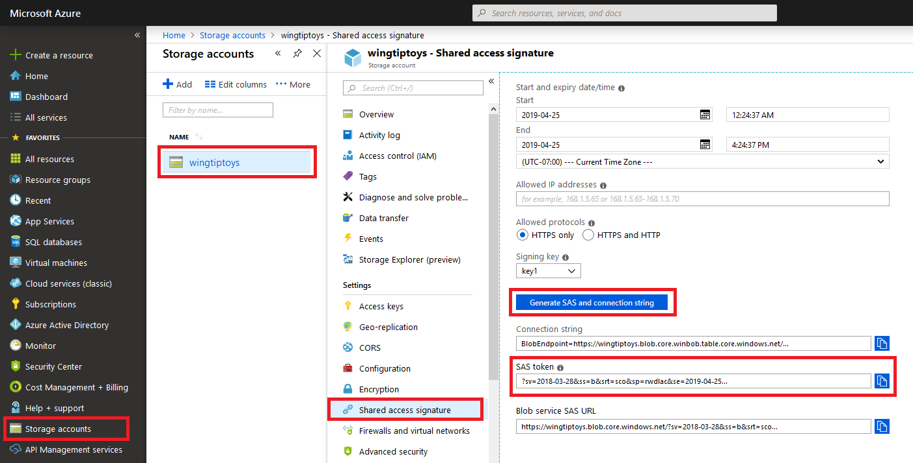

Enabling CORS for your Storage Services provides a secure way of external HTTP calls accessing your Azure Storage Services resources. You can enable CORS using the Azure REST API. 

Some of your company's document resources are located in Blob storage. You have been asked to set up CORS rules to restrict access to these resources to requests from specific domains, and you would like to use a REST API to accomplish this.

In this exercise, you will learn how to enable CORS by adding a rule using the Azure Storage REST API.

<!--

NOTE: The first REST API works with curl, but the second REST API fails with curl due to a TLS/SSL bug, so this unit will use wget for now. However, in the future, curl would be preferred over wget. With that in mind, here are the curl commands for the REST APIs for future reference.

   curl -X OPTIONS \
      -H "Accept: */*" \
      -H "Origin: http://www.contoso.com" \
      -H "Access-Control-Request-Method: PUT" \
      -H "Access-Control-Request-Headers: x-ms-meta-target*,x-ms-meta-customheader" \
      -H "Accept-Encoding: gzip, deflate" \
      --verbose \
      "https://$AZURE_STORAGE_ACCOUNT.blob.core.windows.net/$CONTAINER_NAME/blobname.ext"

   curl -X PUT \
      -H "x-ms-version: $REST_VERSION" \
      -H "x-ms-date: $GMT_DATE" \
      -H "Host: $HOST_NAME" \
      -H "Content-length: $FILE_SIZE" \
      -d body.xml \
      "$CORS_URL"
-->

## Create an Azure Storage account


1. Replace the three placeholder variables in the following commands and run the commands in the Cloud Shell. These commands set the environment variables that you will use in the following steps. These variables specify the name of Azure storage account, a storage container name, the name of the closest geographical region, and the name resource group that was created when you activated your sandbox account.

    ```bash
   export AZURE_STORAGE_ACCOUNT=<unique account name>
   export CONTAINER_NAME=<container name>
   export AZURE_REGION=<your region>
   export RESOURCE_GROUP=<rgn>[sandbox resource group name]</rgn>

    ```

    For AZURE_REGION, replace "your region" with one of the following values:

    [!include[](../../../includes/azure-sandbox-regions-note.md)]

1. Run the following command to create a new blob storage account.

   ```azurecli
   az storage account create \
      --location $AZURE_REGION \
      --name $AZURE_STORAGE_ACCOUNT \
      --resource-group $RESOURCE_GROUP \
      --kind BlobStorage \
      --access-tier cool
   ```

1. Run the following command to retrieve an account key for your storage account.

   ```bash
   export AZURE_STORAGE_KEY=`az storage account keys list --account-name $AZURE_STORAGE_ACCOUNT --query [0].value | tr -d \"`
   ```

1. Run the following command in the Cloud Shell to create a container in your storage account.

   ```azurecli
   az storage container create \
      --name $CONTAINER_NAME \
      --account-name $AZURE_STORAGE_ACCOUNT \
      --account-key $AZURE_STORAGE_KEY \
      --public-access blob
   ```

## Attempt to access blob storage without CORS

1. Use wget to send a preflight request in order to upload a blob to your storage account using an OPTIONS request.

   ```bash
   wget --method=OPTIONS \
      --header="Accept: */*" \
      --header="Origin: http://www.contoso.com" \
      --header="Access-Control-Request-Method: PUT" \
      --header="Access-Control-Request-Headers: x-ms-meta-target*,x-ms-meta-customheader" \
      --header="Accept-Encoding: gzip, deflate" \
      --delete-after \
      "https://$AZURE_STORAGE_ACCOUNT.blob.core.windows.net/$CONTAINER_NAME/blobname.ext"
   ```

1. Verify that the preflight request fails with an **HTTP 403 Forbidden** error; you should see a response like the following example:

   ```
   Resolving wingtiptoys.blob.core.windows.net (wingtiptoys.blob.core.windows.net)... nn.nn.nn.nn
   Connecting to wingtiptoys.blob.core.windows.net (wingtiptoys.blob.core.windows.net)|nn.nn.nn.nn|:443... connected.
   HTTP request sent, awaiting response... 403 CORS not enabled or no matching rule found for this request.
   2019-04-25 23:17:00 ERROR 403: CORS not enabled or no matching rule found for this request..
   ```

## Generate a Shared Access Signature (SAS) using the Azure portal

1. Sign in to the [Azure portal](https://portal.azure.com) using the account that you used when you activate the sandbox, and then click **Storage Accounts**.

1. Click the name of the storage account that you created earlier.

1. Click **Shared access signature**.

1. Click **Generate SAS and connection string**.

1. Copy the value in the **SAS token** field.

   

## Enable CORS using the REST API

1. Run the following command in the Cloud Shell to store the shared access signature that you created earlier in an environment variable so you can use it in later commands.

   ```bash
   export SAS_TOKEN="<shared access token>"
   ```
   For example:
   ```bash
   export SAS_TOKEN="?sv=2018-03-28&ss=b&srt=sco&sp=rwdlac&se=2019-04-25T01:00:00Z&st=2019-04-24T01:00:00Z&spr=https&sig=AbCdEfGhIjKlMnOpQrStUvWxYz%3D"
   ```

1. Run the following command in the Cloud Shell to create a new XML file in the online editor that will contain your CORS rule.

   ```bash
   code body.xml
   ```

1. In the editor, add the following XML, which contains a single CORS rule for the Azure storage service.

   ```xml
   <?xml version="1.0" encoding="utf-8"?>
   <StorageServiceProperties>
      <Cors>
         <CorsRule>
            <AllowedOrigins>http://www.fabrikam.com,http://www.contoso.com</AllowedOrigins>
            <AllowedMethods>GET,PUT</AllowedMethods>
            <MaxAgeInSeconds>500</MaxAgeInSeconds>
            <ExposedHeaders>x-ms-meta-data*,x-ms-meta-customheader</ExposedHeaders>
            <AllowedHeaders>x-ms-meta-target*,x-ms-meta-customheader</AllowedHeaders>
         </CorsRule>
      </Cors>
   </StorageServiceProperties>
   ```

1. In the editor, press **Ctrl-S** to save the file, and then press **Ctrl-Q** to exit the editor.

1. Run the following commands in the Cloud Shell to set additional environment variables that you will use in later commands; these variables specify the size of the XML that contains the CORS rule, the GMT date, the host name of your storage account, and the REST API URL to set the CORS rule.

   ```bash
   export FILE_SIZE=$(stat -c%s body.xml)
   export GMT_DATE=$(TZ=GMT date "+%a, %d %h %Y %H:%M:%S %Z")
   export HOST_NAME="$AZURE_STORAGE_ACCOUNT.blob.core.windows.net"
   export CORS_URL="https://$HOST_NAME/$SAS_TOKEN&restype=service&comp=properties"
   export REST_VERSION="2018-03-28"
   ```

1. Use wget to send a PUT request to set the CORS rule.

   ```bash
   wget --method=PUT \
      --body-file=body.xml \
      --header="x-ms-version: $REST_VERSION" \
      --header="x-ms-date: $GMT_DATE" \
      --header="Host: $HOST_NAME" \
      --header="Content-length: $FILE_SIZE" \
      --delete-after \
      "$CORS_URL"
   ```

1. Verify that the request succeeds with an **HTTP 202 Accepted** status; you should see a response like the following example:

   ```
   Resolving wingtiptoys.blob.core.windows.net (wingtiptoys.blob.core.windows.net)... nn.nn.nn.nn
   Connecting to wingtiptoys.blob.core.windows.net (wingtiptoys.blob.core.windows.net)|nn.nn.nn.nn|:443... connected.
   HTTP request sent, awaiting response... 202 Accepted
   Length: 0
   ```

## Verify that CORS rules have been set

1. Run the following command in the Cloud Shell to retrieve the configuration settings for your blob service.

   ```bash
   wget --output-document="cors.xml" \
      --header="x-ms-version: $REST_VERSION" \
      --header="x-ms-date: $GMT_DATE" \
      --header="Host: $HOST_NAME" \
      "$CORS_URL"
   ```

1. Verify that the request succeeds with an **HTTP 200 OK** status; you should see a response like the following example:

   ```
   Resolving wingtiptoys.blob.core.windows.net (wingtiptoys.blob.core.windows.net)... nn.nn.nn.nn
   Connecting to wingtiptoys.blob.core.windows.net (wingtiptoys.blob.core.windows.net)|nn.nn.nn.nn|:443... connected.
   HTTP request sent, awaiting response... 200 OK
   Length: unspecified [application/xml]
   Saving to: 'cors.xml'
   ```

1. Run the following command in the Cloud Shell to create and open the XML file that contains your blob service configuration.

   ```bash
   code cors.xml
   ```

1. In the editor, you should see configuration settings that resemble the following example, which should contain the CORS rule that you submitted earlier.

   ```xml
   <?xml version="1.0" encoding="utf-8"?>
   <StorageServiceProperties>
       <Logging>
           <Version>1.0</Version>
           <Read>false</Read>
           <Write>false</Write>
           <Delete>false</Delete>
           <RetentionPolicy>
               <Enabled>false</Enabled>
           </RetentionPolicy>
       </Logging>
       <HourMetrics>
           <Version>1.0</Version>
           <Enabled>false</Enabled>
           <RetentionPolicy>
               <Enabled>false</Enabled>
           </RetentionPolicy>
       </HourMetrics>
       <MinuteMetrics>
           <Version>1.0</Version>
           <Enabled>false</Enabled>
           <RetentionPolicy>
               <Enabled>false</Enabled>
           </RetentionPolicy>
       </MinuteMetrics>
       <Cors>
           <CorsRule>
               <AllowedMethods>GET,PUT</AllowedMethods>
               <AllowedOrigins>http://www.fabrikam.com,http://www.contoso.com</AllowedOrigins>
               <AllowedHeaders>x-ms-meta-customheader,x-ms-meta-target*</AllowedHeaders>
               <ExposedHeaders>x-ms-meta-customheader,x-ms-meta-data*</ExposedHeaders>
               <MaxAgeInSeconds>500</MaxAgeInSeconds>
           </CorsRule>
       </Cors>
       <DeleteRetentionPolicy>
           <Enabled>false</Enabled>
       </DeleteRetentionPolicy>
   </StorageServiceProperties>
   ```

1. Press **Ctrl-Q** to exit the editor.

## Attempt to access blob storage with CORS enabled

1. Use wget to send the same preflight request that you sent earlier in order to upload a blob to your storage account using an OPTIONS request:

   ```bash
   wget --method=OPTIONS \
      --header="Accept: */*" \
      --header="Origin: http://www.contoso.com" \
      --header="Access-Control-Request-Method: PUT" \
      --header="Access-Control-Request-Headers: x-ms-meta-target*,x-ms-meta-customheader" \
      --header="Accept-Encoding: gzip, deflate" \
      --delete-after \
      "https://$AZURE_STORAGE_ACCOUNT.blob.core.windows.net/$CONTAINER_NAME/blobname.ext"
   ```

1. Verify that the preflight request now succeeds with an **HTTP 200 OK** status; you should see a response like the following example:

   ```
   Resolving wingtiptoys.blob.core.windows.net (wingtiptoys.blob.core.windows.net)... nn.nn.nn.nn
   Connecting to wingtiptoys.blob.core.windows.net (wingtiptoys.blob.core.windows.net)|nn.nn.nn.nn|:443... connected.
   HTTP request sent, awaiting response... 200 OK
   Length: 0
   Saving to: 'blobname.ext.tmp'
   ```
