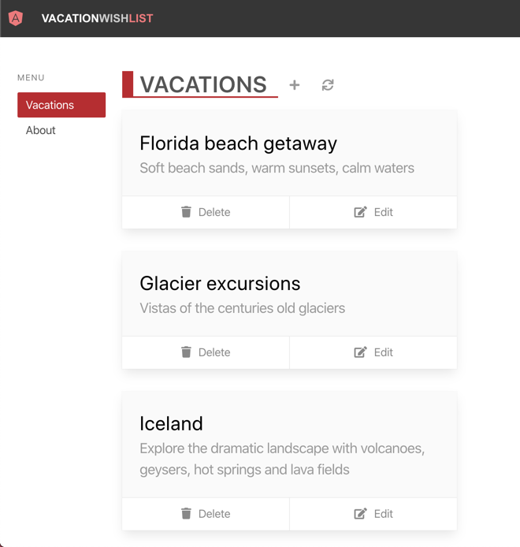

Your company is launching a vacation planning website that helps customers add, edit, view, and remove plans from their wish list. Your API, which powers these features, runs on Node.js and Express is critical to the success of the application.

Your API server is critical to the success of the application. The APIs are hosted on a server running Node.js and Express. You need to launch your application and it must scale up and down as needed while minimizing costs. There's a lot for you to think about!

What if you could reduce some of these burdens without rewriting your entire API? By shifting the API to a serverless model using Azure Functions, you enjoy the following benefits:

- No server to maintain
- Cost reductions
- Application scaling up and down as needed

Plus, you could write less code!

## Learning objective

In this tutorial, you move from an Express API to a serverless architecture through the following steps:

1. You'll begin by exploring and running the Node and Express APIs in the sample project
1. Next, you'll create an Azure Functions application
1. Then, you'll refactor the Express routes and data calls to use the Azure Functions application
1. Finally, you'll explore and launch your application, as shown below

## Planning the Shift to Serverless

You're ready to shift your Express.js APIs to the serverless model. But first, let's consider why you might make these changes and what effort is required to update your app. Here are three things to consider:

1. Configure and maintain the physical server for your Express app
1. Managing scaling for your app (up and down), as demand fluctuates
1. Manage the costs associated with deploying your server

Serverless architecture eases the server maintenance, scaling, and cost for you.

Why would you make this shift? Overall there's less to think about when building a serverless app.

## About your project

The project represents a Node Express application in TypeScript that is shifted to Azure Functions.

> ![NOTE]
> If your Express app is using JavaScript instead of TypeScript, create an Azure Functions app using JavaScript.

What's in the [sample project on GitHub](https://github.com/MicrosoftDocs/mslearn-module-shifting-nodejs-express-apis-to-serverless) that you'll learn about in this module? That's a great question!

The client application is developed with Angular, however you could easily have used Vue.js or React.js. In this module, you learn to:

- Create the Azure Functions app
- Run and debug the app alongside the Angular application locally on your computer
- Refactor the application's code to leverage a serverless design

When you're done, your application and its API will feature all the benefits of serverless technology!

Next, we'll get the sample application, install its dependencies, and build it locally.
