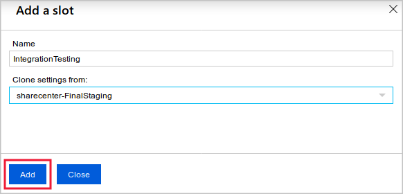
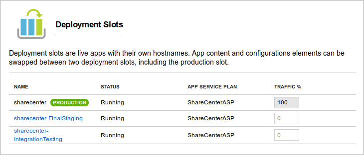
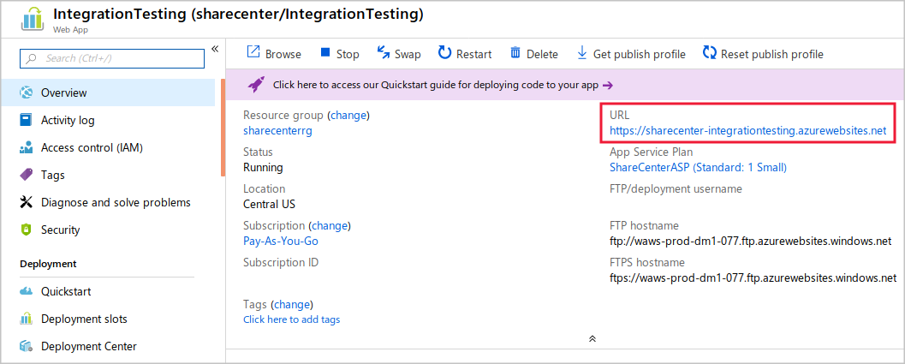

Organizations often need to run web apps in isolated environments to test them before deployment. They also need to deploy quickly and without affecting users. 

Suppose you're trying to decide whether to use slots as a streamlined way to deploy a web app in your social media system. You want to find out if deployment slots will reduce downtime during deployments if they'll ease rollbacks, and if you can set them up in Azure.

Here you'll learn how deployment slots ease the testing and rollout of new code.

## Use a deployment slot

Within a single Azure App Service web app, you can create multiple deployment slots. Each slot is a separate instance of that web app, and it has a separate hostname. You can deploy a different version of your web app into each slot.

One slot is the production slot. This slot is the web app that users see when they connect. Make sure that the app deployed to this slot is stable and well tested.

Use additional slots to host new versions of your web app. Against these instances, you can run tests such as integration tests, acceptance tests, and capacity tests. Fix any problems before you move the code to the production slot. Additional slots behave like their own App Service instances, so you can have confidence that your tests show how the app will run in production.

After you're satisfied with the test results for a new app version, deploy it by swapping its slot with the production slot. Unlike a code deployment, a slot swap is instantaneous. When you swap slots, the slot hostnames are exchanged, immediately sending production traffic to the new version of the app. When you use slot swaps to deploy, your app is never exposed to the public web in a partially deployed state.

If you find that, in spite of your careful testing, the new version has a problem, you can roll back the version by swapping the slots back.

## Understand slots as separate Azure resources

When you use more than one deployment slot for a web app, those slots are treated as separate instances of that web app. For example, they're listed separately on the **All resources** page in the Azure portal. They each have their own URL. However, each slot shares the resources of the App Service plan, including virtual machine memory and CPU as well as disk space.

## Create deployment slots and tiers

Deployment slots are available only when your web app uses an App Service plan in the Standard, Premium, or Isolated tier. The following table shows the maximum number of slots you can create:

| Tier | Maximum staging slots |
|---:|:---:|
| Free | 0 |
| Shared | 0 |
| Basic | 0 |
| Standard | 5 |
| Premium | 20 |
| Isolated | 20 |

## Avoid a cold start during swaps

Many of the technologies that developers use to create web apps require final compilation and other actions on the server before they deliver a page to a user. Many of these tasks are completed when the app starts up and receives a request. For example, if you use ASP.NET to build your app, code is compiled and views are completed when the first user requests a page. Subsequent requests for that page receive a faster response because the code is already compiled.

The initial delay is called a *cold start*. You can avoid a cold start by using slot swaps to deploy to production. When you swap a slot into production, you "warm-up" the app because your action sends a request to the root of the site. The warm-up request ensures that all compilation and caching tasks finish. After the swap, the site responds as fast as if it had been deployed for days.

## Create a deployment slot

Before you create a slot, make sure your web app is running in the Standard, Premium, or Isolated tier:

1. Open your web app in the Azure portal.

1. Select the **Deployment Slots** page. 

1. Select **Add Slot**.

1. Name the slot.

1. Choose whether to clone settings from another slot. If you choose to clone, settings are copied to your new slot from the slot you specify.

    

> [!NOTE]
> Although you can clone settings to a new slot, you can't clone content. New slots always begin with no content. You must deploy content by using git or another deployment strategy. The clone operation copies the configuration to the new slot. After you clone the settings, the configuration of the two slots can be changed independently.

Select **Add** to create the new slot. You now see the new slot in the list on the **Deployment Slots** page. Select the slot to view its management page.

## Access a slot

The new slot's hostname is derived from the web app name and the name of the slot. You see this hostname when you select the slot on the **Deployment Slots** page:

You can deploy your code to the new slot the same way you deploy it for the production slot. Just substitute the new slot's name or URL in the configuration of the deployment tool you use. If you use FTP to deploy, you'll see the FTP hostname and username just under the slot's URL.

The new slot is effectively a separate web app with a different hostname. That's why anyone on the internet can access it if they know that hostname. Unless you register the slot with a search engine or link to it from a crawled page, the slot won't appear in search engine indexes. It will remain obscure to the general internet user. 

You can control access to a slot by using IP address restrictions. Create a list of IP address ranges that you'll allow accessing the slot or a list of ranges that you'll deny access to the slot. These lists are like the allow ranges and deny ranges that you can set up on a firewall. Use this list to permit access only to computers that belong to your company or development team.
