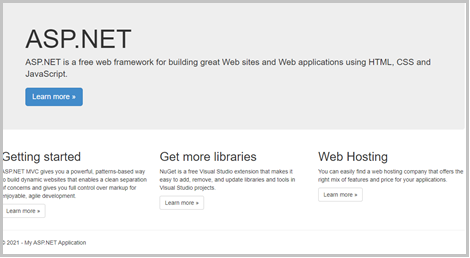
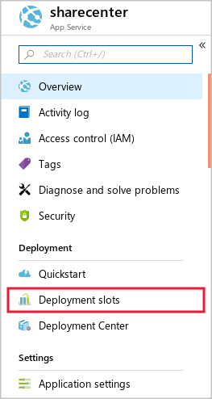
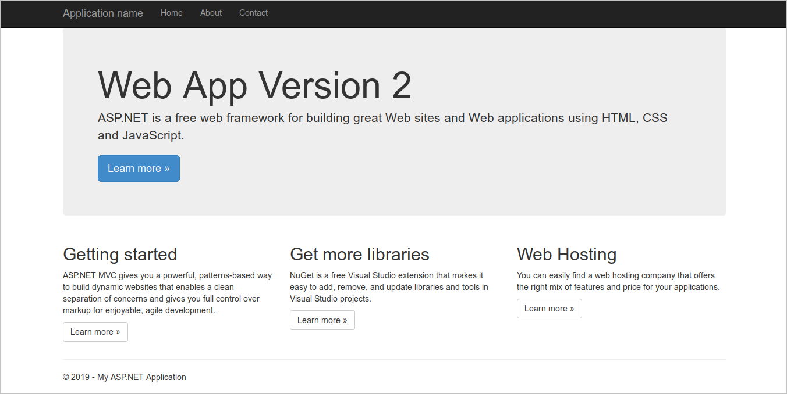

A deployment slot is an instance of a web app in which you can test a new app version before you deploy it. By swapping slots, you can deploy a new version of an app without any downtime.

Suppose you've chosen to use Azure App Service deployment slots to streamline the deployment of new versions of your social media web app. Now you want to set up the web app in Azure and configure the deployment slots.

Here you'll set up a web app and add a new deployment slot to it for staging. You'll also deploy different versions of the web app to those slots.

[!include[](../../../includes/azure-exercise-subscription-prerequisite.md)]

## Create a web app

Start by creating a new web app resource in the Azure portal:

1. Sign in to the [Azure portal](https://portal.azure.com/?azure-portal=true).

1. On the Azure portal menu or from the **Home** page, select **Create a resource**.

1. In the left menu pane, select **Web**, and then search for and select **Web App**. The **Web App** panel appears.

1. Select **Create**. The **Create Web App** panel appears.

1. On the **Basics** tab, enter the following values for each setting.

    | Setting | Value |
    |---|---|
    | **Project Details** |
    | **Subscription** | Select the subscription you'd like to use to complete the exercise |
    | **Resource Group** | Create a new resource group named **mslearn-slots** |
    | **Instance Details** |
    | **Name** | *Enter a unique name* |
    | **Publish** | Code |
    | **Runtime stack** | ASP.NET V4.8 |
    | **Operating System** | Windows |
    | **Region** | *Select a region near you* |
    | **App Service Plan** |
    | **Linux Plan** | *Leave default* |
    | **Sku and size** | *Leave default* |

1. Select **Next : Monitoring**, and enter the following value for the setting.

    | Setting | Value |
    |---|---|
    | **Application Insights** |
    | **Enable Application Insights** | Toggle to **No** |

1. Select **Review and create**, and then select **Create**. Wait while Azure creates the web app.

1. When deployment successfully completes, select **Go to resource**. The **App Service** panel appears.

## Configure git deployment

Use any of the usual deployment tools for your web app and its deployment slots. In this exercise, you'll use a local git repository for deployment. Set up the web app to use git by following these steps:

1. On the **Overview** page, in the left menu pane, under **Deployment**, select **Deployment Center**.

1. On the **Settings** tab, for **Source**, select **Local Git**. On the top menu bar, select **Save**.

1. On the resulting **Deployment Center** pane, select the **Local Git/FTPS credentials** tab.

1. Under **User scope**, enter a new username and password of your choice, and from the top menu bar, select **Save**. Make a note of the username and password for later.

## Configure the git client and clone the web app source code

Now, you'll set up the git client in Console for the left-hand menu, and use it to clone a sample web app. Follow these steps:

1. In the Azure portal, open the Console. Enter the following commands to set up your git username and email address. These commands aren't associated with any account or sign-up, and you can use whatever values you like.

    ```bash
    git config --global user.name "<your name>"
    git config --global user.email "<your email address>"
    ```

1. To create a folder for the source code, enter the following commands.

    ```bash
    mkdir demoapp
    ```

     ```bash
    cd demoapp
    ```

1. To clone the source for the web app, enter the following commands.

    ```bash
    git clone https://github.com/Azure-Samples/app-service-web-dotnet-get-started.git
    cd app-service-web-dotnet-get-started
    ```

## Configure a git remote to deploy the app to production

To use git to deploy the source code to the web app's production slot, set up your app's git URL as a remote repository. Follow these steps:

1. In the Azure portal, on the web app's **Overview** page, in the **Essentials** section, select the **Copy** icon for the **URL**. Note that the URL contains your deployment username.

    :::image type="content" source="../media/3-copy-git-clone-url.png" alt-text="Copy the git clone URL.":::

    > [!NOTE]
    > If you don't see the git clone URL where it's shown in the preceding screenshot, refresh the portal.

1. In the Azure portal, on the web app's Overview page, next to Git clone url, select the Copy button. Note that the URL contains your deployment username.

1. In Console, run the following command to configure the URL as a git remote named "production". Replace `git-clone-url` with the URL from the previous step.

    ```bash
    cd app-service-web-dotnet-get-started
    ```

    ```bash
    git remote add production <git-clone-url>
    ```

1. To deploy the web app to the production slot, enter the following command. When you're prompted for the password, enter your deployment password you created previously.

    ```bash
    git push production
    ```

1. When the deployment finishes, in the Azure portal, go to the web app's **Overview** page, and then select **URL**. You can double- click to copy and paste.

    

1. Close the browser tab that displays the web app.

## Create a new staging slot

For the new web app, you created only one slot: the production slot. You deployed source code to this slot.

Next, you'll create a deployment slot where you can stage new versions of the web app:

1. On the Azure portal menu or from the **Home** page, select **All resources**, and then select the web app.

1. Under **Deployment**, select **Deployment slots**. The **Deployment slots** pane appears.

    

1. From the top menu bar, select **Add Slot**. The **Add a slot** pane appears.

1. In the **Name** box, enter **Staging**, leave **Clone settings from** default, and then select **Add**.

1. After the deployment slot is added, select **Close**.

## Set up git deployment for the staging slot

Set up the new slot to use git deployment, just like you did for the production slot. Follow these steps:

1. On the Azure portal menu or from the **Home** page, select **All resources**. In the list of all resources, you'll now see two App Service entries: deployment slots are represented as separate apps in the portal. Select the entry representing the staging slot to go to its **Overview** page.

1. On the **Overview** page, in the left menu pane, under **Deployment**, select **Deployment Center**.

1. On the **Settings** tab, for **Source**, select **Local Git**. On the top menu bar, select **Save**.

1. On the resulting **Deployment Center** pane, select the **Local Git/FTPS credentials** tab.

1. Under **User scope**, enter a new username and password of your choice, and from the top menu bar, select **Save**. Make a note of the username and password for later.

## Set up git to deploy the app to the staging slot

To use the git client to deploy source code to the new slot, add an extra remote to the git configuration. Follow these steps:

1. In the Azure portal, on the web app's **Overview** page, in the **Essentials** section, select the **Copy** icon for the **URL**. Note that the URL contains your deployment username.

    > [!NOTE]
    > If you don't see the git clone URL where it's shown in the preceding screenshot, refresh the portal. Note that the git URL for the staging slot is slightly different from the URL for the production slot, and includes the slot name.

1. To add the remote for the staging slot, run the following command in the Console. Replace `git-clone-uri` with the URI from the previous step.

    ```bash
    git remote add staging <git-clone-uri>
    ```

## Modify the app source code and deploy the app to the staging slot

Next, make a small change to the web app, and then use git to deploy the new version to the staging slot:

1. In Console, run the following command.

    ```bash
    code .
    ```

1. In the list of **Files**, expand **aspnet-get-started** > **Views** > **Home**.

1. Select **Index.cshtml**.

1. Locate the following code.

    ```html
    <h1>ASP.NET</h1>
    ```

1. Replace that code with this code.

    ```html
    <h1>Web App Version 2</h1>
    ```

1. To save your changes, press <kbd>Ctrl+S</kbd>.

1. In the Console, run the following commands to commit the new version of the app to git, and deploy it to the staging slot. Enter your deployment password when you're prompted.

    ```bash
    git add .
    git commit -m "New version of web app."
    git push staging
    ```

## Browse the staging slot

Now you can view the new version of the web app by browsing to the staging deployment slot's URL.

In the Azure portal, go to the **Overview** page for the staging slot. Near the top of the page, select **Browse**. The new version of the web app appears in a browser tab.



At this point, the staging slot has the new version of the code, and you can run tests on it. Remember that the production slot has the previous web app version, and users can't yet see your new code.
