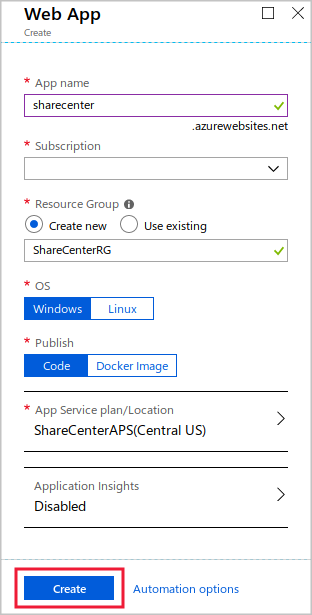
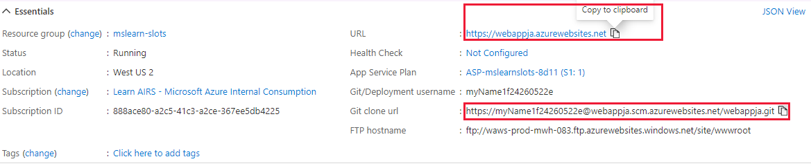

A deployment slot is an instance of a web app in which you can test a new app version before you deploy it. By swapping slots, you can deploy a new version of an app without any downtime.

Suppose you've chosen to use Azure App Service deployment slots to streamline the deployment of new versions of your social media web app. Now you want to set up the web app in Azure and configure the deployment slots.

Here you'll set up a web app and add a new deployment slot to it for staging. You'll also deploy different versions of the web app to those slots.

[!INCLUDE [Activate the sandbox](../../../includes/azure-sandbox-activate.md)]

[!INCLUDE [Select an Azure region](../../../includes/azure-sandbox-regions-first-mention-note-friendly.md)]

## Create a web app

Start by creating a new web app resource in the Azure portal:

1. Sign in to the [Azure portal](https://portal.azure.com/learn.docs.microsoft.com?azure-portal=true) by using the account that you used to activate the sandbox.
1. Select **Create a resource**.
1. Select **Web** > **Web App**.
1. Fill out the form like this:

    | Field                     | Value                                                                |
    |---------------------------|----------------------------------------------------------------------|
    | **App name**                  | Enter a unique name for the site.                                     |
    | **Subscription**              | Select **Concierge Subscription**.                                               |
    | **Resource Group**            | Select **use existing** and choose your sandbox resource group. |
    | **OS**                        | Select **Windows**.                                                              |
    | **Publish**                   | Select **Code**.                                                                 |
    | **App Service plan/Location** | Leave the default value.                                              |
    | **Application Insights**      | Leave the default value.                                             |

1. Select **Create**. Azure creates the web app and the production deployment slot.
 
    

## Configure git deployment

Use any of the usual deployment tools for your web app and its deployment slots. In this exercise, you'll use a local git repository for deployment. Set up the web app to use git by following these steps:

1. In the Azure portal, on the left, select **All resources** and then select the web app you created.
1. On the **App Service** page, under **Deployment**, select **Deployment Center**.
1. Select **Local Git** > **Continue**.
1. Select **App Service Kudu build server** > **Continue** > **Finish**.
1. On the **Deployment Center** page, select **Deployment Credentials**, and then select the **User Credentials** tab.
1. Enter a new password and save the credentials. Note the password for later.

## Configure the git client and clone the web app source code

Now you'll set up the git client in Cloud Shell and use it to clone a sample web app. Follow these steps:

1. On the right side of the Cloud Shell window, enter the following commands to set up your git username and email address. These commands aren't associated with any account or sign-up, and you can use whatever values you like.

    ```bash
    git config --global user.name "<your name>"
    git config --global user.email "<your email address>"
    ```

1. To create a folder for the source code, enter the following commands:

    ```bash
    mkdir demoapp
    cd demoapp
    ```

1. To clone the source for the web app, enter the following commands:

    ```bash
    git clone https://github.com/Azure-Samples/app-service-web-dotnet-get-started.git
    cd app-service-web-dotnet-get-started
    ```

## Configure a git remote to deploy the app to production

To use git to deploy the source code to the web app's production slot, set up your app's git URL as a remote repository. Follow these steps:

1. In the Azure portal, on the web app's **Overview** page, next to **Git clone url**, select the **Copy** button.

    

    > [!NOTE]
    > If you don't see the git clone URL where it's shown in the preceding screenshot, refresh the portal.

1. In Cloud Shell, run the following command to configure the URL as a git remote named "production". Replace `git-clone-url` with the URL from the previous step.

    ```bash
    git remote add production <git-clone-url>
    ```

1. To deploy the web app to the production slot, enter the following command. When you're prompted for the password, enter **Pa$$w0rd**.

    ```bash
    git push production
    ```

1. When the deployment finishes, in the Azure portal, go to the web app's **Overview** page and then select **Browse**. Azure displays the web app:

    

1. Close the browser tab that displays the web app.

## Create a new staging slot

For the new the web app, you created only one slot: the production slot. You deployed source code to this slot. 

Next you'll create a deployment slot where you can stage new versions of the web app:

1. In the Azure portal, select **All resources** and then select the web app.
1. Under **Deployment**, select **Deployment slots**.

    

1. On the **Deployment slots** page, select **Add slot**.
1. In the **Name** box, enter **Staging** and then select **Add**.
1. After the deployment slot is added, select **Close**.

## Set up git deployment for the staging slot

Set up the new slot to use git deployment, just like you did for the production slot. Follow these steps:

1. In the Azure portal, on the left, select **All resources**. In the list of all resources, you'll see both the production web app and the staging slot. These are represented as separate apps. Select the staging slot to go to its **Overview** page.
1. Under **Deployment**, select **Deployment Center**.
1. Select **Local Git** > **Continue**.
1. Select **App Service Kudu build server** > **Continue** > **Finish**.

## Set up git to deploy the app to the staging slot

To use the git client to deploy source code to the new slot, add an extra remote to the git configuration. Follow these steps:

1. In the Azure portal, go to the **Overview** page of the staging slot. Near the top of the page, next to **Git clone url**, select the **Copy** button.

    > [!NOTE]
    > The git URL for the staging slot is slightly different from the URL for the production slot.

1. To add the remote for the staging slot, enter the following command. Paste the git clone URL to replace the token.

    ```bash
    git remote add staging <git clone url>
    ```

## Modify the app source code and deploy the app to the staging slot

Next, make a small change to the web app and then use git to deploy the new version to the staging slot:

1. In Cloud Shell, enter the following command:

    ```bash
    code .
    ```

1. In the list of **Files**, expand **aspnet-get-started** > **Views** > **Home**.
1. Select **Index.cshtml**.
1. Locate the following code:

    ```html
    <h1>ASP.NET</h1>
    ```

1. Replace that code with this code:

    ```html
    <h1>Web App Version 2</h1>
    ```

1. To save your changes, press CTRL+S.
1. In Cloud Shell, enter the following commands to commit the new version of the app to git and deploy it to the staging slot. Enter your deployment password when you're prompted.

    ```bash
    git add .
    git commit -m "New version of web app."
    git push staging
    ```

## Browse the staging slot

Now you can view the new version of the web app by browsing to the staging deployment slot's URL.

In the Azure portal, go to the **Overview** page for the staging slot. Near the top of the page, select the **Browse** button. The new version of the web app appears in a browser tab:


At this point, the staging slot has the new version of the code, and you can run tests on it. Remember that the production slot has the previous web app version, and users can't yet see your new code.
