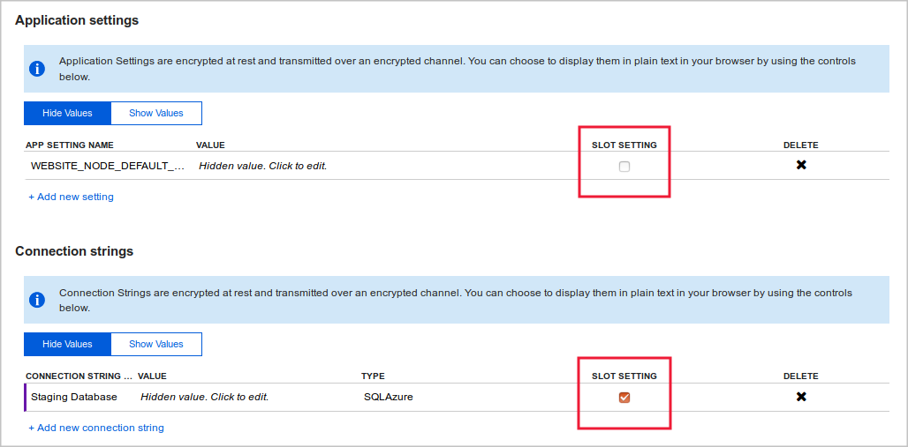
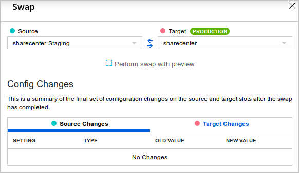
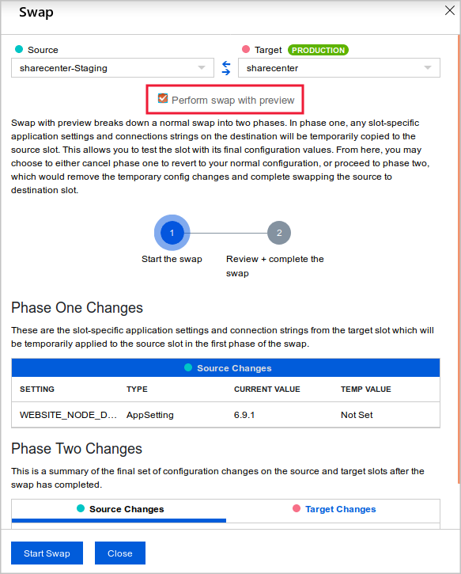
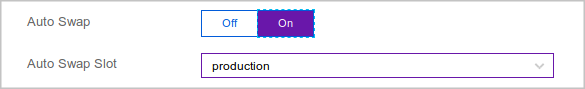

When you swap slots, you can precisely control the behavior and configuration of web apps. 

Suppose you've set up deployment slots for production and staging. You've tested a new version of your social media web app in the staging slot. Now it's time to deploy that new version to production. You want to deploy the app smoothly and in the correct configuration.

Here, you'll learn the correct configuration to swap the web app into production.

## Manage the configuration for a swap

When you swap two slots, the app's configuration travels to the new slot along with the app. You can override this behavior for individual application settings and configuration strings by configuring them as **slot settings**.

Suppose, for example, you have two databases. You use one for production, and the other for acceptance testing. You always want the app version in the staging slot to use the testing database. The app version in the production slot should always use the production database. To achieve this, you can configure the database connection string as a slot setting.

### Configure slot settings

To view and configure settings for the swap, go to the web app resource and follow these steps:

1. On the Azure portal menu or from the **Home** page, select **All resources**, and select the deployment slot you want to configure.

1. Navigate to the **Configuration** page.

1. On the **Application settings** tab, observe whether the settings you're interested in contain a checkmark in the **deployment slot setting** field. To set or unset a checkmark on a given setting, select the setting's pencil button to edit it, then toggle the **deployment slot setting** checkbox to the desired value, and select **OK**.

    

    

1. Select **Save** on the Configuration page when you are finished to save your settings.

### Swap slots in the Azure portal

To swap two slots in the Azure portal:

1. On the Azure portal menu or from the **Home** page, select **All resources**, and navigate to any of the deployment slots for the web app and select the **Deployment Slots** page.

1. Select **Swap**.

1. In the **Swap** dialog box, you can select the source and target slots and see a summary of the settings that will be applied to the swapped slots.

    

## Understand the slot-swapping preview

When you swap slots, the settings in the target slot (which is typically the production slot) are applied to the app version in the source slot before the hostnames are swapped. You might discover problems at this point. For example, if the database connection string is configured as a slot setting, the new version of the web app will use the existing production database. If you forgot to upgrade the database schema in the production database before the swap, you could see errors and exceptions when the new app version attempts to use the old schema.

To help you discover problems before your app goes live into production, Azure App Service offers a swap-with-preview feature. When you choose this option, the swap proceeds in two phases:

- **Phase 1**: Slot settings from the target slot are applied to the web app in the source slot. Then Azure warms up the staging slot. At this point, the swap operation pauses so you can test the app in the source slot to make sure it works with the target slot configuration. If you find no problems, begin the next phase.
- **Phase 2**: The hostnames for the two sites are swapped. The version of the app now in the source slot receives its slot settings.

> [!IMPORTANT]
> Test your web app thoroughly while it's in the staging slot. Eliminate code bugs and problems with non-slot settings. The swap-with-preview feature can only help you spot and eliminate problems caused by the production slot settings. Make sure everything else is sound before you start any kind of swap into production.

### Preview slot swapping

To use the swap-with-preview feature, select **Perform swap with preview**, review the settings, and then select **Start Swap**.

Follow the link to preview the new version of the site. In the preview, the slot settings from the destination slot are applied. If you want to continue, select **Complete Swap**.

## Auto swap

Auto swap brings the zero-downtime and easy rollback benefits of swap-based deployment to automated deployment pipelines. When you configure a slot for auto swap, Azure automatically swaps it whenever you push code or content into that slot.

When you use auto swap, you can't test the new app version in the staging slot before the swap. Auto swap mainly benefits users who want zero-downtime deployments and simple automated deployment pipelines.

If you want to be able to test before you swap, you'll need a more complex deployment pipeline that requests the slot swap itself. Alternatively, you can deploy to a separate slot that's dedicated for testing.

> [!NOTE]
> Auto swap is not available in App Service on Linux.

### Configure auto swap

To configure auto swap for a slot, navigate to the **Configuration > General settings** pane for the slot in the Azure portal. Under **Deployment Slot**, set **Auto swap enabled** to **On**, select the target slot from the dropdown menu, and then select **Save** at the top.

This option is only available on slots other than the production slot.
