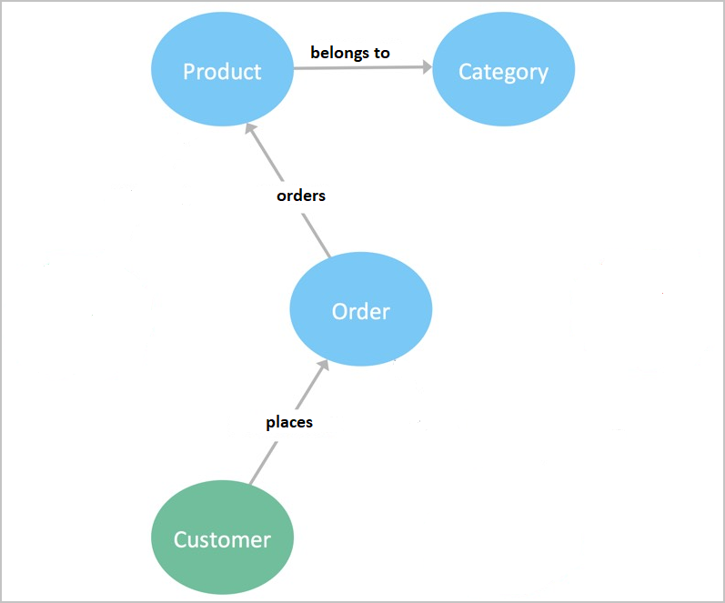

Companies sometimes find that the inflexibility of relational databases can be a barrier to productivity. Graph databases can help with that problem.

In your e-commerce company, you want to know which databases may work better as graph databases.

In this unit, you will learn how graph databases differ from relational databases.

# What is a graph database?

Most developers are familiar with relational databases and their fundamental concept: tables. Tables are where we store our data, which is composed of rows and columns. Tabular data with a consistent structure is ideal for a relational database. However if your application requires a more flexible structure, then an alternative to relational database would be graph databases.

In order to understand graph databases, you first need to know what we mean by a graph. A graph is a structure that's composed of vertices and edges. Both vertices and edges can have an arbitrary number of properties.

| Component | Description  |
|---|---|
| **Vertices** or **Nodes** | Vertices represent objects. For example: a person, a place, or a product. |
| **Edges** or **Relationships** | Edges denote relationships between vertices. For example: a person might know another person, or have visited a place. |
| **Properties** | Properties express information about the vertices and edges. For example:<ul><li>Vertices' properties might include the name and age of a person.</li><li>Edge properties might include a time stamp of a purchase or a hierarchical affiliation between coworkers.</li></ul> |

More formally, this data model is known as a *Property Graph Model*, and Azure Cosmos DB supports this model.

Typically, graph databases are implemented as NoSQL stores, such as Azure Cosmos DB or MongoDB, and usually require schema flexibility and rapid iteration. With the graph data model, changes to the data model can be achieved with little or no impact to the application. Because relationships are treated as data rather than schema structure, there are many scenarios where graph databases are useful, as they let you model and store efficiently in a non-tabular format.

## Strengths and weaknesses of graph databases

Strengths and weaknesses of graph databases fall under the following criteria:

- Performance
- Flexibility
- Deficiencies

### Performance

With traditional relational databases, the performance of relationship queries decreases as the number of relationships increase. With graph databases, the performance stays constant even as the data and complexity continues to grow.

### Flexibility

In graph databases, it's easy to add to an existing structure without affecting functionality. This flexibility allows the graph database model to dictate change, rather than being forced to adapt to a tabular way of seeing your data in a standard relational database.

### Deficiencies

Graph databases are not as efficient at processing high volumes of transactions, nor are they as effective at handling queries that traverse an entire database.

Graph databases do not create better relationships; instead, they provide rapid data retrieval for connected data. This increases the need for efficient data design, because any performance gains from graph searches can be reduced by failing to model the relationships between your nodes efficiently.

## Examining the data model for fit

As previously described, there are two fundamental components that form a graph:

- **Nodes**, which are also known as **Vertices**.

- **Relationships**, which are also known as **Edges**.

### Nodes or Vertices

Nodes are often used to represent entities, but can also represent other domain components, depending on the use case. You can often determine the nodes for your graph model by identifying the nouns in your domain.

For example, you may identify nodes such as these:

- Customer
- Employee
- Product
- Order
- Category
- Invoice

Nodes can contain properties that hold name-value pairs of data. Nodes can be assigned roles or types by using one or more labels in order to group or categorize them.

### Relationships or Edges

A relationship connects two nodes, the power of graphs is that both the relationship and the nodes can be queried in order to find related data. A relationship has a source node and a target node, and is represented in a graph diagram by a line or an arrow. You can often determine relationships for the graph model by identifying actions or verbs in your domain.

For example, you may identify relationships such as these:

- Likes
- Places
- Belongs to
- Submits

### Properties

In this unit, we have been describing the process of creating a basic graph data model for an e-commerce company, which shows the interactions between customers, products, and orders.

When you have identified your nodes and relationships, your data model begins to take shape. For example:

| Node | Relationship | Node |
|---|---|---|
| A **customer** | *likes* | a **product** |
| A **product** | *belongs to* | a **category** |
| A **customer** | *places* | an **order** |
| A **product** | *belongs to* | an **order** |
| An **employee** | *submits* | an **invoice** |
| An **order** | *belongs to* | an **invoice** |

You can further enhance your data model by defining attributes for each of these entities as key-value properties.

Properties are name-value pairs that you can define for nodes or relationships, which enable you to store relevant data about the node or relationship you're describing.

To determine what kind of properties you can use, you could ask some relevant questions about the data you are capturing:

- When did the customer place the order?
- What was the product price?
- When did the employee submit the invoice?
- Which invoice does the order belong to?

The flexible nature of a graph database enables you to grow and change your model over time, and to add or remove relationships, nodes, and properties.
