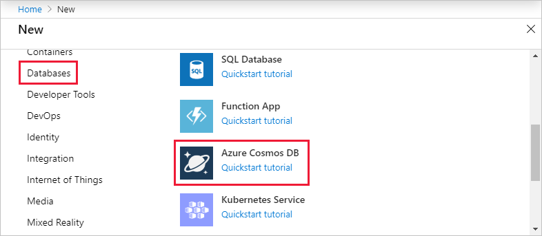
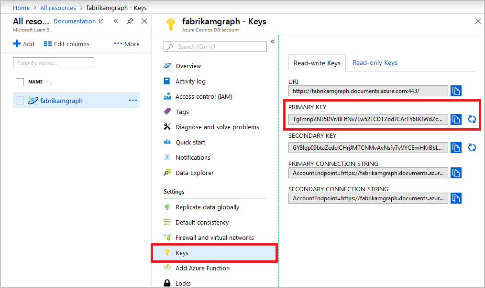
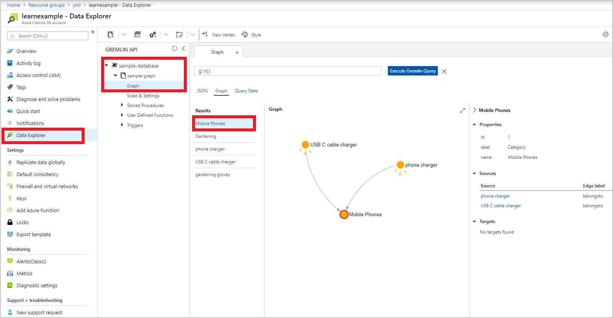

In this exercise, you'll create an Azure Cosmos DB Gremlin API account, database, and graph (container) using the Azure portal. You'll then build and run a console app using an open-source Gremlin driver.

[!INCLUDE[](../../../includes/azure-sandbox-regions-first-mention-note-friendly.md)]

## Create an Azure Cosmos DB account

Start by creating the database in <a href="https://portal.azure.com/learn.docs.microsoft.com" data-linktype="external" target="az-portal">Azure portal <span class="docon docon-navigate-external" aria-hidden="true"></span></a> by adding an Azure Cosmos DB account that uses the Graph API.

1. On the Azure portal home page, under **Azure services**, select **Create a resource**.

   

   The **Create a resource** pane appears.

1. In the left menu pane, under **Categories**, select **Databases**, and then select **Azure Cosmos DB**.

   

    The **Select API option** pane appears.

1. Select **Gremlin (Graph)**. The **Create Azure Cosmos DB Account - Gremlin (Graph)** pane appears.

1. On the **Basics** tab, enter the following values for each setting.

    | Setting | Value |
    | --- | --- |
    | **Project Details** |
    | Subscription | Concierge Subscription |
    | Resource Group | From the dropdown list, select <rgn>[Sandbox resource group]</rgn> |
    | **Instance Details** |
    | Account Name | Enter a globally unique value for your Azure Cosmos DB account. |
    | Location | Choose a region near you from the previous list. |
    | Capacity mode | Provisioned throughput |
    | Apply Free Tier Discount | Do Not Apply |

1. Select **Next: Global Distribution**, and enter the following values for each setting.

    | Setting | Value |
    | --- | --- |
    | **Global Distribution** |
    | Geo-Redundancy | Disable |
    | Multi-region Writes | Disable |

1. Select **Review + create**, and after receiving the *Validation Success* notification, select **Create**.

   A *Deployment is in progress* notification appears, displaying the details about your new resource. It may take a few minutes to deploy your new Azure Cosmos DB account.

1. When deployment is complete, a notification appears. Select **Go to resource**. Your Azure Cosmos DB account **Quick start** pane appears.

## Add a graph

1. In the left menu pane, select **Data Explorer**. The **Data Explorer** pane appears.

1. In the upper task bar, select **New Graph**. The **New Graph** pane appears.

1. Enter the following values for each setting to build your new graph. Take note of the values that you choose for the **Database id** and **Graph id**. You'll use these values when you create your application in the next section.

   | Setting | Suggested value | Description |
   | --- | --- | --- |
   | **Database id** | `sample-database` | **Create new** is selected by default. Database names must be between 1 and 255 characters, and cannot contain / \ # ? or a trailing space. **Share throughput across graphs** is selected by default. |
   | **Database throughput (autoscale)** | `4000` | **Autoscale** is selected by default. Under **Database Max RU/s**, accept the default of **4000**. If you want to reduce latency, you can scale up the throughput later. |
   | **Graph id** | `sample-graph` | Enter **sample-graph** as the name for your new collection. Graph names have the same character requirements as database IDs. |
   | **Partition key** | `/name` | Enter **/name** as the partition key. |

1. Select **OK**. After the graph is built, the **Data Explorer** pane appears and displays your *sample-database* under **Gremlin API**.

1. In the left menu pane, under **Settings**, select **Keys**. The **Keys** pane appears for your *Azure Cosmos DB account*.

1. Note the value for the **GREMLIN ENDPOINT**, and copy the value for the **PRIMARY KEY**. You'll use these values when you create your application in the next section.

   

::: zone pivot="csharp"

## Create a .NET Core app

Now, you'll create a .NET Core application that will allow you to run Gremlin API queries with the Azure Cosmos DB account that you created.

1. In Cloud Shell, run the following commands to scaffold a new .NET app, and then change to your new app's directory.

   ```bash
   dotnet new console -n GremlinApp
   cd GremlinApp
   ```

1. Add the necessary packages to your app for Gremlin.net and Microsoft.Extensions.Configuration.

   ```bash
   dotnet add package Gremlin.net
   dotnet add package Microsoft.Extensions.Configuration
   dotnet add package Microsoft.Extensions.Configuration.Json
   dotnet restore
   ```

1. Create a file for your application settings.

   ```bash
   touch appsettings.json
   ```

1. Open your app in the online code editor.

   ```bash
   code .
   ```

1. Select the **appsettings.json** file to open it in the editor, and then add the following syntax.

   ```json
   {
     "AzureConfig": {
      "HostName" : "endpoint.gremlin.cosmos.azure.com",
      "Port" : "443",
      "AuthKey" : "AbCdEfGhIjKlMnOpQrStUvWxYz==",
      "Database" : "sample-database",
      "Collection" : "sample-graph"
      }
   }
   ```

1. Update the following values:

   | Field | Description |
   |---|---|
   | `HostName` | Replace the placeholder with the *domain name* from your **Gremlin Endpoint**; for example: *jagremlin.gremlin.cosmos.azure.com*. |
   | `Port` | This value should be *443*. Use port ID, or last three numbers from your **Gremlin Endpoint**. |
   | `AuthKey` | Replace the sample value with your **PRIMARY KEY** that you copied in the previous task. |
   | `Database` | If you used a different **Database ID** replace the default value *sample-database*. |
   | `Collection` | If you used a different **Graph ID** replace the default value *sample-graph*. |

1. Press <kbd>Ctrl+S</kbd> to save the file.

1. Open the Program.cs file in the editor, and add the following `using` statements to the beginning of the file.

   ```csharp
   using System.Threading.Tasks;
   using Gremlin.Net.Driver;
   using Gremlin.Net.Driver.Exceptions;
   using Gremlin.Net.Structure.IO.GraphSON;
   using Microsoft.Extensions.Configuration;
   using Microsoft.Extensions.Configuration.Json;
   ```

1. Replace the default `Main()` method with the following code. This method reads your configuration settings from your appsettings.json file, initializes the connection to your Azure Cosmos DB account using the Gremlin.NET driver, sends a graph query to the server, and displays the number of items that were returned by the query.

   ```csharp
   static void Main(string[] args)
   {
      try
      {
         if (args.Length!=1)
         {
            Console.WriteLine("Please enter a Gremlin/Graph Query.");
         }
         else
         {
            var azureConfig = new ConfigurationBuilder()
               .SetBasePath(Environment.CurrentDirectory)
               .AddJsonFile("appsettings.json", optional: false, reloadOnChange: false)
               .Build()
               .GetSection("AzureConfig");
            var hostname = azureConfig["HostName"];
            var port = Convert.ToInt32(azureConfig["Port"]);
            var authKey = azureConfig["AuthKey"];
            var database = azureConfig["Database"];
            var collection = azureConfig["Collection"];
            var gremlinServer = new GremlinServer(
               hostname, port, enableSsl: true,
               username: $"/dbs/" + database + "/colls/" + collection,
               password: authKey);
            using (var gremlinClient = new GremlinClient(gremlinServer, new GraphSON2Reader(), new GraphSON2Writer(), GremlinClient.GraphSON2MimeType))
            {
               var resultSet = AzureAsync(gremlinClient, args[0]);
               Console.WriteLine("\n{{\"Returned\": \"{0}\"}}", resultSet.Result.Count);
            }
         }
      }
      catch (Exception ex)
      {
         Console.WriteLine("EXCEPTION: {0}", ex.Message);
      }
   }
   ```

1. Add a new `AzureAsync()` method after `Main()` method with the following code. This method will execute the query, and return a result set that the `Main()` method will use to determine the number of nodes that were returned by the query.

   ```csharp
   private static Task<ResultSet<dynamic>> AzureAsync(GremlinClient gremlinClient, string query)
   {
      try
      {
         return gremlinClient.SubmitAsync<dynamic>(query);
      }
      catch (ResponseException ex)
      {
         Console.WriteLine("EXCEPTION: {0}", ex.StatusCode);
         throw;
      }
   }
   ```

1. Press <kbd>Ctrl+S</kbd> to save the file.

1. Under obj, open **GremlinApp.csproj** in the editor.

1. Change the version of **Gremlin.net** to 3.4.0.

1. Press <kbd>Ctrl+S</kbd> to save the file, and then press <kbd>Ctrl+Q</kbd> to exit the editor.

::: zone-end

::: zone pivot="javascript"

## Create a Node.js app

Now, you'll create a Node.js application that will allow you to run Gremlin API queries with the Azure Cosmos DB account that you created.

1. In Cloud Shell, run the following commands to create a new Node.js application.

   ```bash
   mkdir gremlinapp
   cd gremlinapp
   npm init -y
   ```

1. Install the `gremlin` package.

   ```bash
   npm install gremlin
   ```

1. Create files for your configuration settings and your app's implementation.

   ```bash
   touch config.js
   touch app.js
   ```

1. Open your app in the online code editor.

   ```bash
   code .
   ```

1. Open your config.js file in the editor and add the following text.

   ```javascript
   const config = {};

   config.endpoint = "wss://endpoint.gremlin.cosmos.azure.com:443";
   config.authKey = "AbCdEfGhIjKlMnOpQrStUvWxYz==";
   config.database = "sample-database";
   config.collection = "sample-graph";

   module.exports = config;
   ```

   where:

   | Field | Description |
   |---|---|
   | `config.endpoint` | Replace the example value with your **Gremlin Endpoint** you copied earlier. |
   | `config.authKey` | Replace the example value with your **PRIMARY KEY** you copied earlier. |
   | `config.database` | Replace the example value with your **Database ID** value; for example: *sample-database*. |
   | `config.collection` | Replace the example value with your **Graph ID** value; for example: *sample-graph*. |

1. Press <kbd>Ctrl+S</kbd> to save the file.

1. Open the app.js file in the editor, and add the following code. This code reads your configuration settings, initializes the connection to your Azure Cosmos DB account using the Gremlin driver, sends a graph query to the server, and displays the number of items that were returned by the query.

   ```javascript
   const Gremlin = require("gremlin");
   const config = require("./config");
   
   if (process.argv.length < 3) {
     console.log("Please enter a Gremlin/Graph Query");
     return;
   }
   
   (async () => {
     const authenticator = new Gremlin.driver.auth.PlainTextSaslAuthenticator(
       `/dbs/${config.database}/colls/${config.collection}`,
       config.authKey
     );
   
     const client = new Gremlin.driver.Client(config.endpoint, {
       authenticator,
       traversalsource: "g",
       rejectUnauthorized: true,
       mimeType: "application/vnd.gremlin-v2.0+json"
     });
   
     try {
       const result = await client.submit(process.argv[2]);
       console.log(`{"Returned": "${result.length}"}`);
     } catch (e) {
       console.error(e);
     } finally {
       await client.close();
     }
   })();

   ```

1. Press <kbd>Ctrl+S</kbd> to save the file.

3. Press <kbd>Ctrl+Q</kbd> to exit the editor.

::: zone-end

## Run queries with your app

::: zone pivot="csharp"

1. From Cloud Shell, run the following command:

   ```bash
   dotnet run
   ```

   Your app should display a basic help message. For example:

   ```
   Please enter a Gremlin/Graph Query.
   ```

1. Your new Azure Cosmos DB account shouldn't contain any data, but just to make sure, run the following command to remove all of the nodes:

   ```bash
   dotnet run "g.V().drop()"
   ```

   Your app should display a message indicating that no nodes were returned. For example:

   ```json

   {"Returned": "0"}
   ```

1. Now, you'll add some product nodes to your database. To do so, run the following commands:

   ```bash
   dotnet run "g.addV('Product').property('id', 'p1').property('name', 'Phone Charger').property('price', 12.99)"
   dotnet run "g.addV('Product').property('id', 'p2').property('name', 'USB C Cable Charger').property('price', 8.99)"
   dotnet run "g.addV('Product').property('id', 'p3').property('name', 'Gardening Gloves').property('price', 2.99)"
   ```

   Your app should display a message for each command indicating that one (1) vertice/node was returned. For example:

   ```json
   {"Returned": "1"}
   ```

1. Now, add some category nodes to your database. To do so, run the following commands:

   ```bash
   dotnet run "g.addV('Category').property('id', 'c1').property('name', 'Mobile Phones')"
   dotnet run "g.addV('Category').property('id', 'c2').property('name', 'Gardening')"
   ```

   Your app should display a message for each command indicating that one (1) vertice/node was returned:

   ```json
   {"Returned": "1"}
   ```

1. Verify that all of your vertices/nodes have been added to your database. To do so, run the following command:

   ```bash
   dotnet run "g.V()"
   ```

   Your app should display a message indicating that five (5) vertices/nodes were returned. For example:

   ```json
   {"Returned": "5"}
   ```

1. Now, add some product to category relationships to your database. To do so, run the following commands:

   ```bash
   dotnet run "g.V('p1').addE('belongsto').to(g.V('c1'))"
   dotnet run "g.V('p2').addE('belongsto').to(g.V('c1'))"
   dotnet run "g.V('p3').addE('belongsto').to(g.V('c2'))"
   ```

   Your app should display a message for each command indicating that 1 edge/relationship was returned. For example:

   ```json
   {"Returned": "1"}
   ```

1. Verify that all of your edges/relationships have been added to your database. To do so, run the following command:

   ```bash
   dotnet run "g.E()"
   ```

   Your app should display a message indicating that three (3) edges/relationships were returned. For example:

   ```json
   {"Returned": "3"}
   ```

::: zone-end

::: zone pivot="javascript"

1. From Cloud Shell, run the following command:

   ```bash
   node app.js
   ```

   Your app should display a basic help message. For example:

   ```
   Please enter a Gremlin/Graph Query.
   ```

1. Your new Azure Cosmos DB account shouldn't contain any data, but just to make sure, run the following command to remove all of the nodes:

   ```bash
   node app.js "g.V().drop()"
   ```

   Your app should display a message indicating that no nodes were returned. For example:

   ```json
   {"Returned": "0"}
   ```

1. Now, you'll add some product nodes to your database. To do so, run the following commands:

   ```bash
   node app.js "g.addV('Product').property('id', 'p1').property('name', 'Phone Charger').property('price', 12.99)"
   node app.js "g.addV('Product').property('id', 'p2').property('name', 'USB C Cable Charger').property('price', 8.99)"
   node app.js "g.addV('Product').property('id', 'p3').property('name', 'Gardening Gloves').property('price', 2.99)"
   ```

   Your app should display a message for each command indicating that one (1) vertice/node was returned. For example:

   ```json
   {"Returned": "1"}
   ```

1. Now, add some category nodes to your database. To do so, run the following commands:

   ```bash
   node app.js "g.addV('Category').property('id', 'c1').property('name', 'Mobile Phones')"
   node app.js "g.addV('Category').property('id', 'c2').property('name', 'Gardening')"
   ```

   Your app should display a message for each command indicating that one (1) vertice/node was returned. For example:

   ```json
   {"Returned": "1"}
   ```

1. Verify that all of your vertices/nodes have been added to your database. To do so, run the following command:

   ```bash
   node app.js "g.V()"
   ```

   Your app should display a message indicating that five (5) vertices/nodes were returned. For example:

   ```json
   {"Returned": "5"}
   ```

1. Now, add some product to category relationships to your database. To do so, run the following commands:

   ```bash
   node app.js "g.V('p1').addE('belongsto').to(g.V('c1'))"
   node app.js "g.V('p2').addE('belongsto').to(g.V('c1'))"
   node app.js "g.V('p3').addE('belongsto').to(g.V('c2'))"
   ```

   Your app should display a message for each command indicating that one (1) edge/relationship was returned. For example:

   ```json
   {"Returned": "1"}
   ```

1. Verify that all of your edges/relationships have been added to your database. To do so, run the following command:

   ```bash
   node app.js "g.E()"
   ```

   Your app should display a message indicating that three (3) edges/relationships were returned. For example:

   ```json
   {"Returned": "3"}
   ```

::: zone-end

## Examine your data in the Azure portal

You can now use the Data Explorer in the Azure portal to browse and query your new graph data.

1. In the left menu pane, select **Data Explorer**. The **Data Explorer** pane appears.

1. In the pane, under **GREMLIN API**, expand the database and container nodes, and then select **Graph**.

1. Select **Execute Gremlin Query** to use the default query to view all the vertices in the graph.

    

The data you entered using your app appears in the Graph pane. You can zoom in and out of the graph, you can expand the graph display, add more vertices, and move vertices on the display surface.
