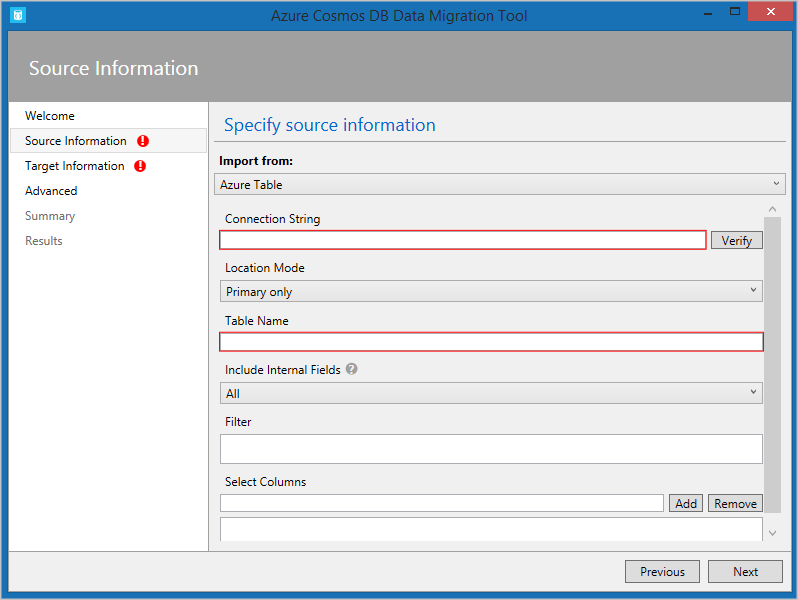

Companies that use Azure Storage tables for business-critical applications may find that Azure Cosmos DB provides a better service for their needs.

Suppose that your lenses database, which is implemented in Azure Storage tables, has been working well. The company has recently expanded into several new countries, and you have found that the performance of the database is not always as good in those countries as it is in your country. Your technical director has asked you to determine if there is a way to eliminate these problems without rewriting the app that uses the database.

Here, you will learn how Azure Cosmos DB provides a more scalable alternative to Azure Storage tables and does not require developers to rewrite code.

## Features of Azure Storage tables

Azure Storage is a service that provides the following data services:

| Data Service | Description |
|---|---|
| **Blob storage** | Store, secure, and access Binary Large Objects (Blobs). Blobs can be any file and this service is often used with image, videos, and other media. |
| **Queue storage** | Store messages in a queue to organize communications between systems. Queues help to improve communications, because messages won't be lost at times of high demand. Instead, the queue may lengthen, but the receiving component keeps picking up and processing the messages until it catches up. |
| **File storage** | Store files in file shares in the cloud for access with the Server Message Block (SMB) protocol. |
| **Table storage** | Store data in a NoSQL database to underpin applications. |

In this module, we'll concentrate on Azure Storage tables. This service provides a way to store semi-structured data in the cloud. The data is highly available to clients because it is replicated to multiple nodes or locations.

Storage tables are an example of a NoSQL database. Such databases don't impose a strict schema on each table like a SQL database does. Instead, each entity in the table can have a different set of properties. It's up to you to ensure that these properties are organized, and to ensure that apps that query the data can work with results that may have different values. A primary advantage of this semi-structured approach to data is that the database can evolve more quickly to meet changing business requirements.

> [!NOTE]
> An entity, in a NoSQL table, is the equivalent of a row in a relational database table.

Tables in Azure Storage can scale to large quantities of data; you can store any number of tables and any number of entities in a table. The only limits are the capacity of the storage account, which depends on the type of storage account you created. For example, a standard storage account can store 2 PB of data in US and European data centers, or 500 TB in other locations.

Azure storage accounts replicate data to multiple locations to ensure high-availability. You can choose from the following types of replication in a storage account:

| Replication Type | Description |
|---|---|
| **Locally redundant storage** | Data is replicated to a different storage scale unit with the same data center. This data remains available if a single node fails in the data center. Your data may be unavailable if an entire data center fails.
| **Zone-redundant storage** | Data is replicated to three storage clusters in a single region. This data remains available if a single data center fails. Your data may be unavailable if there is a region-wide outage.
| **Geo-redundant storage** | Data is replicated to a secondary region, hundreds or thousands of miles from the primary region. This data remains available even if there is a region-wide outage.
| **Read-access geo-redundant storage** | Data replicated to a secondary region, where it is available for clients to read. You can use this replication to provide a source of data that is closer to users than the primary. Closer data can improve performance by avoiding the need to read data from hundreds or thousands of miles away.

> [!NOTE]
> With geo-redundant storage, data in the secondary region is not readable unless an outage causes Azure to fail-over to that region. Under normal circumstances, all clients must connect to the primary region to access data.

## Features of Azure Cosmos DB

Azure Cosmos DB is Microsoft's globally distributed, multi-model database service with Azure.

**Multi-model** means that you can use one of many data access methods and APIs to read and write data. For example, you can use SQL, but if you prefer a NoSQL approach, you can use MongoDB, Cassandra, or Gremlin. Azure Cosmos DB includes the Tables API, which means that if you move your data from Azure Storage tables into Azure Cosmos DB, you don't have to rewrite your apps. Instead, you just change their connection strings.

Azure Cosmos DB can replicate data for read and write access to multiple regions. Clients can connect to a local replica both to query but also to modify data, which is not possible in Azure Storage tables.

## Differences between Azure Storage tables and Azure Cosmos DB tables

There are some differences in behavior between Azure Storage tables and Azure Cosmos DB tables to remember if you are considering a migration. For example:

- You are charged for the capacity of an Azure Cosmos DB table as soon as it is created, even if that capacity isn't used. This charging structure is because Azure Cosmos DB uses a reserved-capacity model to ensure that clients can read data within 10 ms. In Azure Storage tables, you are only charged for used capacity, but read access is only guaranteed within 10 seconds.
- Query results from Azure Cosmos DB are not sorted in order of partition key and row key as they are from Storage tables.
- Row keys in Azure Cosmos DB are limited to 255 bytes.
- Batch operations are limited to 2 MBs.
- Cross-Origin Resource Sharing (CORS) is supported by Azure Cosmos DB.
- Table names are case-sensitive in Azure Cosmos DB. They are not case-sensitive in Storage tables.

While these differences are small, you should take care to review your apps to ensure that a migration does not cause unexpected problems.

## How to choose a storage location

Each organization has different priorities for their NoSQL database system. Once you have identified those priorities, use this table to help you choose whether to use Azure Storage tables or Azure Cosmos DB tables to persist data for your applications:

| Priority | Azure Storage tables | Azure Cosmos DB tables |
| --- | --- | --- |
| Latency | Responses are fast, but there is no guaranteed response time. | < 10 ms for reads, < 15 ms for writes. |
| Throughput | Maximum 20,000 operations/sec | No upper limit on throughput. Over 10 million operations/sec/table. |
| Global distribution | Single region for writes. A secondary read-only region is possible with read-access geo-redundant replication. | Replication of data for read and write to more than 30 regions. |
| Indexes | A single primary key on the partition key and the row key. No other indexes. | Indexes are created automatically on all properties. |
| Data consistency | Strong in the primary region. If you are using read-access geo-redundant replication, it may take time for changes to reach the secondary region. | You can choose from five different consistency levels depending on your needs for availability, latency, throughput, and consistency. |
| Pricing | Optimized for storage. | Optimized for throughput. |
| SLAs | 99.99% availability. | 99.99% availability for single region and relaxed consistency databases. 99.999% availability for multi-region databases. |

## How to migrate an app to Azure Cosmos DB

If you have decided to move to Azure Cosmos DB, and you currently have data in one or more Azure Storage tables, you must consider how to move that data into Azure Cosmos DB. Microsoft provides two tools to complete this task:

- **Azure Cosmos DB Data Migration Tool.** This open source tool is built specifically to import data into Azure Cosmos DB from many different sources, including tables in Azure Storage, SQL databases, MongoDB, text files in JSON and CSV formats, HBase, and other databases. The tool has both a command-line version and a GUI version. You supply the connection strings for the data source and the Azure Cosmos DB target, and you can filter the data before migration.

- **AzCopy.** This command-line only tool is designed to enable developers to copy data to and from Azure Storage accounts. The process has two stages:

   - Export the data from the source to a local file.

   - Import from that local file to a database in Cosmos, specifying the destination database by using its URL and access key.

