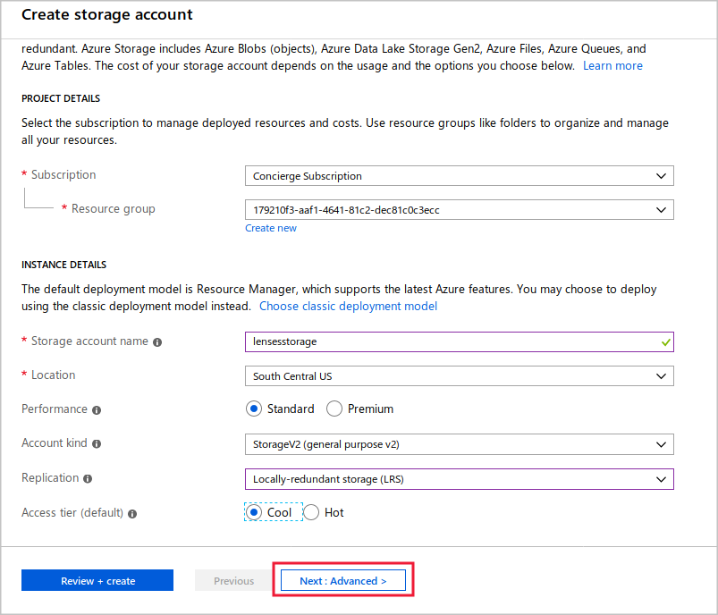
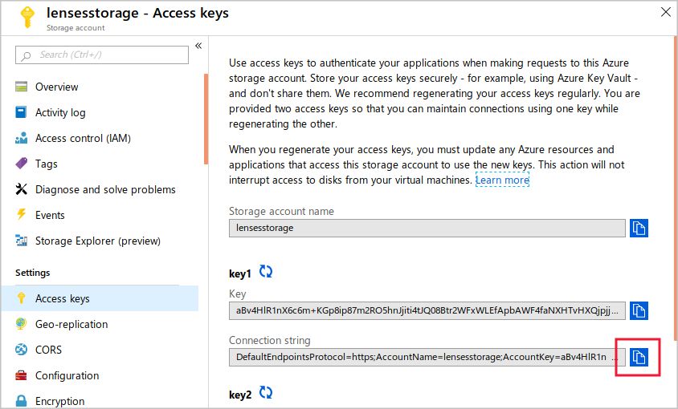
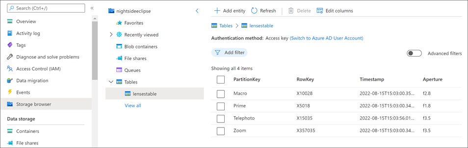
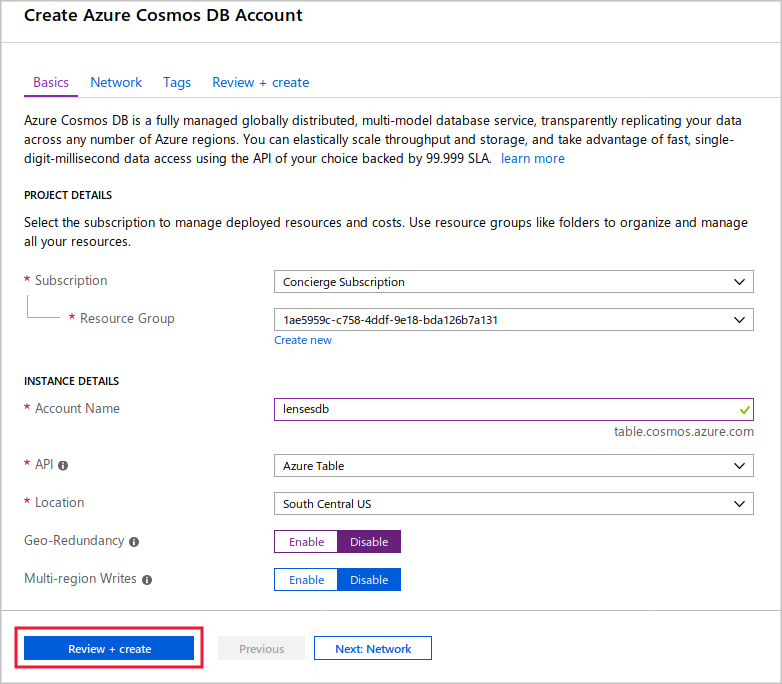
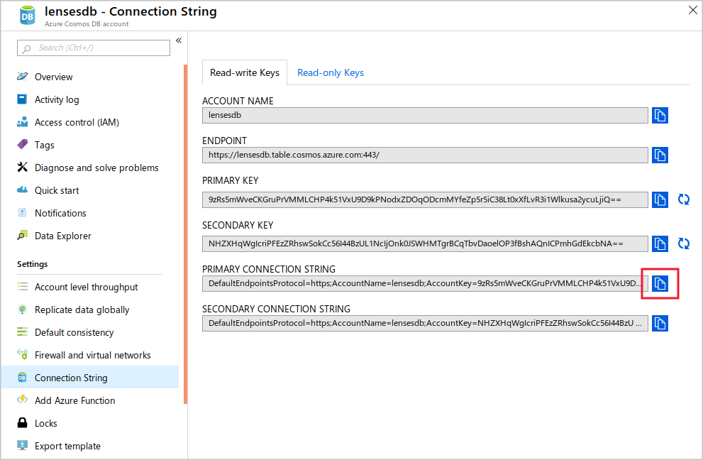
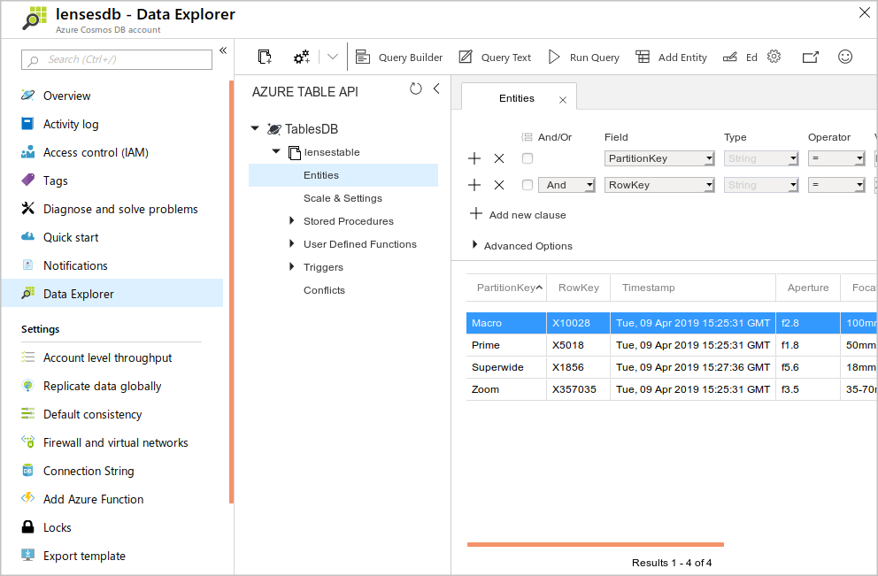

Apps that use Azure Storage tables can be moved to Azure Cosmos DB Tables API by changing the connection string.

Suppose you have decided to migrate the data for your app that manages camera lenses into Azure Cosmos DB. You want to reconfigure this app to use the new database.

Here, you will create and populate a table with data in a storage table. You will see the app working in that context and then move it onto Azure Cosmos DB, with no changes to the code.

[!INCLUDE[](../../../includes/azure-sandbox-activate.md)]

[!INCLUDE[](../../../includes/azure-sandbox-regions-first-mention-note-friendly.md)]

## Create a Storage account

Let's start by creating a storage account. Later, you'll configure the app to store table entries in this account.

1. Browse to the [Azure portal](https://portal.azure.com/learn.docs.microsoft.com?azure-portal=true), and log in using the account that you used when you activated the sandbox.

1. Click **+ Create a resource**, then **Storage**, and then click **Storage account**.

1. In the **Create storage account** wizard, complete the **Basics** page with these values, and then click <nobr>**Next:&nbsp;Advanced&nbsp;&gt;**<nobr>.

   | Field | Value |
   | --- | --- |
   | Subscription | Concierge Subscription |
   | Resource group | <rgn>[Sandbox resource group]</rgn> |
   | Storage account name | Use a globally unique value. For example, "lensesstorage" with your own initials postfixed. |
   | Location | Choose a region near you from the above list. |
   | Performance | Standard |
   | Account kind | StorageV2 (general-purpose v2) |
   | Replication | Locally redundant storage (LRS) |
   | Access tier | Cool |

   

1. On the **Advanced** page, next to **Secure transfer required**, click **Disabled** and then click **Review + create**.

1. Check your configuration, and then click **Create**.

It might take a few minutes for Azure to create your new storage account.

## Clone the Lenses app

The Lenses App is a sample command-line program that stores information about camera lenses in an Azure Storage table. Let's clone that app from GitHub.

1. In the Cloud Shell on the right, run the following command to create a folder for the lenses app.

   ```bash
   mkdir lensesapp
   ```

1. To clone the app from GitHub, run the following command.

   ```bash
   git clone https://github.com/MicrosoftDocs/mslearn-store-access-data-cosmos-table-api lensesapp
   ```

::: zone pivot="csharp"

## Configure the Lenses app with the connection string

Next, you will configure the lenses app with the connection string of the storage account you created, so that it knows where to store data.

1. In the [Azure portal](https://portal.azure.com/learn.docs.microsoft.com?azure-portal=true), click **All resources**, and then click the storage account you created.

1. Under **Settings**, click **Access Keys**.

1. To the right of the **key1 Connection string** textbox, click the **Copy** button.

   

1. In the Cloud Shell on the right, run the following command to change to the folder for the lenses app.

   ```bash
   cd lensesapp/dotnet
   ```

1. Enter the following command to start the code editor.

   ```bash
   code .
   ```

1. In the code editor, in the **Files** list, double-click **appsettings.json**.

1. Replace the value of the **LensesDatabase** property with the connection string that you just copied.

1. To save your changes, press **Ctrl-S** to save the file, and then press **Ctrl-Q** to exit the editor.

## Run the lenses app to populate the lenses table

We can use the .NET Core CLI tool to compile and run the lenses app. Here, let's use it to populate a table with lenses and then add our own lens entry.

1. To create and populate a table, run this command.

   ```bash
   dotnet run PopulateTable
   ```

1. To add your own lens to the table, run a command like the following example.

   ```bash
   dotnet run AddLens Telephoto X15035 150mm f3.5
   ```

1. To display the contents of the Azure Storage table, run this command.

   ```bash
   dotnet run DisplayTable
   ```
   You should see a display that is similar to the following.
   ```
   DisplayTable
   Reading the contents of the Lenses table...
   | Lens Type | Part Number | Focal Length | Aperture |
   |     Macro |      X10028 |        100mm |     f2.8 |
   |     Prime |       X5018 |         50mm |     f1.8 |
   | Telephoto |      X15035 |        150mm |     f3.5 |
   |      Zoom |     X357035 |      35-70mm |     f3.5 |
   ```

1. In the [Azure portal](https://portal.azure.com/learn.docs.microsoft.com?azure-portal=true), click **All resources**, and then click the storage account you created.

1. Click **Storage Explorer**, expand **Tables**, and then click **lensestable**. The Storage Explorer displays the list of camera lenses, including the lens you added.

   

::: zone-end

::: zone pivot="javascript"

## Configure the Lenses app with the connection string

Next, you will configure the lenses app with the connection string of the storage account you created, so that it knows where to store data.

1. In the [Azure portal](https://portal.azure.com/learn.docs.microsoft.com?azure-portal=true), click **All resources**, and then click the storage account you created.

1. Under **Settings**, click **Access Keys**.

1. To the right of the **key1 Connection string** textbox, click the **Copy** button.

   

1. In the Cloud Shell on the right, run the following command to change to the folder for the lenses app.

   ```bash
   cd lensesapp/node
   ```

1. Enter the following command to start the code editor.

   ```bash
   code .
   ```

1. In the code editor, in the **Files** list, double-click **.env**.

1. Paste in the value of the connection string to the right of the equals sign on the first line.

1. To save your changes, press **Ctrl-S** to save the file, and then press **Ctrl-Q** to exit the editor.

## Run the lenses app to populate the lenses table

Let's use the app to populate a table with lenses and then add our own lens entry.

1. Install the app's dependencies to get it ready to run.

    ```bash
    npm install
    ```

1. To create and populate a table, run this command.

   ```bash
   node app.js PopulateTable
   ```

1. To add your own lens to the table, run a command like the following example.

   ```bash
   node app.js AddLens Telephoto X15035 150mm f3.5
   ```

1. To display the contents of the Azure Storage table, run this command.

   ```bash
   node app.js DisplayTable
   ```
   You should see a display that is similar to the following.
   ```
   DisplayTable
   Reading the contents of the Lenses table...
   | Lens Type | Part Number | Focal Length | Aperture |
   |     Macro |      X10028 |        100mm |     f2.8 |
   |     Prime |       X5018 |         50mm |     f1.8 |
   | Telephoto |      X15035 |        150mm |     f3.5 |
   |      Zoom |     X357035 |      35-70mm |     f3.5 |
   ```

1. In the [Azure portal](https://portal.azure.com/learn.docs.microsoft.com?azure-portal=true), click **All resources**, and then click the storage account you created.

1. Click **Storage Explorer**, expand **Tables**, and then click **lensestable**. The Storage Explorer displays the list of camera lenses, including the lens you added.

   

::: zone-end

## Create an Azure Cosmos DB database

Next, create an Azure Cosmos DB database in your Azure subscription, and select the **Azure Table** API.

1. In the [Azure portal](https://portal.azure.com/learn.docs.microsoft.com?azure-portal=true), click **+ Create a resource**.

1. Click **Databases**, and then click **Azure Cosmos DB**.

1. In the **Create Azure Cosmos DB Account** wizard, complete the **Basics** page with these values, and then click **Review + create**.

   | Field | Value |
   | --- | --- |
   | Subscription | Concierge Subscription |
   | Resource group | <rgn>[Sandbox resource group]</rgn> |
   | Account name | Use a globally unique value. For example, "lensesdb" with your own initials postfixed. |
   | API | Azure Table |
   | Location | Choose a region near you from the above list. |
   | Geo-Redundancy | Disable |
   | Multi-region Writes | Disable |

   

1. If your settings are correct, click **Create**.

It might take a few minutes for Azure to create your new Azure Cosmos DB account.

::: zone pivot="csharp"

## Switch the Lenses app to the Azure Cosmos DB database

To change the lenses app to use the new Azure Cosmos DB database, you must change the connection string.

1. In the [Azure portal](https://portal.azure.com/learn.docs.microsoft.com?azure-portal=true), click **All resources**, and then click the Cosmos database you created.

1. Under **Settings**, click **Connection String**.

1. To the right of the **PRIMARY CONNECTION STRING** textbox, click the **Copy** button.

    

1. In the Cloud Shell on the right, to start the code editor, type this command.

    ```bash
    code .
    ```

1. In the code editor, in the **Files** list, double-click **appsettings.json**.

1. Replace the value of the **LensesDatabase** property with the connection string that you just copied.

1. To save your changes, press **Ctrl-S** to save the file, and then press **Ctrl-Q** to exit the editor.

## Investigate the contents of the Cosmos Database

Now that you have changed the app to use the Azure Cosmos DB database, let's see whether it connects and displays the correct contents.

1. To display the contents of the table, run this command.

   ```bash
   dotnet run DisplayTable
   ```
   There should be no entries in the table, because you have not yet migrated the data.
   ```
   DisplayTable
   Reading the contents of the Lenses table...
   | Lens Type | Part Number | Focal Length | Aperture |
   ```

1. In the [Azure portal](https://portal.azure.com/learn.docs.microsoft.com?azure-portal=true), click **All resources**, and then click the Cosmos database you created.

1. Click **Data Explorer**, and then next to **TABLE API**, click the refresh button. Again, no tables or entities are yet present.

## Test the Azure Cosmos DB database

Finally, let's populate the table in Azure Cosmos DB and view the results.

1. In the Cloud Shell, to create and populate a table, run the following command.

   ```bash
   dotnet run PopulateTable
   ```

1. To display the contents of the table, run the following command.

   ```bash
   dotnet run DisplayTable
   ```
   You should see a table displayed like you saw with the Azure Storage Table.

1. To add your own lens to the table, run a command like the following example.

   ```bash
   dotnet run AddLens Superwide X1856 18mm f5.6
   ```

1. In the [Azure portal](https://portal.azure.com/learn.docs.microsoft.com?azure-portal=true), click **All resources**, and then click the Cosmos database you created.

1. Click **Data Explorer**. Under **AZURE TABLE API**, expand **TablesDB**, then **lensestable**, and then click **Entities**. The data explorer displays your list of camera lenses.

   

::: zone-end

::: zone pivot="javascript"

## Switch the Lenses app to the Azure Cosmos DB database

To change the lenses app to use the new Azure Cosmos DB database, you must change the connection string.

1. In the [Azure portal](https://portal.azure.com/learn.docs.microsoft.com?azure-portal=true), click **All resources**, and then click the Cosmos database you created.

1. Under **Settings**, click **Connection String**.

1. To the right of the **PRIMARY CONNECTION STRING** textbox, click the **Copy** button.

    

1. In the Cloud Shell on the right, to start the code editor, type this command.

    ```bash
    code .
    ```

1. In the code editor, in the **Files** list, double-click **.env**.

1. Replace the existing value of the **AZURE_STORAGE_CONNECTION_STRING** variable with the new Cosmos DB connection string that you just copied.

1. To save your changes, press **Ctrl-S** to save the file, and then press **Ctrl-Q** to exit the editor.

## Investigate the contents of the Cosmos Database

Now that you have changed the app to use the Azure Cosmos DB database, let's see whether it connects and displays the correct contents.

1. To display the contents of the table, run this command.

   ```bash
   node app.js DisplayTable
   ```
   The app will display an error: you have not created the table in Cosmos DB yet, so there is nothing there to query.
   ```
   Reading the contents of the Lenses table...
   Error: The specified resource does not exist.
   RequestID:a45f5e70-d387-11e9-9fe4-7d2558c62514
   ```

1. In the [Azure portal](https://portal.azure.com/learn.docs.microsoft.com?azure-portal=true), click **All resources**, and then click the Cosmos database you created.

1. Click **Data Explorer**, and then next to **TABLE API**, click the refresh button. Again, no tables or entities are yet present.

## Test the Azure Cosmos DB database

Finally, let's populate the table in Azure Cosmos DB and view the results.

1. In the Cloud Shell, to create and populate a table, run the following command.

   ```bash
   node app.js PopulateTable
   ```

1. To display the contents of the table, run the following command.

   ```bash
   node app.js DisplayTable
   ```
   You should see a table displayed like you saw with the Azure Storage Table.

1. To add your own lens to the table, run a command like the following example.

   ```bash
   node app.js AddLens Superwide X1856 18mm f5.6
   ```

1. In the [Azure portal](https://portal.azure.com/learn.docs.microsoft.com?azure-portal=true), click **All resources**, and then click the Cosmos database you created.

1. Click **Data Explorer**. Under **AZURE TABLE API**, expand **TablesDB**, then **lensestable**, and then click **Entities**. The data explorer displays your list of camera lenses.

   

::: zone-end