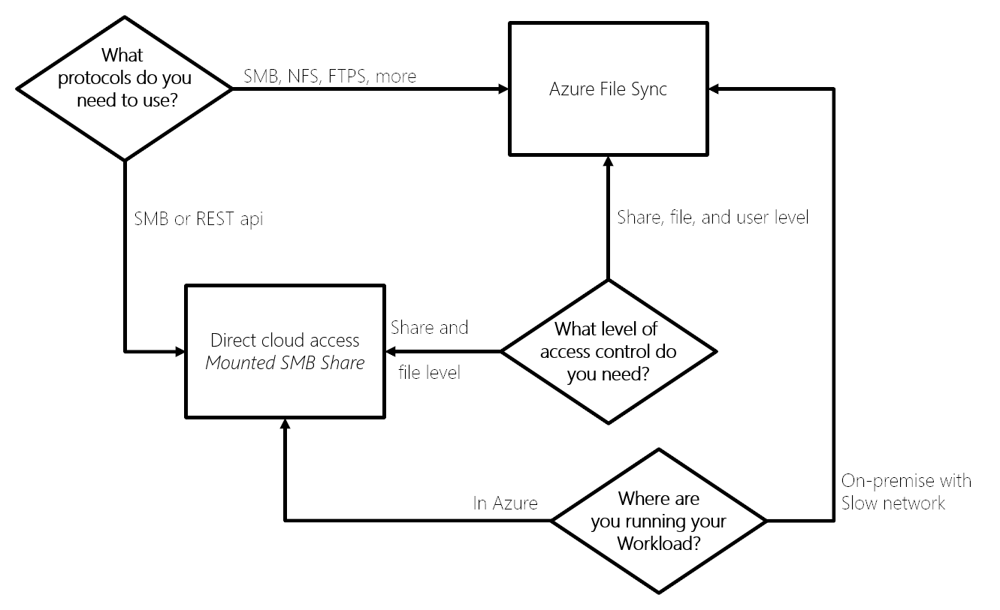

Moving a company's shared files into the cloud-based Azure Files requires an analysis of the options and a plan for the implementation. There's an important decision to make. How are you going to access and update the files? You could choose to replace your existing Server Message Block (SMB) file shares with their equivalent in Azure Files. The other option is to set up an Azure File Sync. If you choose to use Azure File Sync, there's more flexibility on how files are secured and accessed.

The finance company has given you guidance on their requirements. The main concern is that they want to reduce the impact on existing applications, systems, and users. The company would like to use a drop-in replacement for their existing SMB protocol shares. They intend that there won't be any code changes required to support the moved data.

In this unit, you'll explore the features offered by Azure Files, and understand the different ways you can access your files. A company's data needs to be resilient to failures. You'll investigate the different redundancy options, and choose the right one for the finance company. Finally, knowing the Azure Files features to use, you'll create a plan to migrate the existing files.

## What is Azure Files?

Before exploring what Azure Files is, you need to understand that storage of file shares is one type of data that can be contained in an Azure Storage account. Later in this unit, you'll see how storage accounts provide options for the resilience of stored files.

You can think of Azure Files as a standard file share, hosted on Azure, that you can access with the industry standard SMB protocol. You can mount, or connect, to the an Azure Files file share concurrently on all the main operating systems.

Azure Files can be used to supplement, or replace, a company's existing on-premises NAS devices or file servers. Some of the reasons why your organization will want to use Azure Files are:

  - Developers can store apps and configuration files in a file share and connect new VMs to the shared files. This action reduces the speed to get new machines into production.
  - Cloud-based apps can efficiently write log files using the File REST API to the shared storage. Developers can then map to the shared folder and run their local debugging tools on the shared data.
  - File shares on Azure don't need a company to buy and deploy expensive redundant hardware and manage software updates.
  - You can automate the creation and editing of file shares using PowerShell, or Azure CLI commands, leading to an increase in the productivity of a company's operations.
  - All of the resilience of the Azure platform is inherited by your file share, making files globally redundant. You also gain options to use the integrated snapshots feature and set up automatic backups using Recovery Services vaults.
  - All the data is encrypted in transit using HTTPS and is stored encrypted when at rest.
  - The shares are cross-platform, and you can connect to them from Windows, Linux, or macOS.

Moving a companies existing file shares into Azure Files gives them the flexibility to move their data and processing, or just data, into the cloud. They can then benefit from its scalability, security, and reduced costs compared to running and maintaining the required resources on-premises.

### Choose your data access method

There are two built-in methods of data access supported by Azure Files. One is direct access via a mounted drive in your operating system. The other is to use a Windows Server (either on-premises or in Azure) and install Azure File Sync to synchronize the files between local shares and Azure Files.

The most common scenario that would lead you to consider using Azure File Sync is to run your applications or compute resources locally on on-premises Windows machines. If the office also has a slow internet connection, it increases the need to run Azure File Sync for performance reasons.

The primary use of direct cloud access is where the apps are running on Azure, and all locations that need access to the data have a fast internet connection.

As the finance company is moving its main apps to Azure, and they want to reduce the number of changes they have to make in their offices, direct access is the best choice for them.

### Choose your file redundancy option

As Azure Files are stored in a storage account, you can choose between standard or premium performance storage accounts.

- **Standard performance**: double-digit ms latency, 10,000 IOPS, 300-MBps bandwidth
- **Premium performance**: single-digit ms latency, 100,000 IOPS, 5GBps bandwidth

Standard performance accounts use HDD to store the data. This way, the costs are lower, as is the performance. SSD arrays back the premium storage accounts' performance, the price being higher costs. Currently, premium accounts can only use FileStorage accounts with ZRS storage in a limited number of regions.

You need to balance the availability and performance requirements to decide on the account and redundancy options. The finance company is more concerned with the security of their data than performance, and they want the most resilience possible. Therefore, the best choice is a standard GRS storage account. When GZRS leaves preview and is generally available, it would become the best option for them.

|         |LRS      |ZRS      |GRS / GZRS     |
|---------|---------|---------|---------|
|You can easily recreate data and cost is a priority    |    ✔     |         |         |
|Data must be stored in a single known location     |    ✔    |         |         |
|Premium performance is required |    ✔    |     ✔*    |         |
|Data needs to be highly available, and redundancy is a priority     |         |    ✔     |    ✔     |
|99.999999999% (11 nines) durability     |    ✔     |         |         |
|99.9999999999% (12 nines) durability     |         |    ✔     |         |
|99.99999999999999% (16 nines) durability     |         |         |    ✔    |

 *Premium File Storage accounts with ZRS are only supported in a smaller subset of regions.

The above table compares the different characteristics of each storage option.

### Choose your data migration solution

The finance company has existing systems, data, and file shares. You need to migrate this data into Azure Files, so there's another decision to make. Because you can connect over SMB, or use the REST APIs, you have many options, from writing a custom utility to using Microsoft solutions. Here's a list of the most common utilities.

|Utility  | Description  |
|---------|---------|
|AzCopy     | Command-line tool offering the best performance, especially for a low volume of small files.  |
|Robocopy   | Command-line tool shipped with Windows and Windows Server. AzCopy is written to be Azure aware and performs better. |
|Azure Storage Explorer     | Graphical file management utility that runs on Windows, Linux, and macOS.         |
|Azure portal     | Use the portal to import files and folders. |
|Azure File Sync     | Can be used to do the initial data transfer, and then uninstalled when the data is transferred.  |
|Azure Data Box     | If you have up to 35 TB of data and you need it imported in less than a week.  |

The finance company's files are small, and they have around 100-Mbps bandwidth on their network. Their operations team don't want to install software on any of the machines and want the transfers to be as fast as possible.

Knowing these requirements and constraints, you propose that AzCopy is the best tool for their needs.