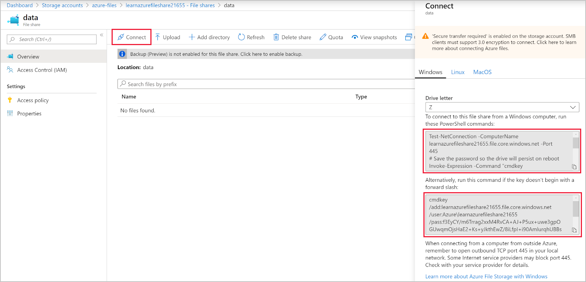

There are two steps to creating Azure file shares. The first step is to create a storage account by choosing the correct options. The second step involves creating the file shares themselves.

After you've reviewed all the options, you're going to propose to the finance company that they use a geo-redundant storage (GRS) account. This type of account provides the highest level of resilience for the stored files. You'll use this storage account and create file shares for reports and application data.

In this unit, you'll see how to use Azure CLI commands to create the storage account you need. You'll learn how to authenticate with Azure and persist credentials to allow the company's satellite offices to maintain connections to the file shares.

## Create a storage account with the Azure CLI

```azurecli
az storage account create
```

The CLI command to create a storage account has many options. These options can be narrowed down to the ones required if you know the sku of the account you need.

For the finance company, you've decided that GRS is the best choice. This decision limits the arguments to be concerned with to `--sku`. The allowed values for this argument are Premium_LRS, Premium_ZRS, Standard_GRS, Standard_GZRS, Standard_LRS, Standard_RAGRS, Standard_RAGZRS, or Standard_ZRS. In our scenario, the argument should be set to `Standard_GRS`.

There are only two other required arguments for the command, `--name` and --`resource-group`.

You'll run the following full command.

```azurecli
az storage account create \
--name <unique account name> \
--resource-group <resource group name> \
--sku Standard_GRS
```

## Create a file share

```azurecli
az storage share create
```

The only required argument to this command is `--name`, but it won't enable you to create a share on its own. You also need to provide the storage account information. There are two ways you can provide the information to the command:

- By using the `--account-name` and either an `--account-key` or a `--sas-token` argument.
- By using a storage account connection string with `--connection-string`.

There are interesting optional arguments that you might find useful in some situations. The first argument controls the size of the share in gigabytes. If you need this restriction, use the `--quota` argument. The second argument lets you control the timeout for calls to the service in seconds with `--timeout`.

The defaults for these arguments are acceptable in our scenario. So, the full command takes the following form:

```azurecli
az storage share create \
--account-name <unique account name> \
--account-key <account key> \
--name <share name>
```

## Connect to an Azure file share with SMB

With the Azure file share created, you connect to it from a Windows, Linux, or macOS computer. There are guides for each operating system online, and links to them are in the summary unit. This module assumes you're going to be working with Windows machines.

The Azure portal makes it easy to connect to your new share by providing the PowerShell commands to run.



### Authenticate with Azure Active Directory

Azure Active Directory (Azure AD) authentication is possible if the machine that needs access to the file share is a domain-joined Windows-based VM hosted on Azure. This method provides a great solution to secure your file shares and offers advantages over using a shared key:

- You can enforce more granular control over file access based on role-based access.
- On-premises discretionary access control lists (DACLs) can be copied, along with the files, over SMB to preserve a company's existing permissions.

### Authenticate with a shared key

Currently, Azure doesn't support authenticating with Kerberos over SMB. You can create file shares by using a shared key until this option becomes available. The downside is that this method of authentication grants any user who has the shared key full administration access to all files and folders contained in the file share. If this level of access is unacceptable, use Azure File Sync because it supports DACLs.

The finance company's file shares need to be used by individuals in satellite offices and by a combination of hosted and on-premises Windows machines. This scenario leads you to choose a shared key on all those machines to access the file shares. You can persist the key on those machines by using the `cmdkey` utility. As you'll see in a later unit, you can add extra security to the file shares.
