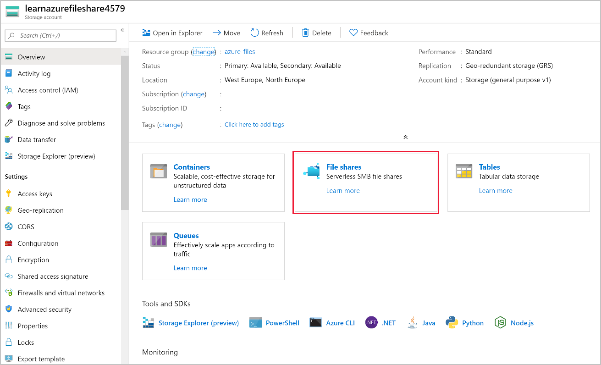
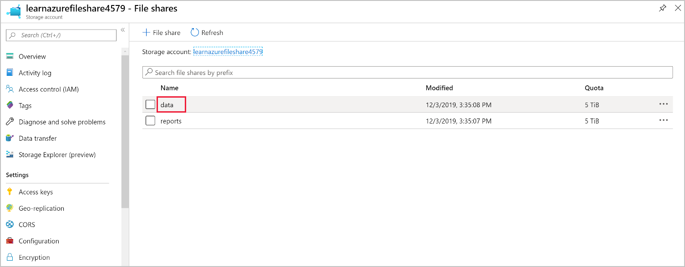
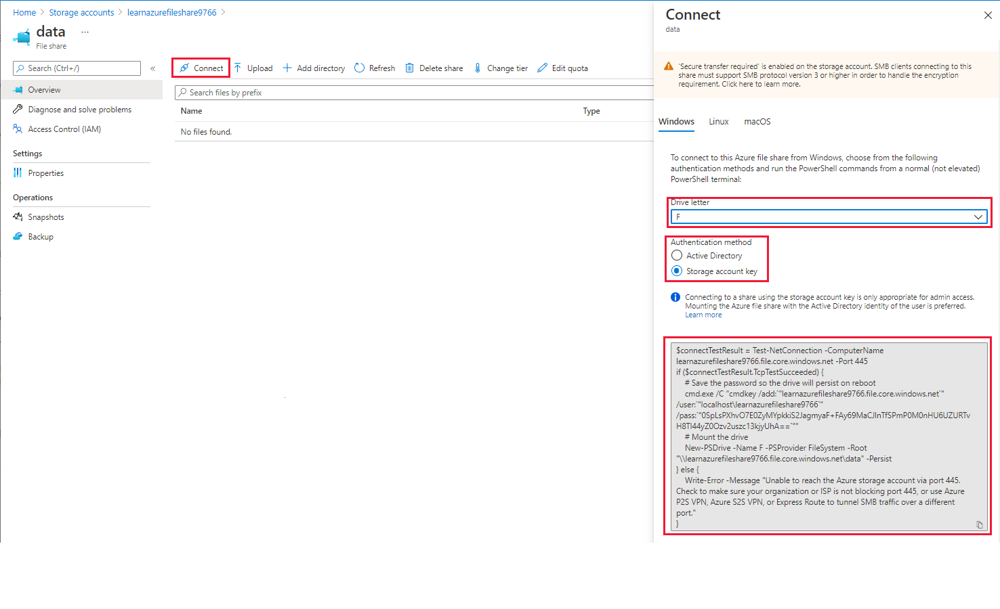
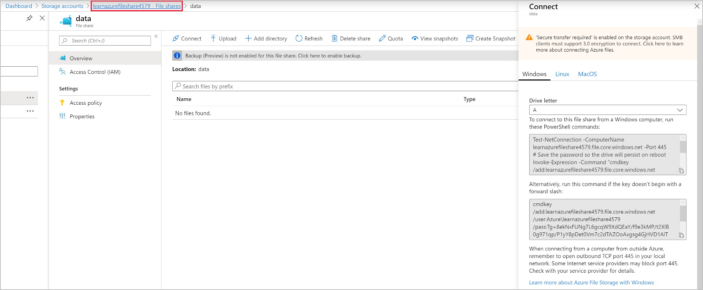
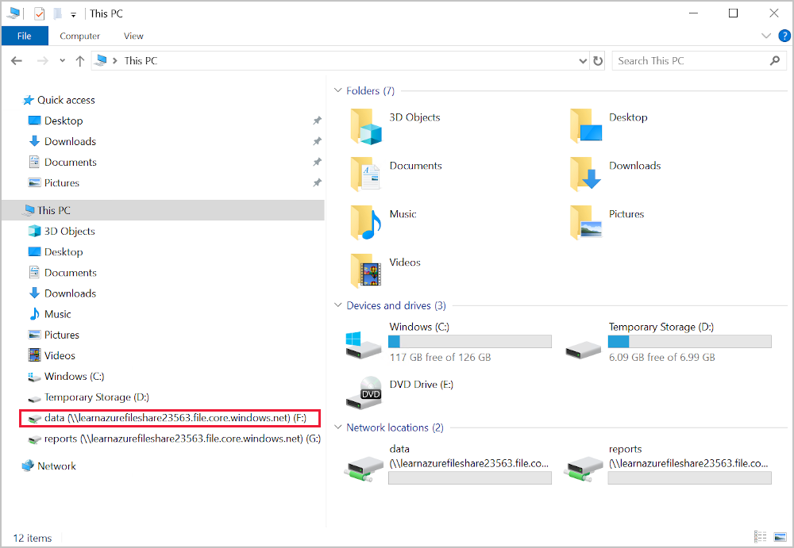

Azure storage accounts enable organizations to replicate their on-premises file shares in a secure, resilient cloud service. Companies can then remove redundant hardware and infrastructure that support the internal SANs and NAS. At the same time, a company can reduce the risk of files being unavailable because of a hardware failure.

The finance company has asked you to duplicate the two file shares that they currently have on-premises. It uses one file share for reports and the other for application data. The storage account needs to be resilient to datacenter failures. That's why you'll create it to use GRS redundancy.

In this exercise, you'll first create a new storage account and two file shares for reports and application data. You'll then create a Windows VM to use as your example customer machine. You'll use the Windows VM to mount drives where you access the file shares. Finally, you'll map two drives to the new Azure file shares and copy reports to them.

## Create a GRS storage account

1. Create a storage account by using the Azure CLI command.

    ```azurecli
    export STORAGEACCT=learnazurefileshare$RANDOM

    az storage account create \
        --name $STORAGEACCT \
        --resource-group <rgn>[sandbox resource group]</rgn> \
        --sku Standard_GRS
    ```

1. Using Azure CLI commands, save the storage account key in a local variable.

    ```azurecli
    STORAGEKEY=$(az storage account keys list \
        --resource-group <rgn>[sandbox resource group]</rgn> \
        --account-name $STORAGEACCT \
        --query "[0].value" | tr -d '"')
    ```

## Create file shares

1. Create a file share to store the finance company's reports.

    ```azurecli
    az storage share create \
        --account-name $STORAGEACCT \
        --account-key $STORAGEKEY \
        --name "reports"
    ```

1. Create a file share to store the finance company's application data.

    ```azurecli
    az storage share create \
        --account-name $STORAGEACCT \
        --account-key $STORAGEKEY \
        --name "data"
    ```

## Create and connect to a Windows server

Next, create a Windows Server VM to simulate an on-premises machine running in the finance company's datacenter or branch office.

1. Using Azure Cloud Shell, create a Windows VM with the Azure CLI. When you're prompted for a password, enter a complex password of your choice and note it for reference later.

    ```azurecli
    az vm create \
        --resource-group <rgn>[sandbox resource group]</rgn> \
        --name 2019FileServer \
        --image Win2019Datacenter \
        --admin-username azureuser
    ```

1. Sign in to the [Azure portal](https://portal.azure.com/learn.docs.microsoft.com?azure-portal=true) with the account you used to activate the sandbox. On the portal menu, select **All services** > **Virtual machines**. Then select the **2019FileServer** VM you created.

1. On the **Overview** pane, select **Connect** > **RDP**, and then select **Download RDP File**.

1. Run the RDP file, and select **Connect** when you're prompted.

1. On the **Enter your credentials** prompt, select **More choices**. Then select **Use a different account**. In the **Username** field, enter **azureuser**, and enter the password for this user.

1. Select **OK**, and then select **Yes** to connect to the server.

## Map drives to the Azure file shares

1. In the Azure portal, select or search for **Storage Accounts** from the portal menu.

1. Select the created storage account that should be named **learnazurefileshare**, followed by random numbers.

    

1. Select **File shares**, and then select **data** (same page you just selected data).

    

1. Select **Connect**, and in the pop-up window on the right, select the **F** drive letter.

    

1. Copy the PowerShell command.
1. On your virtual machine, right-click **Start** and select **Windows PowerShell (Admin)**.
1. In the PowerShell window, paste the copied commands.
1. Return to the Azure portal, go back to the file shares, and select the **reports** file share.

    

1. Select **Connect**, and in the pop-up window on the right, select the **G** drive letter.
1. Copy the bottom PowerShell command.
1. In the PowerShell window, paste the copied commands.

## Test the mounted drive

1. Open Explorer in the VM , and select **This PC**.

    

1. Select the data drive named drive **F**. 
1. Right-click the main window, and select **New** > **Text Document**. 
1. Name the file **test upload**.
1. Return to the Azure portal in your browser, and go to the **data** file share. You should see the file in the portal.
1. Keep this connection open for the next exercise.
