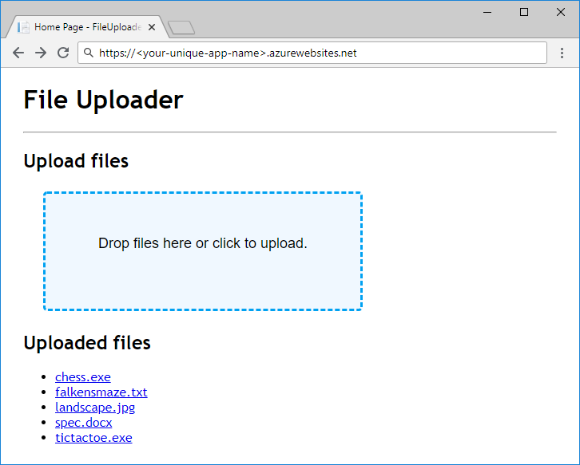

Once we have an idea of how we're going to store data across storage accounts, containers and blobs, we can think about the Azure resources we need to create to support the app.

### Storage accounts

Storage account creation is an administrative/management activity that takes place prior to deploying and running your app. Accounts are usually created by a deployment or environment setup script, an Azure Resource Manager template, or manually by an administrator. Applications other than administrative tools generally should not have permissions to create storage accounts.

### Containers

Unlike storage account creation, container creation is a lightweight activity that makes sense to perform from within an app. It's not uncommon for apps to create and delete containers as part of their work.

For apps that rely on a known set of containers with hard-coded or preconfigured names, typical practice is to let the app create the containers it needs on startup or first usage if they don't already exist. Letting your app create containers instead of doing it as part of your app's deployment eliminates the need for both your application and your deployment process to know the names of the containers the app uses.

## Exercise

We're going to complete an unfinished ASP.NET Core app by adding code to use Azure Blob storage. This exercise is more about exploring the Blob storage API than it is about designing an organization and naming scheme, but here's a quick overview of the app and how it stores data.



Our app works like a shared folder that accepts file uploads and makes them available for download. It doesn't use a database for organizing blobs &mdash; instead, it sanitizes the names of uploaded files and uses them as blob names directly. All uploaded files are stored in a single container.

The code we'll start with compiles and runs, but the parts responsible for storing and loading data are empty. After we complete the code, we'll deploy the app to Azure App Service and test it.

[!include[](../../../includes/azure-sandbox-activate.md)]

Let's set up the storage infrastructure for our app.

### Storage account

We'll use the Azure Cloud Shell with the Azure CLI to create a storage account. You'll need to provide a unique name for the storage account &mdash; make a note of it for later. We're using "East US" in the example below, but you can change it to any of the available locations from list.

[!include[](../../../includes/azure-sandbox-regions-first-mention-note.md)]

Execute the following command to create the storage account. 

```azurecli
az storage account create \
  --kind StorageV2 \
  --resource-group <rgn>[sandbox resource group name]</rgn> \
  --location eastus \
  --name <your-unique-storage-account-name>
```

> [!NOTE]
> Why `--kind StorageV2`? There are a few different kinds of storage accounts. For most scenarios, you should use general-purpose v2 accounts. The only reason you need to explicitly specify `--kind StorageV2` is that general-purpose v2 accounts are still fairly new and have not yet been made the default in the Azure Portal or the Azure CLI.

### Container

The app we'll be working with in this module uses a single container. We're going to follow the best practice of letting the app create the container at startup. However, container creation can be done from the Azure CLI: run `az storage container create -h` in the Cloud Shell terminal if you'd like to see the documentation.