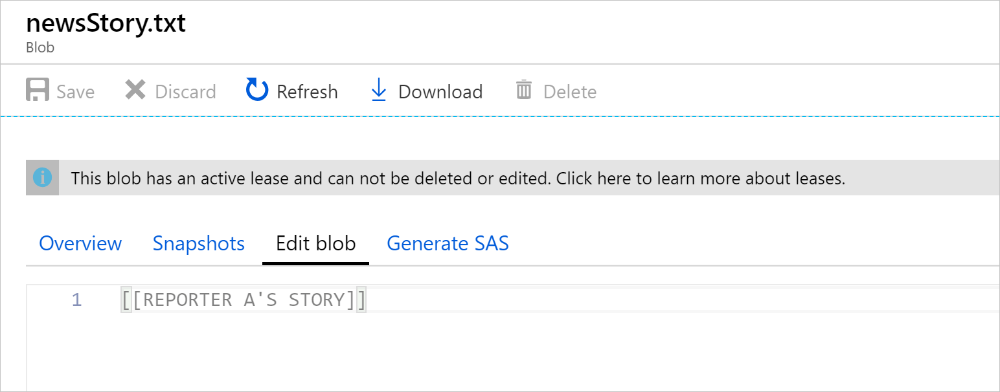

Pessimistic concurrency prevents other users from modifying data by locking it with a **lease**. A **lease** restricts access to a single client for a predetermined amount of time. Once the lease has been acquired, other users are prevented from completing actions on that data. The lease defines how long you hold on to the content. Lease times are from between 15 to 60 seconds. A lease can be reacquired before it expires to extend it, and released earlier once you've finished using it. The blob service automatically releases finite leases when they expire.


<!-- TODO replace with studio graphics -->

Using our example app, the first reporter locks the file. No one else can acquire a lock until the current one has been released, or has expired. The second reporter, being the quickest, has finished making edits but is unable to get a lock to save it until the first reporter lets them.

Locks on Azure blobs are called *leases*. An app must acquire a lease before it tries to update an object in blob storage. When requesting the least you specify an amount of time, or say that you want the lease indefinitely. The operations possible on a lease are:

- **Acquire**: requests a new lease.
- **Renew**: allows you to renew an existing lease.
- **Change**: is used to change the ID of an existing lease.
- **Release**: frees the lease early to allow another apps to acquire a lease.
- **Break**: ends the lease but prevents another client from acquiring a new lease until the current lease period has expired.

The first reporter acquires a lease for the blob, and begins writing. The second reporter tries to acquire the lease before starting and receives an error, because there's already a lease in use. The second reporter has to wait until the lease is either released or expired.

### Azure Blob Storage

To acquire a lease in C#, use this code:

```csharp
lease = await blobLeaseClient.AcquireAsync(TimeSpan.FromSeconds(60));
```

The above code notifies the service that you'd like exclusive access to the blob represented by `blobLeaseClient` for **60 seconds**. If a second app, or process, also tries to acquire a lease on the same object while it's locked, Azure returns a **409** HTTP error code (conflict occurred). If other processes, including the Azure portal, try to change the file they aren't able to. At the end of the 60 seconds, or if the lease is explicitly released, other apps or processes are able to acquire a lease on the blob.



Now the lease has been created, use it with `UploadAsync` to prove that you're allowed to complete the update. In the code, you create a request condition generated from the acquired lease:

```csharp
// Set the request condition to include the lease ID.
BlobUploadOptions blobUploadOptions = new BlobUploadOptions()
{
    Conditions = new BlobRequestConditions()
    {
        LeaseId = lease.LeaseId
    }
};
await blobClient.UploadAsync(BinaryData.FromString(story), blobUploadOptions);
```
## Advantages and disadvantages

Pessimistic concurrency is primarily used in environments where there's heavy contention for data. The cost of protecting data with a lease is less than the cost of fixing the data if concurrency conflicts occur. Pessimistic concurrency is best implemented when lease times are short, as in programmatic processing of records. Pessimistic concurrency isn't a scalable option if users are working with data and locking records for large periods of time. It's pessimistic, because you think that someone else is going to edit a file at the same time you're using it.

An app can request ownership of a blob and not allow anyone else to change it while it's being used. The obvious downside is that no one else can make changes to the blob. As you can see from the above Azure portal screenshot, it's still possible to open it for read access though.

Unlike optimistic concurrency, leases are enforced globally, regardless of application implementation. So if a single app acquires a lease, no other process can update the blob until the lease has expired or been released.
