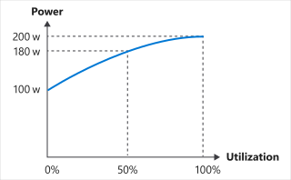

> [!VIDEO https://www.microsoft.com/videoplayer/embed/RWwMdr]
_The content in the video is still valid, but the principle numbers may differ due to the Green Software Foundation's principle renumbering._

## Electricity and carbon

Most people think electricity is clean. When we plug something into a wall, our hands don't become dirty, and our laptops don't need exhaust pipes. However, the truth is that most electricity is produced through burning fossil fuel ([usually coal](https://ourworldindata.org/grapher/world-electricity-by-source)) and energy supply is the [single most significant](https://www.eea.europa.eu/data-and-maps/daviz/change-of-co2-eq-emissions-2#tab-chart_4) cause of carbon emission.

Because we can draw a direct line from electricity to carbon emissions, we can consider electricity one of the proxies for carbon.

From the applications running on your smartphone to training machine-learning models running in data centers, all software consumes electricity in its execution. One of the best ways to reduce electricity consumption and our software's subsequent carbon pollution emissions is to make our applications more energy-efficient.

This is why this principle of Sustainable Software Engineering is to **build applications that are energy-efficient**.

As sustainable engineers, we need to understand electricity. Our journey doesn't start with the computer; it begins with how the electricity that powers our computers is made.

## Energy vs. power

Energy measures the amount of electricity used; the standard unit for Energy is Joules or J. However, kilowatt-hours or kWh is another common way of referring to energy consumption.

Electricity is often reported as either Power or Energy, which are two different concepts:

```Energy = Power &#10005; Time```

- Energy is the total amount of electricity used; the standard unit for Energy is Joules or J.

- Power is the rate of electricity consumed per unit of time; the standard unit of Power is Watt or W. A single Watt is one Joule per second.

A common way of referring to energy consumption is _Power over a unit of Time, such as Watt-seconds or Kilowatt-hours_. For example:

- 20 Watt-seconds or ```20 Ws``` is the amount of energy you would get if ```20 W``` were run for one second. Since one Watt is one Joule per second, this value is 20 Joules.

- 20 Kilowatt-hours or ```20 kWh``` is the energy you would get if 20,000 Watts ran for one hour.

    ```Energy = 60 &#10005; 60 &#10005; 20,000 = 72,000,000 Joules = 72 Megajoules (72 MJ)```

## Energy proportionality

> [!VIDEO https://www.microsoft.com/videoplayer/embed/RWxdGc]

Utilization measures how much of a computer's resources are being used, which is usually represented as a percentage. An idle computer has a low utilization percentage and isn't being utilized; a computer running at its maximum capacity has a high percentage and is being fully utilized.

[Energy proportionality](https://en.wikipedia.org/wiki/Energy_proportional_computing) is a measure of the relationship between power consumed in a computer system and the rate at which useful work is done (its utilization). If the overall power consumption is proportional to the computer's utilization, then its energy proportional.

In an energy proportional system, the energy efficiency is a constant; no matter the utilization, the energy efficiency remains the same. However, the energy efficiency of hardware isn't constant. It varies based on context. Due to the complex interactions of many different hardware device components, it can be nonlinear, which means that the relationship between power and utilization isn't proportional.



At 0% utilization, the computer still draws ```100 W```; at 50% utilization, it draws ```180 W```, and at 100% utilization, it draws ```200 W```. The relationship between power consumption and utilization isn't linear, and it doesn't cross the origin.

Because of this relationship, **the more you utilize a computer, the more efficient it becomes at converting electricity to useful computing operations**. Running your work on as few servers as possible with the highest utilization rate maximizes their energy efficiency.

### Static power draw

There are various reasons for this lack of energy proportionality, one of which is static power draw.

An idle computer, even at zero percent utilization, still draws electricity. This static power draw varies by configuration and hardware components, but all components have some static power draw. This potential power draw is one of the reasons that PCs, laptops, and mobile devices have power-save modes available. If the device is idle, it will eventually trigger a hibernation mode, put the disk and screen to sleep, or even change the CPU frequency. These power-save modes save on electricity but have other trade-offs, such as a slower restart when the device wakes up.

Servers are usually not configured for aggressive or even minimal power-saving. Many server use cases demand full capacity as quickly as possible in response to rapidly changing demands. This scenario can leave many servers in idle mode during low-demand periods. An idle server has a cost both from embedded carbon and its inefficient utilization.

#### Clock speed

Clock speed (frequency) is the operating speed of a computer or its microprocessor, expressed in cycles per second (megahertz). Dynamically adjusting the clock speed of computing devices is often used in consumer devices to achieve more energy proportionality.

Clock speed denotes how fast a computer can execute instructions.

The energy efficiency of microprocessors changes with clock speed; high clock speeds are often **less** energy-efficient than low clock speeds. For example, in the I7-3770K system, you can run at ```3.5 GHz``` for ```50 W```, or about ```5 GHz``` for ```175 W```. An approximate 40% increase in clock speed requires **&gt;3&#10005;** power increase.

Considering this information, reducing the clock speed at times of low utilization can increase energy efficiency, thereby maximizing the energy efficiency of hardware.
