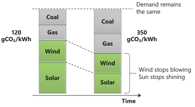
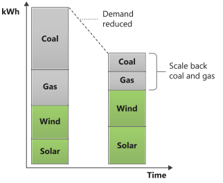
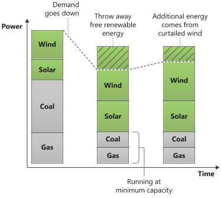
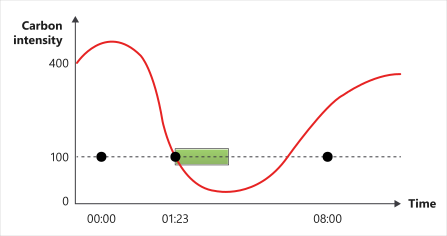
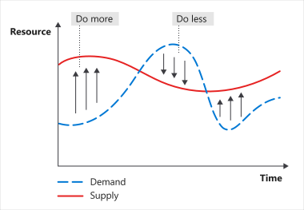

> [!VIDEO https://www.microsoft.com/videoplayer/embed/RWxeEn]
_The content in the video is still valid, but the principle numbers may differ due to the Green Software Foundation's principle renumbering._

## Carbon awareness

Not all electricity is produced in the same way. In different locations and times, electricity is made using various sources with varying carbon emissions. Some sources, such as wind, solar, or hydroelectric, are clean, renewable sources that emit no carbon. Other fossil fuel sources emit varying amounts of carbon to produce electricity. For example, gas-burning power plants emit less carbon than coal-burning power plants.

### Carbon Intensity

> [!VIDEO https://www.microsoft.com/videoplayer/embed/RWwOVB]

The carbon intensity of electricity is a measure of how many carbon (CO₂eq) emissions are produced per kilowatt-hour of electricity consumed.

The standard unit of carbon intensity is ```gCO₂eq/kWh```, or grams of carbon per kilowatt-hour.

If your computer was plugged directly into a hydroelectric plant, then the electricity it consumed would have a carbon intensity of ```zero gCO₂eq/kWh```. A hydroelectric plant emits no carbon to produce that electricity. Most people can't plug directly into hydroelectric plants. Instead, they plug into power grids supplied with electricity from a mix of sources that produce varying amounts of carbon. Therefore, when plugged into a grid, your carbon intensity is usually greater than zero.

### Variability of carbon intensity

Carbon intensity changes by location since some regions have an energy mix containing more clean energy sources than others.

Carbon intensity also changes over time due to the variable nature of renewable energy. For example, when it's cloudy, or the wind isn't blowing, carbon intensity increases because more of the electricity in your mix comes from sources that emit carbon.



Electricity demand varies during the day, and supply needs to meet that demand. Some of that supply can easily control the power it produces; for example, a coal power plant can burn less coal. Some of that supply can't easily control the power it produces; for example, a wind farm can't control how much the wind blows, and it can only throw away (curtail) electricity that was made essentially for free.



As a byproduct of the way energy markets work, as demand for electricity goes down, ordinarily, the high-emitting fossil fuel sources of power are scaled back first, with renewables scaled back last.

Reducing the amount of electricity consumed in your applications can decrease the carbon intensity of the local grid's energy mix.

### Marginal carbon intensity

Typically, a marginal power plant is a system that can react quickly to changes in electricity demand, such as a gas turbine.

If you consume more energy, that energy comes from the marginal power plant. It however cannot be a wind turbine or solar cells, as you can’t command them to produce more.

 That power plant can control the energy it outputs. Renewables can't control the sun or the wind, so marginal power plants are often powered by fossil fuels.

The marginal plant emits carbon, and at any moment, we have the carbon intensity of the energy mix in the grid and the carbon intensity of the energy that would have to be brought online to meet new demand. That's called the marginal carbon intensity.

Fossil-fueled power plants rarely reach zero; they have a minimum functioning threshold. Some don't scale and are considered a consistent always-on base load. Because of this, we can sometimes reach the unreasonable scenario where we throw away (curtail) renewable energy created for free to consume energy from fossil-fuel power plants made with a fuel that costs money.



If a new load would be met with supply from a renewable source that would otherwise have been curtailed, then marginal carbon intensity is ```zero gCO₂eq/kWh```.

There are moments when the marginal carbon intensity of electricity is ```zero gCO₂eq/kWh```. Running compute during these times results in **no carbon being emitted** from electricity consumption.

### Demand shifting

There's currently little in the way of storage or buffering in electrical grid systems. Typically electricity is produced so supply always meets demand. If more energy is generated from renewables than is needed to support demand and all our storage options are full, we curtail (throw away) that clean energy. One solution is to shift workloads to times and locations with more renewable energy supply, called demand shifting.

If you can be flexible with when and where you run workloads, you can consume electricity when the carbon intensity is less and pause when the carbon intensity is high. For example, training a machine learning model at a different time or in a region with much lower carbon intensity.

Studies such as _[Putting a CO₂ figure on a piece of computation](https://ieeexplore.ieee.org/document/6128960)_ have shown that these actions can reduce carbon emissions as much as 45% to 99%, depending on the number of renewables powering the grid.

Look at your application end to end, identify opportunities for being flexible regarding workloads, and use the carbon intensity of electricity to signal when or if to run those workloads.



### Calculating carbon intensity

Several services allow you to obtain real-time data regarding the current carbon intensity of different electricity grids. Some provide estimates of future carbon intensity, and some give the marginal carbon intensity.

- [Carbon Intensity API](https://carbonintensity.org.uk/): Free resource for carbon intensity data in the UK.

- [ElectricityMap](https://api.electricitymap.org/): Free for noncommercial single country/region use, premium solutions for commercial and multi-country/region access.

- [WattTime](https://www.watttime.org/): Free for a single grid region, premium solutions for multi-grid, and real-time marginal emissions.

[Demand shifting](https://learn.greensoftware.foundation/carbon-awareness#demand-shaping) is the strategy of moving compute to regions or times when the carbon intensity is less; or, to put it another way, when the supply of renewable electricity is high.

Demand shaping is a similar strategy, but instead of moving demand to a different region or time, we shape our demand to match the existing supply.



If the supply of renewable energy is high, increase the demand (do more in your applications); if the supply is low, decrease demand (do less in your applications).

- A great example of this is video-conferencing software. Rather than constantly stream at the highest quality possible, they often shape the demand by reducing the video quality to prioritize audio.

- Another example is TCP/IP. The transfer speed increases in response to how much data can be broadcasted over the wire.

- A third example is progressive enhancement with the web. The web experience improves depending on the resources and bandwidth of the end user's device.

## Carbon-aware vs. carbon-efficient

Carbon efficiency can be transparent to the end user. You can be more efficient at every level in converting carbon to useful functionality while keeping the user experience the same.

But at some point, being transparently more carbon-efficient isn't enough. If the carbon cost of running an application right now is too high, we can change the user experience to reduce carbon emissions further. At the point the user is aware the application is running differently, it becomes a carbon-aware application.

Demand shaping carbon-aware applications is all about the supply of carbon. When the carbon cost of running your application becomes high, shape the demand to match the supply of carbon. This can happen automatically, or the user can make a choice.

Demand shaping is related to a broader concept in sustainability, which is to reduce consumption. We can achieve a lot by becoming more efficient with resources, but we need to consume less at some point. As Sustainable Software Engineers, to be carbon-efficient means that when the carbon intensity is high, instead of demand-shifting compute, we consider canceling it, thereby reducing the demands of our application and the expectations of our end users.

## Eco-modes

Eco-modes are often used in life; for instance, in cars or washing machines. When switched on, the performance changes as they consume fewer resources (gas/electricity) to perform the same task. It's not cost-free (otherwise, we would always choose eco-modes), so we make trade-offs. Because it's a trade-off, eco-modes are almost always presented to a user as a choice, and the user decides if they want to go with it and accept the compromises.

Software applications can also have eco-modes, which, when engaged, change application behavior in potentially two ways:

- **Intelligence**: Giving users information to make informed decisions.

- **Automatic**: The application automatically makes more aggressive decisions to reduce carbon emissions.
