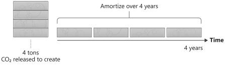
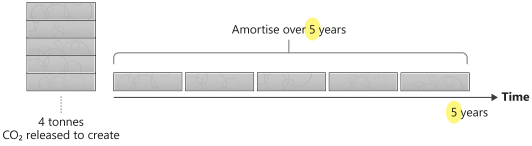

> [!VIDEO https://www.microsoft.com/videoplayer/embed/RWwTWD]
_The content in the video is still valid, but the principle numbers may differ due to the Green Software Foundation's principle renumbering._

The device on which you're reading this document released some carbon in its creation; once it reaches the end of life, disposing of it may release more. Embodied carbon (otherwise referred to as "Embedded Carbon") is the amount of carbon pollution emitted during the creation and disposal of a device. When calculating the total carbon pollution for the computers running your software, account for the carbon pollution to run the computer and the computer's embodied carbon.

## Embodied carbon is significant

Depending on your energy mix's carbon intensity, the embodied carbon cost of a device can be high compared to the carbon cost of the electricity powering it.

For example, a [2019 R640 Dell Server](https://i.dell.com/sites/csdocuments/CorpComm_Docs/en/carbon-footprint-poweredge-r640.pdf) has an amortized embedded carbon cost of ```320 kg CO₂eq/year```. It's also expected to consume ```1760.3 kWh/year``` of electricity. The average carbon intensity in the EU was ```0.276 kg CO₂eq/kWh``` for 2019.

Therefore, the total carbon cost is ```320 + (0.276 \* 1760.3) = 805 kg``` of carbon/year, of which 320 kilograms or about 40% is from the embodied carbon. Embodied carbon is a significant contributor to the total emitted carbon of servers.

> [!NOTE]
>
> The embodied carbon cost is often much higher for consumer devices, sometimes more significant than the lifetime carbon cost from electricity consumption. For example, reference _[Smartphones Are Killing The Planet Faster Than Anyone Expected](https://www.fastcompany.com/90165365/smartphones-are-wrecking-the-planet-faster-than-anyone-expected)_.
>

### Don't waste hardware

When you buy a computer, it's already emitted much carbon. Computers also have an expiry date; they get old, can't handle modern workloads, and need to be refreshed. If you think about it this way, hardware is a proxy for carbon, so as Sustainable Software Engineers, we must be hardware efficient if our goal is to be **carbon-efficient**.

You can do many things to be hardware efficient, but one thing you can do is help extend the expiry date of hardware. Computers don't wear out; there are no moving parts; they just become obsolete. They become outdated because we're continually creating software that pushes limits.

### Extending the lifespan of hardware

A way to account for embodied carbon is to amortize the carbon over a device's expected life span. For example, suppose it took ```4,000 Kg``` of carbon to build a hypothetical server, and we hoped the server would have a four-year lifespan. In that case, we can consider this equivalent to 1,000 Kg of carbon released annually during its lifespan.



By thinking of embodied carbon in this way, any device, even one that isn't consuming electricity, effectively releases carbon over its lifetime. With that in mind, if we were to amortize the same ```4,000 Kg``` of carbon for our hypothetical server over a five-year lifespan instead of four, the carbon released per year would be reduced to 800 Kg.



If we apply this concept to the lifespan of the 2019 R640 Dell Server that we discussed earlier, the amortized carbon drops from ```320 kg CO₂eq/year``` to ```256 kg CO₂eq/year``` if we extended its lifespan over five years instead of four.

Hardware is retired because it breaks down or struggles to handle modern workloads. Software can't help with the first; however, if we focus on building applications running on older hardware, we can help with the second.
