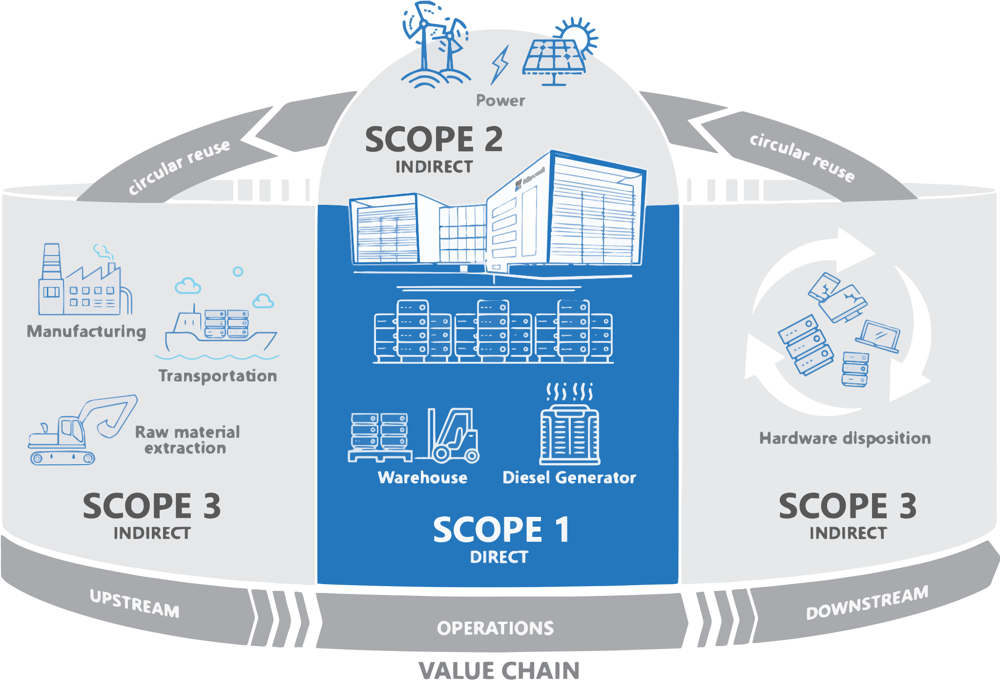
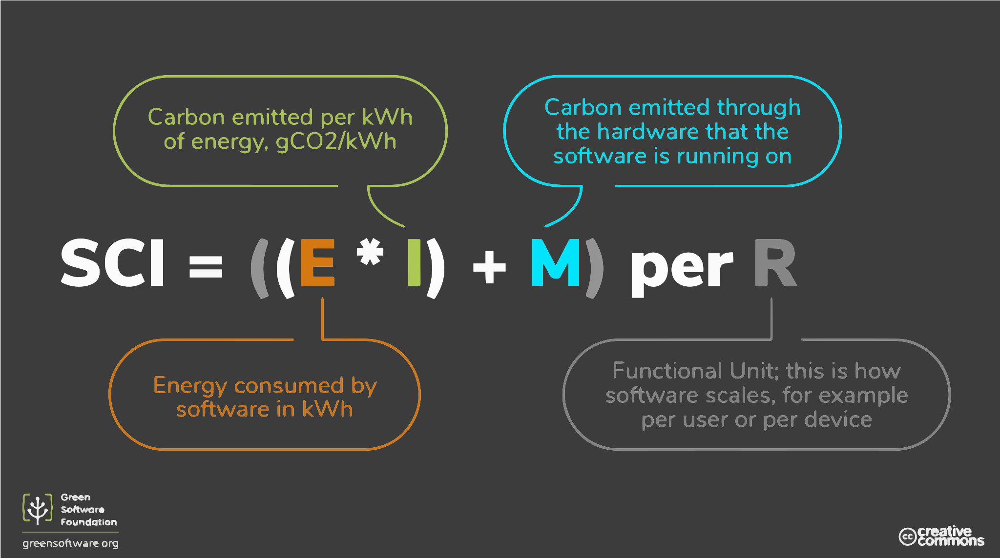

## What you can't measure, you can't change

The Greenhouse Gas (GHG) protocol is the most commonly used method for organisations to measure their total carbon emissions.  Whilst software emissions can be calculated using this approach, it can be difficult.  A better suited calculation is the Software Carbon Intensity (SCI) calculation. 

## Greenhouse Gas Protocol 

The GHG protocol enables organisations to calculate their total emissions.  The emissions are attributed to a particulary category corresponding to how they were produced.  These categories are called scopes. 

## Scope 1 
These are direct emissions associated with your activites owned or controlled by a company.  For example, emissions from combustion of fossil fuels in facilities and vehicles.

## Scope 2
Indirect emissions that come from the production of electricity or heat that you use. For example, from the energy sources that heat and light your home. 

## Scope 3
Indirect emissions that come from other activities.  A common example of this for a business is emission from activities within the supply chain, production of purchased materials, transportation of goods and services, and use of sold products.

## Software Carbon Intensity Calculation 

SCI is a method of measuring the carbon emissions associated with all types of software applications.  It provides a consistent way to describe the emissions of software and how changes can make a difference. 

It uses a number of components to calculate the emission score, all of which have already been previously introduced.  The components are energy, location based carbon intensity, and embodied carbon.  

Energy is the power consumed by the hardware.  It's measured in kilwatt hours.  More hardware suppliers are making this information available, and it can be consumed as datasets or via an api. 

Carbon intensity is the amount of carbon equivalent for the particular time and location that the software is running.  It's measured in grams of carbon equivalent per kilowatt-hour. 

The calculation multiplies the energy consumed by the carbon intensity.  The amount of carbon emitted through the hardware is then added to the sum.  This gives a score that can be applied to each functional unit.  For example if the software is an api, then the functional unit is a single call to that api.  This makes the score an intensity, rather than a total. 