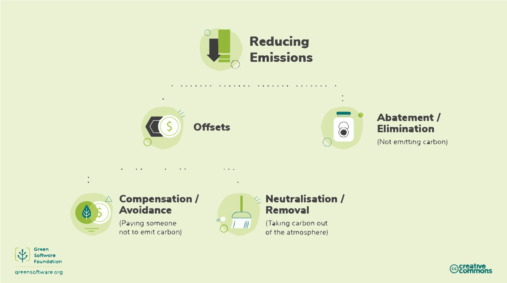

## Understand the exact mechanism of carbon reduction 

Over the years when discussing an approach to reduce emissions many terms have been used interchangably.  It's essential to have a common understanding of these terms in order to be able to work towards an agreed goal.  

## Carbon reduction methodologies 

There are many ways to reduce emissions, it's important to understand the exact mechanism of the reduction when planning how to work toward these targets. 

At the highest level, there are offsets or abatement.  Offsetting involves reducing emissions elsewhere, whereas abatement or elimination involves not emitting carbon in the first place.  It is generally understood that in today's society it's impossible not to emit carbon, and so the offset approach is the one that's adopted. 

There are two mechanisms to offset, these are compensation or neutralisation.  

Compensation or sometimes called avoidance involves paying someone else to not emit carbon.  Whereas neutralisation or removal involves taking carbon out of the atmosphere. Examples of this include enhancing natural carbon sinks such as forest restoration, or direct air capture where carbon is removed from the air. 

## Climate Commitments 

There are many different climate commitment strategies that an organisation can commit to.  Understanding the different meanings and implications of each can help identify the right strategy.

## Carbon Neutral

To achieve carbon neutrality an organisation must measure its emissions then match the total emissions through caron reduction projects.  This can include carbon removal projects and carbon avoidance.  

Carbon neutral is an internationally recognised standard, [PAS 2060](https://info.eco-act.com/hubfs/0%20-%20Downloads/PAS%202060/PAS%202060%20factsheet%20EN.pdf).  To be carbon neutral you must cover all emissions in scope 1 and 2, and all scope 3 emissions that contribute to more than 1% of the total. 

## Net Zero

Net zero means reducing emissions and balancing remaining residual emissions through carbon removals (neutralizations). Net zero, by definition, requires emissions reductions in line with a 1.5°C pathway.

The critical differentiator between net zero and carbon neutral is net zero's focus on abatement/elimination and compensations. 

The standard for [net zero](https://sciencebasedtargets.org/resources/files/foundations-for-net-zero-full-paper.pdf) is being developed by the Science Based Targets initiative. 

For Net zero, 90% of emissions are eliminated and the remainined 10% are permanently netralised. 

Net zero must cover both direct and indirect emission from scope 1, 2, and 3.
