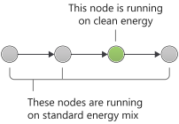

> [!VIDEO https://www.microsoft.com/videoplayer/embed/RWxtXU]

A network is a series of switches, routers, and servers. All of the equipment in a network consumes electricity and have embedded carbon. The internet is a global network of devices typically run off the standard local grid energy mix or powered by renewables.

When you send data across the internet, you send that data through many devices in the network, and each of those devices consumes electricity. As a result, any data you send or receive over the internet emits carbon.

The amount of carbon emitted to send data depends on many factors:

- The size of the data

- Distance the data travels

- The number of hops between network devices

- The energy efficiency of the network devices

- The carbon intensity of energy in the region of each device at the time the data is transmitted

- The network protocol used to coordinate data transmission; for example, multiplex, header compression, TLS/Quic

We assume the two most important are size and distance, so carbon-efficient applications focus on reducing the amount of data and distance it travels.

A 2019 study by The Shift Project proposed a 1-byte model for estimating the energy used in the transmission of data. To estimate the kWh, multiply the total megabytes of your traffic by 0.0023.

To convert to carbon, we use the average global carbon intensity of <nobr>519 gCO2eq/kWh</nobr>, multiply with 0.519 to get kilograms of carbon. Using this model, we estimate transmitting 1 GB would result in <nobr>1024 &#10005; 0.0023 &#10005; 0.519 = 1.22 kilos</nobr> of carbon emitted.

The same study also suggested the energy consumed is almost double for data transmitted over mobile networks.
